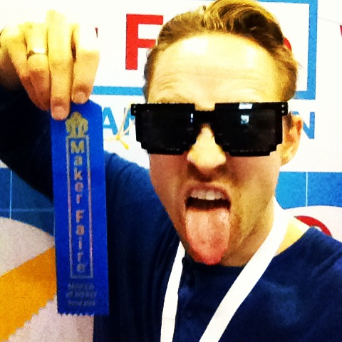
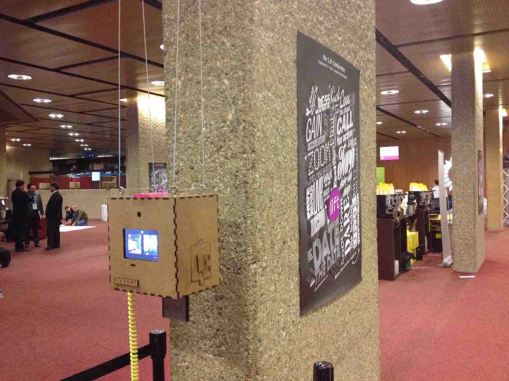
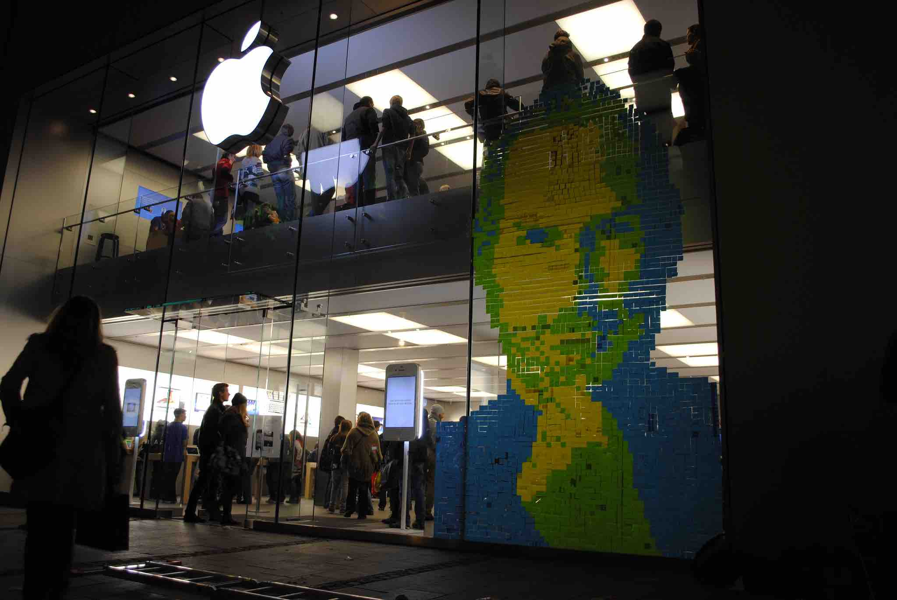

[FINAL PROJECT](final) / [WEEK 1](week1) / [COMPUTER AIDED DESIGN](week2) / [COMPUTER-CONTROLLED-CUTTING](week3) / [ELECTRONICS PRODUCTION](week4) / [3D SCANNING & PRINTING](week5) / [ELECTRONICS DESIGN](week6)  / [COMPUTER-CONTROLLED MACHINING](week7) / [EMBEDDED PROGRAMMING ](week8) / [MECHANICAL DESIGN](week9) / [MACHINE DESIGN](week10) / [INPUT DEVICES](week11) / [3D MOLDING AND CASTING](week12) / [OUTPUT DEVICES](week13) /  [COMPOSITES](week14) / [EMBEDDED NETWORKING & COMMUNICATIONS](week15) / [INTERFACE AND APPLICATION PROGRAMMING ](week16) / [APPLICATIONS AND IMPLICATIONS ](week17) / [INVENTION, INTELLECTUAL PROPERTY, AND BUSINESS MODELS](week18) / [PROJECT DEVELOPMENT ](week19)  

				
	
This year (2016) I will participate in the Fabacademy course called **"How to make (almost) anything"** with about 350 other students in over 80 Fab Labs all over the world. [Neil Gershenfeld](https://de.wikipedia.org/wiki/Neil_Gershenfeld) (watch his TED Talk [here](https://www.ted.com/talks/neil_gershenfeld_on_fab_labs)) who founded the first Fab Lab and is known as the father of Fab Labs and also a leader in the [Open Hardware](https://de.wikipedia.org/wiki/Open-Source-Hardware) movement. He is now head of the Center of Bits and Atoms a spin of of the MIT Media Lab will give a lecture each week from Boston for 5 month. Then the students have one week to complete the assignments.

I will participate at the Fablab Barcelona but I will try to complete most of the work in my home lab in Munich. On this website I will document my course activity and my [final project](final). The student websites of the bast years you find [here](http://archive.fabacademy.org/).

# About Me

Hi, I am Andreas a 33 year old guy from Munich Germany who makes a living tinkering and teaching kids coding and electronics. Also I am building up my own fablab and raspberry pi academy at the moment focused on small and big kids called [erfindergarden](http://www.erfindergarden.de) (erfinder is inventor in German) and plan a Fablab world tour after the academy program with my [Minecraft Hacking workshop](https://raspi-grundlagen-wien.eventbrite.de)

## My Story

I studied business with engineering and first started working in software sales. But I realized that being an employee is nothing for me so started working for myself in 2011.

My creazy journey started when I filmed and helped create a post-it art memorial for Steve Jobs at the Apple window in Munich store in 2011. This youtube video I filmed went viral and since then I have been creating [post-it art portraits](http://www.postitartcreators.com) and pictures for conferences, commercials and art shows. 

In 2013 I build the [pixomat](http://www.pixomat.co) a pixel photobooth in a shopwindow on the other site of the street of the Steve Jobs portrait and since then got deeper and deeper into the maker world learning coding, electronics, raspberry pi, 3D Printing, Laser Cutting and since 2014 started teaching that knowledge to kids and also started freelancing for [hybris/SAP labs](http://labs.hybris.com) as a creative technologist.

  

My first maker of merit batch for the pixomat at Maker Faire Rome 2013.

The pixomat at Lift conference in Geneva in 2014.

The Steve Jobs Post-it Portrait.

## So why do I do the fabacademy?

I want to gain deeper knowledge in the fablab technolgies, especially electronics, 3D Design, PCB making, CNC milling, molding, composites and get to know other makers and share knowledge and experiences with them.  I also think it is a good way to focus my energy on a project I have been dreaming to build for a while - [the stickomat](final). A machine that would stick post-its on a wall automatically.

## Github

You find all of this website also on github [here](https://github.com/ARKopp/fabacademy2016). 

## Contact me

Twitter: [@andreaskopp](http://www.twitter.com/andreaskopp)
Facebook: [www.facebook.com/andreaskopp](http://www.facebook.com/andreaskopp)
Email: [mail@andreaskopp.de](mailto:mail@andreaskopp.de)
 

## Copyright and License

After filling out [these questions](https://creativecommons.org/choose/) on the creative commons website I decided to license this website and my work for fabacademy under a Creative Commons Attribution 4.0 International License.

The content of [Andreas Kopp](bit.ly/fab16-andreas) on this website except the content of the final project is licensed under [Creative Commons Attribution 4.0 International License](http://creativecommons.org/licenses/by/4.0/).

The software and hardware of the final project speedometer by [Andreas Kopp](bit.ly/fab16-fabspeed) is licensed under [Attribution-ShareAlike 4.0 International (CC BY-SA 4.0)](http://creativecommons.org/licenses/by-sa/4.0/).

