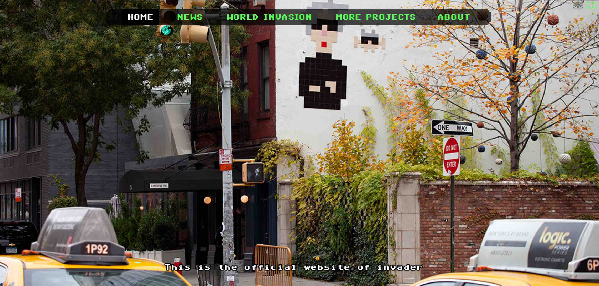
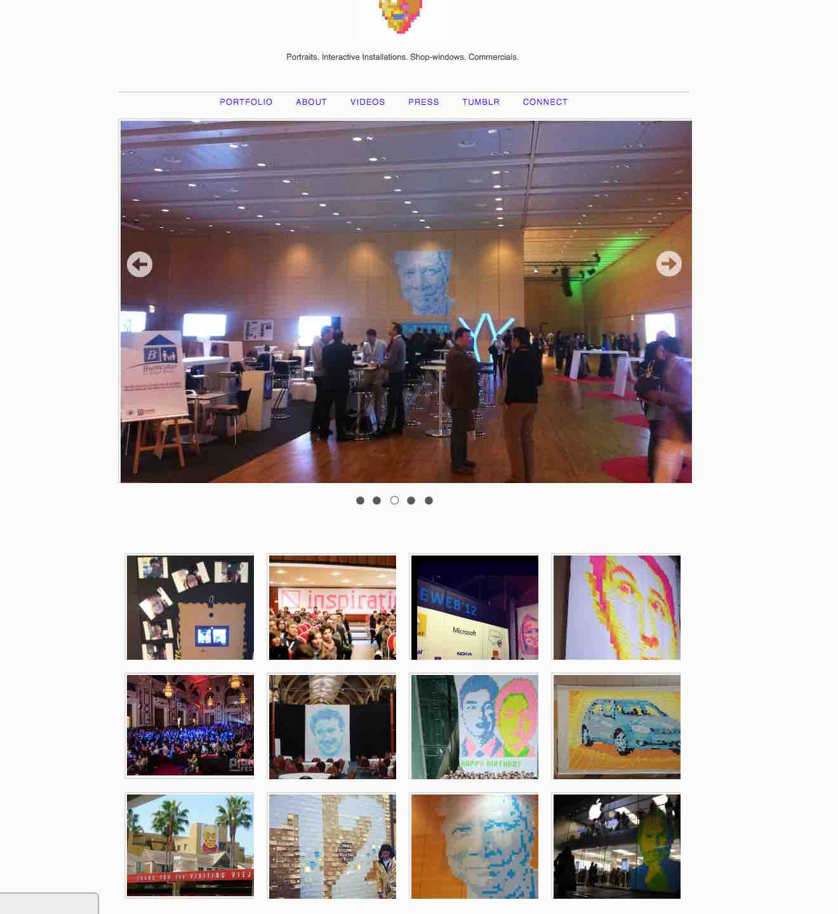
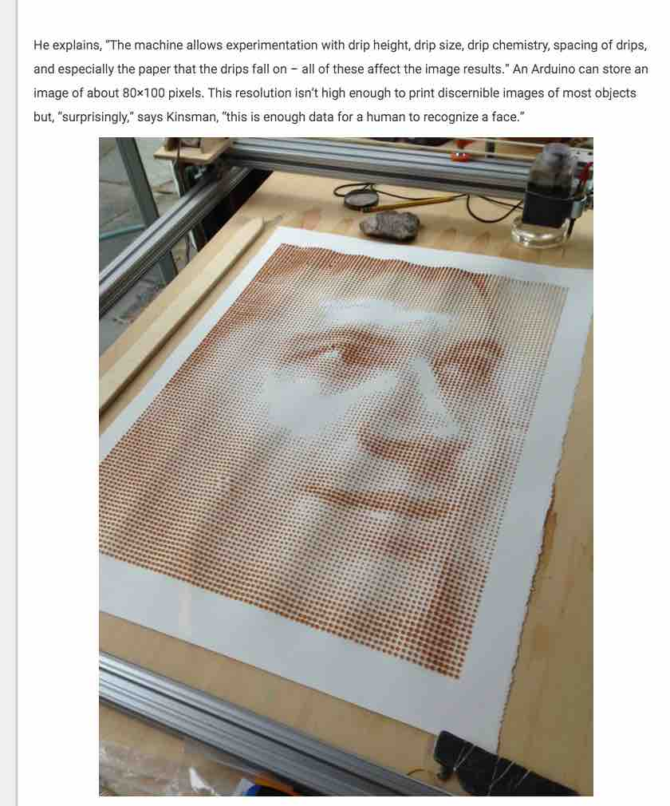
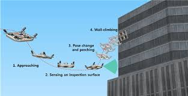
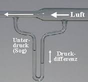
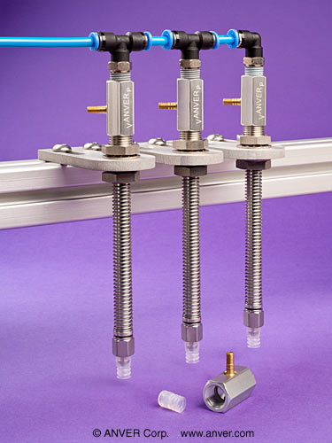

[BACK to START](../)

[FINAL PROJECT](../final) / [WEEK 1](../week1) / [COMPUTER AIDED DESIGN](../week2) / [COMPUTER-CONTROLLED-CUTTING](../week3) / [ELECTRONICS PRODUCTION](../week4) / [3D SCANNING & PRINTING](../week5) / [ELECTRONICS DESIGN 1](../week6)  / [COMPUTER-CONTROLLED MACHINING](../week7) / [EMBEDDED PROGRAMING ](../week8) / [MECHANICAL AND MACHINE DESIGN](../week9) / [INPUT DEVICES](../week10) / [3D MOLDING AND CASTING ](../week11) / [OUTPUT DEVICES](../week12) /  [COMPOSITES](../week13) / [EMBEDDED NETWORKING & COMMUNICATIONS](../week14) / [INTERFACE AND APPLICATION PROGRAMMING ](../week15) / [APPLICATIONS AND IMPLICATIONS ](../week16) / [INVENTION, INTELLECTUAL PROPERTY, AND BUSINESS MODELS](../week17) / [PROJECT DEVELOPMENT ](../week18)  

## Final Project

[Space Invader world map ](http://www.space-invaders.com/world/)

I love pixel art and make pixel art [myself](postitman.de). I was always sticking post-its or origami manually but would love to have a machine helper. So for my final project I want to make a post-it plotter that can stick post-its to any surface. I call it the stickomat and start my own invasion.

Similar to this [Coffee plotter](http://makezine.com/2016/02/24/this-machine-prints-portraits-8000-drops-coffee/) that prints with droplets of coffee only vertical. 

## Week 10 

In week 10 I finally thought more about my final project and I realized I still need a couple of things.

* learn sketchup to simulate my machine
* learn Rhino to simulate my machine
* make a small scale model
* Develop the feeder: similar mechanism like pick and place, buy venturi valves
* Chose a machine design: [Openbuild?](http://openbuilds.org/), Drawbot
* Find a way to stick it to glass but also other surfaces: Drones???
* Develop the brain/software

[Wall climping drone??](http://www.smh.com.au/technology/technology-news/disney-research-creates-drone-car-that-can-climb-walls-20151230-glx6dd.html)

## Skateboard Speedomater

## Project Files

Download all project files from my Google Drive.

## Feedback ?

[Twitter](http://www.twitter.com/andreaskopp) me or [email me at andreasrkopp at gmail dot com](mailto:andreasrkopp@gmailcom). 

Or chat with me on gitter.

