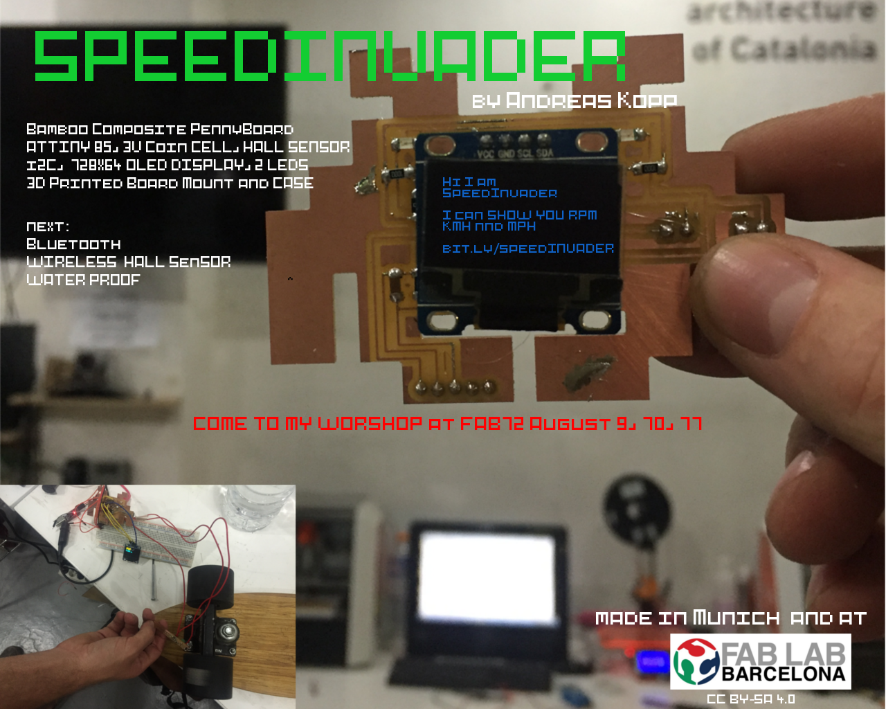
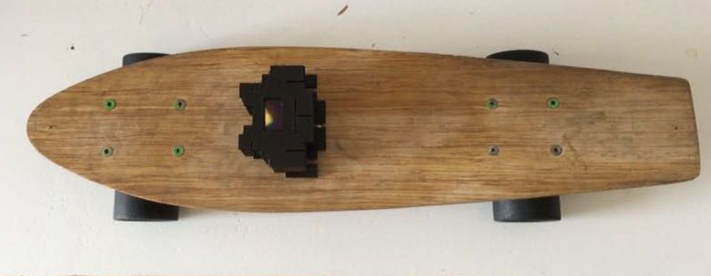
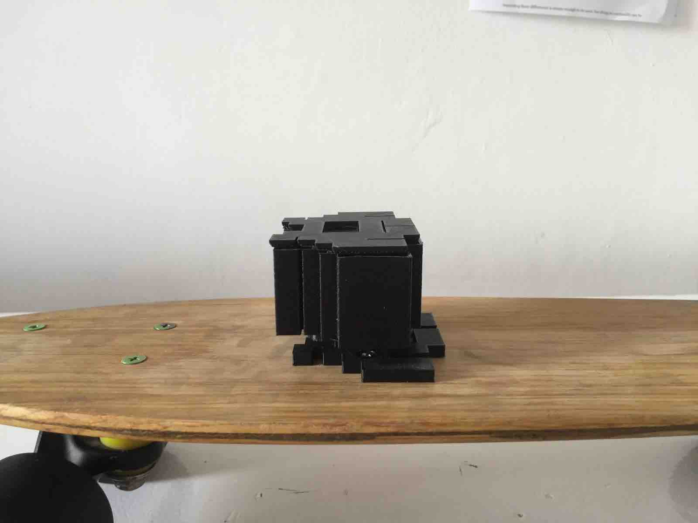
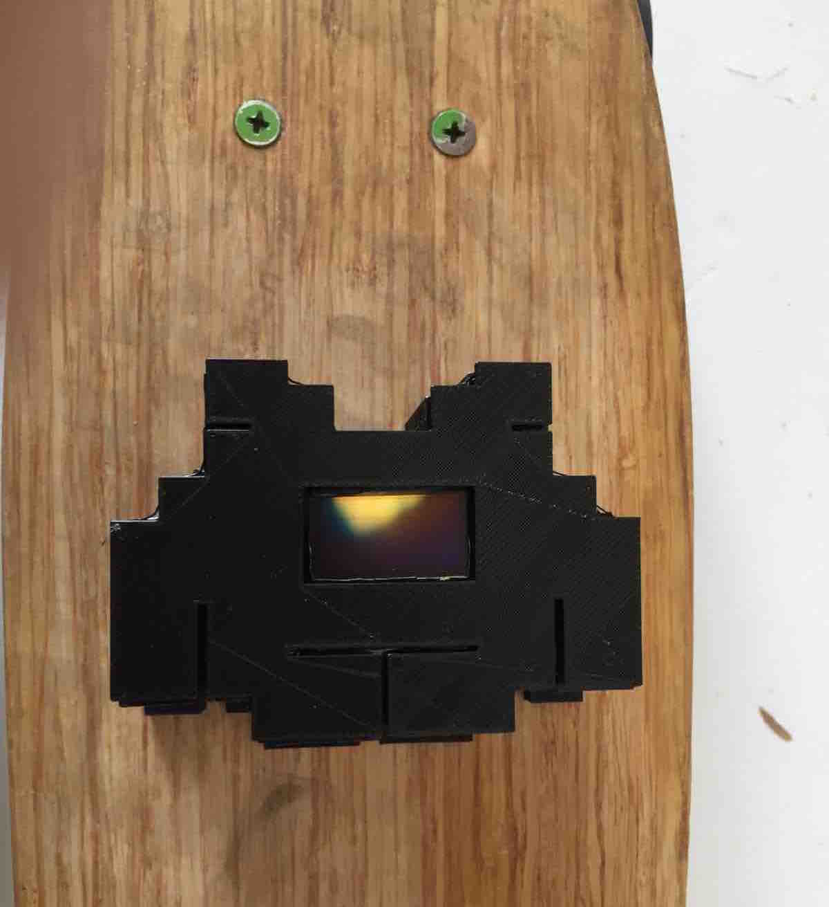

[BACK to START](../)

[FINAL PROJECT](../final) / [WEEK 1](../week1) / [COMPUTER AIDED DESIGN](../week2) / [COMPUTER-CONTROLLED-CUTTING](../week3) / [ELECTRONICS PRODUCTION](../week4) / [3D SCANNING & PRINTING](../week5) / [ELECTRONICS DESIGN](../week6)  / [COMPUTER-CONTROLLED MACHINING](../week7) / [EMBEDDED PROGRAMMING ](../week8) / [MECHANICAL DESIGN](../week9) / [MACHINE DESIGN](../week10) / [INPUT DEVICES](../week11) / [3D MOLDING AND CASTING](../week12) / [OUTPUT DEVICES](../week13) /  [COMPOSITES](../week14) / [EMBEDDED NETWORKING & COMMUNICATIONS](../week15) / [INTERFACE AND APPLICATION PROGRAMMING ](../week16) / [APPLICATIONS AND IMPLICATIONS ](../week17) / [INVENTION, INTELLECTUAL PROPERTY, AND BUSINESS MODELS](../week18) / [PROJECT DEVELOPMENT ](../week19)  

--------------------------------------------------------------------

***[Initial Idea  - the stickomat](./ideas)***

***[The Speedinvader](./)***

***[Process - How did I make it?](./process)***   

--------------------------------------------------------------------

## What did I make?

I made a bamboo composite skateboard and a skateboard speedometer that measures the speed with a magnetic sensor on the wheel of the board and displays it on a tiny oled display on top. 

But I learned to so much more in the last 6 months and most importantly I won friends from all over the world. Thank you all for the great time, your help and your couches. Also special thanks to my instructors Ferdi and Santi for your support. I could not have made it with you!

The Barcelona Fabacademy Class of 2016

## Final project video and Presentation

* [my final project Video live from the Chino infront of the Fablab Barcelona](../presentation.mp4)
* [presenting it to Neil Gerschenfield ](http://archive.fabacademy.org/archives/2016/master/videos/06-22/index.html)

## Composite Skateboard in week 14

I made the bamboo composite skateboard in [week14](../week14). 

## Bill of Materials (Version 7. Juli 2016)

* bamboo sheets 4 mm
* penny board wheels and beerings
* penny board axle
* black filament 
* one blank circuit board
* hall sensor
* tiny oled display
* Attiny85
* 4x 10k Resistor
* 1uF Capacitor
* 2 X SMD LEDs
* Battery Holder
* little neodyne magnet
* 2 Screws 

* [adafruit voltage booster](https://www.adafruit.com/products/2465)
* Lipo Battery 3,7 V

### What are my future plans for the project?

This is just a first version of the speedinvader. I could not complete all things I wanted to do but I want to keep on working.

* <del>Design and mill Hall Breakout v1</del>
* <del>Program Board v1<del>
* <del>Code for OLED Display in Arduino</del>
* <del>Add voice and Button v3</del>
* <del>Mill and solder board v3</del>
* <del>Design and mill Hall Breakout Double Sided</del>
* <del>Design Housing</del>
* <del>3D Print Housing</del>
* <del>make slide</del> 
* <del>make video</del>
* make a smaller board version
* make the breakoutboard fit better
* Design Waterproof Housing
* Mold Housing
* send board to be made in China
* make a bike version
* develop a workshop
* experiment with hex images

* optional: Raspberry Pi Zero HAT
* optional: add Bluetooth and Radio
* optional: Make a Light blue bean hat

##  Continue while Repositry locked

While the repository is locked I will continue to work on the speedinvader on my own git hub [here](github [here](https://github.com/ARKopp/fabacademy2016). 

## All files you need to rebuild it

It is still not perfect, so when you want to replicate this you may wont to wait a bit until I have made the next version. 

### Electronics

[hall_sensor_final_displayv5.brd](./files/speedinvader_board/hall_sensor_final_displayv5.brd)

[hall_sensor_final_displayv5.sch](./files/speedinvader_board/hall_sensor_final_displayv5.sch)

[hall_sensor_break_out.brd](./files/breakout_board/hall_sensor_break_out.brd)

[hall_sensor_break_out.sch](./files/breakout_board/hall_sensor_break_out.sch)

### Code

[firmwarespeedinvader.ino (you need all libraries)](./files/firmware_speedinvader/firmware_speedinvader)

### Skateboard

[skateboard design (rhino)](../week14/files/skateboard_file.3dm)

### Case

[CaseBottom, Case Top, Skateboard Holder (Tinkercad)](https://tinkercad.com/things/1azkU2S8nCk)

[CaseTop](./files/design_files/case_top.stl)

[CaseBottom](./files/design_files/scase_bottom.stl)

[Skateboard Mount](./files/design_files/skateboard_mount.stl)

I will make speedinvader PCB much smaller because I do not think that is very practical.

## Feedback ?

[Twitter](http://www.twitter.com/andreaskopp) me or [email me at andreasrkopp at gmail dot com](mailto:andreasrkopp@gmail.com) I am very happy to help. 

Or chat with me on gitter.

## License

In [week18 ](../week18) I chose the license for the speedinvader. 

The project is licensed under Attribution-ShareAlike 4.0 International (CC BY-SA 4.0). So if you are creating a derivative of my speedometer you should license it as well under CC BY-SA 4.0 license and credit me like above. This is the same license Arduino is using for their hardware.

[BACK to TOP](../final)
