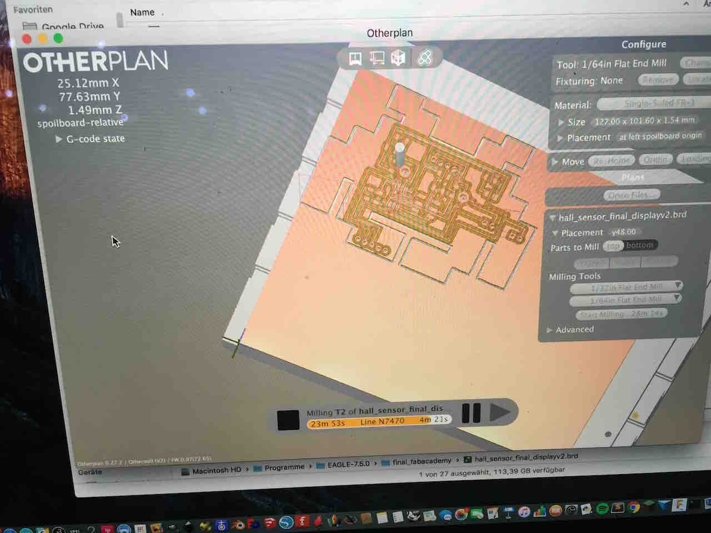
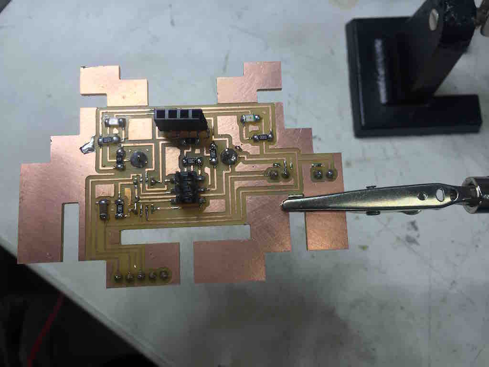

[BACK to START](../)

[FINAL PROJECT](../final) / [WEEK 1](../week1) / [COMPUTER AIDED DESIGN](../week2) / [COMPUTER-CONTROLLED-CUTTING](../week3) / [ELECTRONICS PRODUCTION](../week4) / [3D SCANNING & PRINTING](../week5) / [ELECTRONICS DESIGN 1](../week6)  / [COMPUTER-CONTROLLED MACHINING](../week7) / [EMBEDDED PROGRAMING ](../week8) / [MECHANICAL AND MACHINE DESIGN](../week9) / [INPUT DEVICES](../week10) / [3D MOLDING AND CASTING ](../week11) / [OUTPUT DEVICES](../week12) /  [COMPOSITES](../week13) / [EMBEDDED NETWORKING & COMMUNICATIONS](../week14) / [INTERFACE AND APPLICATION PROGRAMMING ](../week15) / [APPLICATIONS AND IMPLICATIONS ](../week16) / [INVENTION, INTELLECTUAL PROPERTY, AND BUSINESS MODELS](../week17) / [PROJECT DEVELOPMENT ](../week18)  


## First Idea


[Space Invader world map ](http://www.space-invaders.com/world/)

I love pixel art and make pixel art [myself](postitman.de). I was always sticking post-its or origami manually but would love to have a machine helper. So for my final project I want to make a post-it plotter that can stick post-its to any surface. I call it the stickomat and start my own invasion.

Similar to this [Coffee plotter](http://makezine.com/2016/02/24/this-machine-prints-portraits-8000-drops-coffee/) that prints with droplets of coffee only vertical. 


## Week 10 

In week 10 I finally thought more about my final project and I realized I still need a couple of things.

* learn sketchup to simulate my machine
* learn Rhino to simulate my machine
* make a small scale model
* Develop the feeder: similar mechanism like pick and place, buy venturi valves
* Chose a machine design: [Openbuild?](http://openbuilds.org/), Drawbot
* Find a way to stick it to glass but also other surfaces: Drones???
* Develop the brain/software


[Wall climbing drone??](http://www.smh.com.au/technology/technology-news/disney-research-creates-drone-car-that-can-climb-walls-20151230-glx6dd.html)


## Second Idea: a Skateboard Speedometer - Speedinvader

***Update 5 June 2016***

After realizing that I will not have the time to complete all the components of a Postit Sticking Machine I decided to build a Skateboard Speedometer instead. I love the idea that it is quite small and I can take it anywhere with me. I also already made a skateboard in [composites](../week13).

Check out [week17](../week17) for more details about my Speedometer. I will update while I go along. 

### Arduino Prototype

***Update 8. June***

With the help of a friend I got my Arduino Prototype to calculate the RPM (rounds per minute working) the first day I arrived back Barcelona. (This time we drove with a Mercedes Bus from Munich to Barcelona. This way I can take my Something Big with me back to Munich).

I just used a simple code I found on the [homepage](http://playground.arduino.cc/Main/ReadingRPM). 


For prototyping I used a light blue bean and added a button. This is a great little arduino compatible open source board that is powered by a 3V Coin Cell, has a M328 chip, I2C, SPI and a little prototyping area. 


That is the Architecture of the Light Blue Bean. It would be great if I can rebuild parts of the that.


### Attiny Test

Then I tested the code with my Hall Sensor Board from Input Devices.
I got it to work but I realized I needed to get the hall sensor closer to my wheel magnet. 

### Speedinvader First Board with Coin Cell and Hall Seinsor on the Side

So I quickly adapted the hall sensor board and put the hall sensor on the side of the board and added a coin cell battery. To get everything working it took me the whole day. In the end the problem was I had not burned the bootloader. 

In the code I added that my LED are Blinking according to the RPMS.


### Speedinvader Second Board with OLED

***Update 10. June***

Today I decided to first etooth right away. As I did not have a proper Attiny Holder (I know ordered one from ebay) and I now find it easier to prototype the board in eagle and mill it right away instead with a Breadboard and a million jumper cables. 

For the OlED Screen I used a screen I bought earlier. It is a 0.96 Inch 128 x 64 OLED that supports I2C meaing I need to add I2C to my board design. For that I looked at Neils I2C Bridge design and added a 10K Pull-up to SDA and SCL. In Neils board there is only one pull-up but if I do not need the second pull-up I can easily replace it with a Zero Ohm. 


I also added a Coin Cell Battery Holder and two Screw Terminals I found in the adafruit eagle library. The display needs 3.3 to 5V but I hope it works. As my goal is to later implement bluetooth and I do not want to add a lipo charging cycle I hope I can power everything with a 3.3V coin cell. 


The process of designing, milling and soldering took me a whole day. In the end I had a copper line below my ship broke so I had to fix it with a little wire with took me almost 2 hours. Milling still takes 23 Minutes I try to get that down by making the the lines bigger and closer together. 






***Update 11. June***

It took my like 4 hours again to solder my Speedinvader and I needed 4 jumpers to debug. Now I know I only should use small jumpers and not big cables.

After bootloading I tested the invader first with a Arduino blink code and then managed to find a code in c for the display and got it running. Still I did not got it to run with Arduino because some libraries where to recognized.


```
sudo make

```


```
avrdude -c avrisp2 -p t85 -U flash:w:"main.hex":a

```


I am not sure if the coincell works yet. So I made a new design and added a voltage regulator for 5V to it.

***Update 12. June***

[This link](http://www.instructables.com/id/ATTiny85-connects-to-I2C-OLED-display-Great-Things/) from instructables was a great help in getting the Arduino code working. The two sketches and the libraries worked right away. 

I thought about an interface but could not find a working library for a big font so I first decided to show RPM, km/h, mph and max speed in kmh.

To get from RPM to km/h you just need to measure the range of the wheel in m and multiply it with the RPMS times 3,6 to get to km/h.


Also I made a test with a power supply with 3V and 200 ma and I got the screen working so I wont need to add a voltage regulator and and two 3V batteries. 


***Update 13. June***


### What is still missing?


* <del>Design and mill Hall Breakout v1</del>
* <del>Program Board v1<del>
* <del>Code for OLED Display in Arduino<del>
* Add Condesator and Button v3
* Mill and solder board v3
* Design and mill Hall Breakout Double Sided 
* Design Housing
* 3D Print Housing
* Design Mold for Housing
* Mold Housing

* optional: Raspberry Pi Zero HAT
* optional: add Bluetooth and Radio
* optional: Make a Light blue bean hat


## Project Files

[Download](https://drive.google.com/folderview?id=0B3iYmii-HJ7Tblo1MHpuZ2stSzQ&usp=sharing) all project files of my Google Drive or from github. 


## Feedback ?

[Twitter](http://www.twitter.com/andreaskopp) me or [email me at andreasrkopp at gmail dot com](mailto:andreasrkopp@gmail.com). 


Or chat with me on gitter.

[](https://gitter.im/ARKopp/fabacademy2016?utm_source=badge&utm_medium=badge&utm_campaign=pr-badge)


