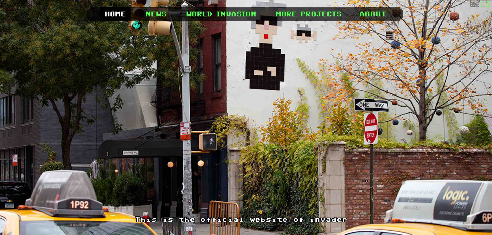
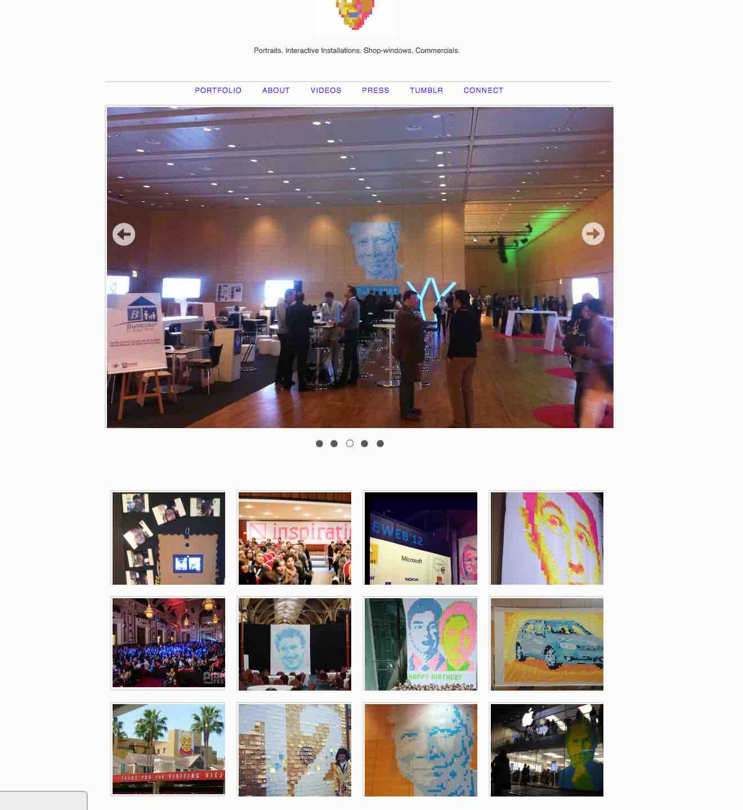
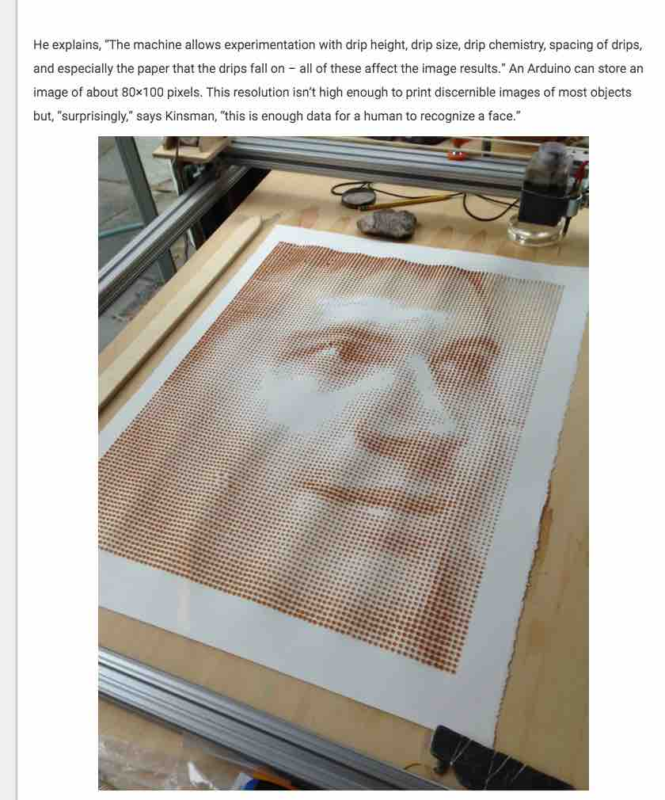
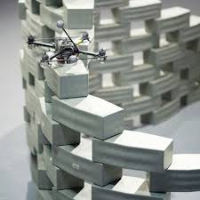
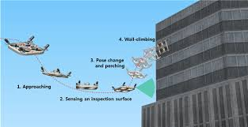
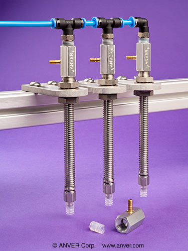

[BACK to START](../)

[FINAL PROJECT](http://archive.fabacademy.org/archives/2016/fablabbcn2016/students/375/final/) / [WEEK 1](http://archive.fabacademy.org/archives/2016/fablabbcn2016/students/375/week1/) / [COMPUTER AIDED DESIGN](http://archive.fabacademy.org/archives/2016/fablabbcn2016/students/375/week2) / [COMPUTER-CONTROLLED-CUTTING](http://archive.fabacademy.org/archives/2016/fablabbcn2016/students/375/week3/) / [ELECTRONICS PRODUCTION](http://archive.fabacademy.org/archives/2016/fablabbcn2016/students/375/week4) / [3D SCANNING & PRINTING](http://archive.fabacademy.org/archives/2016/fablabbcn2016/students/375/week5) / [ELECTRONICS DESIGN](http://archive.fabacademy.org/archives/2016/fablabbcn2016/students/375/week6)  / [COMPUTER-CONTROLLED MACHINING](http://archive.fabacademy.org/archives/2016/fablabbcn2016/students/375/week7) / [EMBEDDED PROGRAMMING ](http://archive.fabacademy.org/archives/2016/fablabbcn2016/students/375/week8) / [MECHANICAL DESIGN](http://archive.fabacademy.org/archives/2016/fablabbcn2016/students/375/week9) / [MACHINE DESIGN](http://archive.fabacademy.org/archives/2016/fablabbcn2016/students/375/week10) / [INPUT DEVICES](http://archive.fabacademy.org/archives/2016/fablabbcn2016/students/375/week11) / [3D MOLDING AND CASTING](http://archive.fabacademy.org/archives/2016/fablabbcn2016/students/375/week12) / [OUTPUT DEVICES](http://archive.fabacademy.org/archives/2016/fablabbcn2016/students/375/week13) /  [COMPOSITES](http://archive.fabacademy.org/archives/2016/fablabbcn2016/students/375/week14) / [EMBEDDED NETWORKING & COMMUNICATIONS](http://archive.fabacademy.org/archives/2016/fablabbcn2016/students/375/week15) / [INTERFACE AND APPLICATION PROGRAMMING ](http://archive.fabacademy.org/archives/2016/fablabbcn2016/students/375/week16) / [APPLICATIONS AND IMPLICATIONS ](http://archive.fabacademy.org/archives/2016/fablabbcn2016/students/375/week17) / [INVENTION, INTELLECTUAL PROPERTY, AND BUSINESS MODELS](http://archive.fabacademy.org/archives/2016/fablabbcn2016/students/375/week18) / [PROJECT DEVELOPMENT ](http://archive.fabacademy.org/archives/2016/fablabbcn2016/students/375/week19)  

  
   

--------------------------------------------------------------------
 

***[Initial Idea  - the stickomat](../ideas)***

***[The Speedinvader](http://archive.fabacademy.org/archives/2016/fablabbcn2016/students/375/final)***

***[Process - How did I make it?](../process)***   

--------------------------------------------------------------------

## Initial Idea

[Space Invader world map ](http://www.space-invaders.com/world/)

I love pixel art and make pixel art [myself](postitman.de). I was always sticking post-its or origami manually but would love to have a machine helper. So for my final project I want to make a post-it plotter that can stick post-its to any surface. I call it the stickomat and start my own invasion.

Similar to this [Coffee plotter](http://makezine.com/2016/02/24/this-machine-prints-portraits-8000-drops-coffee/) that prints with droplets of coffee only vertical. 

## Week 10 

In week 10 I finally thought more about my final project and I realized I still need a couple of things.

* learn sketchup to simulate my machine
* learn Rhino to simulate my machine
* make a small scale model
* Develop the feeder: similar mechanism like pick and place, buy venturi valves
* Chose a machine design: [Openbuild?](http://openbuilds.org/), Drawbot
* Find a way to stick it to glass but also other surfaces: Drones???
* Develop the brain/software

[Wall climbing drone??](http://www.smh.com.au/technology/technology-news/disney-research-creates-drone-car-that-can-climb-walls-20151230-glx6dd.html)

***Update 5 June 2016***

After realizing that I will not have the time to complete all the components of a Postit Sticking Machine I decided to build a Skateboard Speedometer instead. I love the idea that it is quite small and I can take it anywhere with me. I also already made a skateboard in [composites](../week13).

Check out [week17](../week17) for more details about my Speedometer. I will update while I go along.

I still want to continue building a post-it stickomat after the fabacademy. If anybody is interested to joint me for this project please contact me.  

## Feedback ?

[Twitter](http://www.twitter.com/andreaskopp) me or [email me at andreasrkopp at gmail dot com](mailto:andreasrkopp@gmail.com). 

Or chat with me on gitter.

[BACK to TOP](../ideas)