[BACK to START](../)

[FINAL PROJECT](http://archive.fabacademy.org/archives/2016/fablabbcn2016/students/375/final) / [WEEK 1](http://archive.fabacademy.org/archives/2016/fablabbcn2016/students/375/week1/) / [COMPUTER AIDED DESIGN](http://archive.fabacademy.org/archives/2016/fablabbcn2016/students/375/week2) / [COMPUTER-CONTROLLED-CUTTING](http://archive.fabacademy.org/archives/2016/fablabbcn2016/students/375/week3/) / [ELECTRONICS PRODUCTION](http://archive.fabacademy.org/archives/2016/fablabbcn2016/students/375/week4) / [3D SCANNING & PRINTING](http://archive.fabacademy.org/archives/2016/fablabbcn2016/students/375/week5) / [ELECTRONICS DESIGN](http://archive.fabacademy.org/archives/2016/fablabbcn2016/students/375/week6)  / [COMPUTER-CONTROLLED MACHINING](http://archive.fabacademy.org/archives/2016/fablabbcn2016/students/375/week7) / [EMBEDDED PROGRAMMING ](http://archive.fabacademy.org/archives/2016/fablabbcn2016/students/375/week8) / [MECHANICAL DESIGN](http://archive.fabacademy.org/archives/2016/fablabbcn2016/students/375/week9) / [MACHINE DESIGN](http://archive.fabacademy.org/archives/2016/fablabbcn2016/students/375/week10) / [INPUT DEVICES](http://archive.fabacademy.org/archives/2016/fablabbcn2016/students/375/week11) / [3D MOLDING AND CASTING](http://archive.fabacademy.org/archives/2016/fablabbcn2016/students/375/week12) / [OUTPUT DEVICES](http://archive.fabacademy.org/archives/2016/fablabbcn2016/students/375/week13) /  [COMPOSITES](http://archive.fabacademy.org/archives/2016/fablabbcn2016/students/375/week14) / [EMBEDDED NETWORKING & COMMUNICATIONS](http://archive.fabacademy.org/archives/2016/fablabbcn2016/students/375/week15) / [INTERFACE AND APPLICATION PROGRAMMING ](http://archive.fabacademy.org/archives/2016/fablabbcn2016/students/375/week16) / [APPLICATIONS AND IMPLICATIONS ](http://archive.fabacademy.org/archives/2016/fablabbcn2016/students/375/week17) / [INVENTION, INTELLECTUAL PROPERTY, AND BUSINESS MODELS](http://archive.fabacademy.org/archives/2016/fablabbcn2016/students/375/week18) / [PROJECT DEVELOPMENT ](http://archive.fabacademy.org/archives/2016/fablabbcn2016/students/375/week19)  


--------------------------------------------------------------------

***[Initial Idea  - the stickomat](../ideas)***

***[The Speedinvader](http://archive.fabacademy.org/archives/2016/fablabbcn2016/students/375/final)***

***[Process - How did I make it?](../process)***   

--------------------------------------------------------------------


## Second Idea: a Skateboard Speedometer - Speedinvader

***Update 5 June 2016***

After realizing that I will not have the time to complete all the components of a Postit Sticking Machine I decided to build a Skateboard Speedometer instead. I love the idea that it is quite small and I can take it anywhere with me. I also already made a skateboard in [composites](../week13).

Check out [week17](../week17) for more details about my Speedometer. I will update while I go along. 

### Arduino Prototype

***Update 8. June***

With the help of a friend I got my Arduino Prototype to calculate the RPM (rounds per minute working) the first day I arrived back Barcelona. (This time we drove with a Mercedes Bus from Munich to Barcelona. This way I can take my Something Big with me back to Munich).

I just used a simple code I found on the [homepage](http://playground.arduino.cc/Main/ReadingRPM). 


For prototyping I used a light blue bean and added a button. This is a great little arduino compatible open source board that is powered by a 3V Coin Cell, has a M328 chip, I2C, SPI and a little prototyping area. 

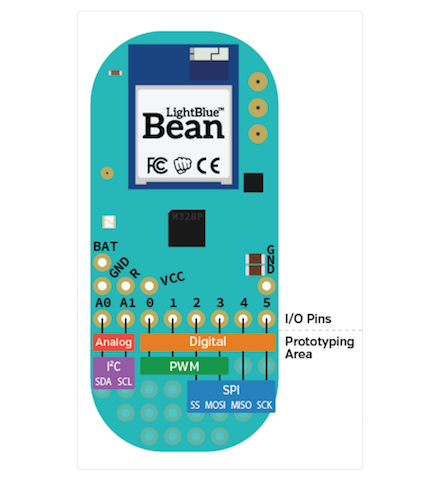


That is the Architecture of the Light Blue Bean. It would be great if I can rebuild parts of the that.

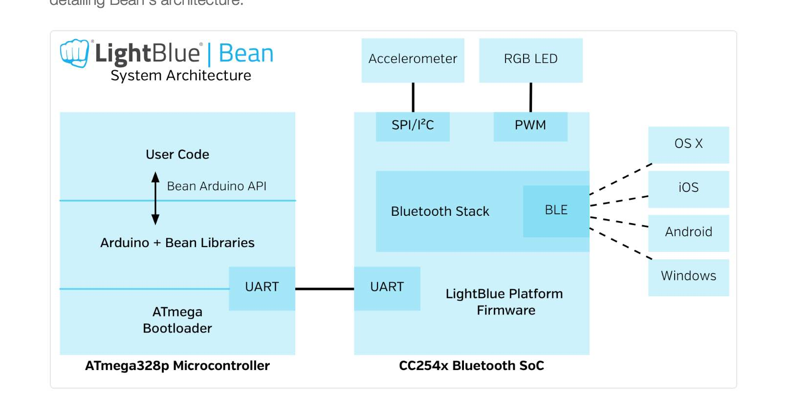


### Attiny Test

Then I tested the code with my Hall Sensor Board from Input Devices.
I got it to work but I realized I needed to get the hall sensor closer to my wheel magnet. 

### Speedinvader First Board with Coin Cell and Hall Seinsor on the Side

So I quickly adapted the hall sensor board and put the hall sensor on the side of the board and added a coin cell battery. To get everything working it took me the whole day. In the end the problem was I had not burned the bootloader. 

In the code I added that my LED are Blinking according to the RPMS.


### Speedinvader Second Board with OLED

***Update 10. June***

Today I decided to first etooth right away. As I did not have a proper Attiny Holder (I know ordered one from ebay) and I now find it easier to prototype the board in eagle and mill it right away instead with a Breadboard and a million jumper cables. 

For the OlED Screen I used a screen I bought earlier. It is a 0.96 Inch 128 x 64 OLED that supports I2C meaing I need to add I2C to my board design. For that I looked at Neils I2C Bridge design and added a 10K Pull-up to SDA and SCL. In Neils board there is only one pull-up but if I do not need the second pull-up I can easily replace it with a Zero Ohm. 


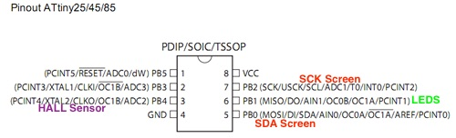


I also added a Coin Cell Battery Holder and two Screw Terminals I found in the adafruit eagle library. The display needs 3.3 to 5V but I hope it works. As my goal is to later implement bluetooth and I do not want to add a lipo charging cycle I hope I can power everything with a 3.3V coin cell. 


The process of designing, milling and soldering took me a whole day. In the end I had a copper line below my ship broke so I had to fix it with a little wire with took me almost 2 hours. Milling still takes 23 Minutes I try to get that down by making the the lines bigger and closer together. 


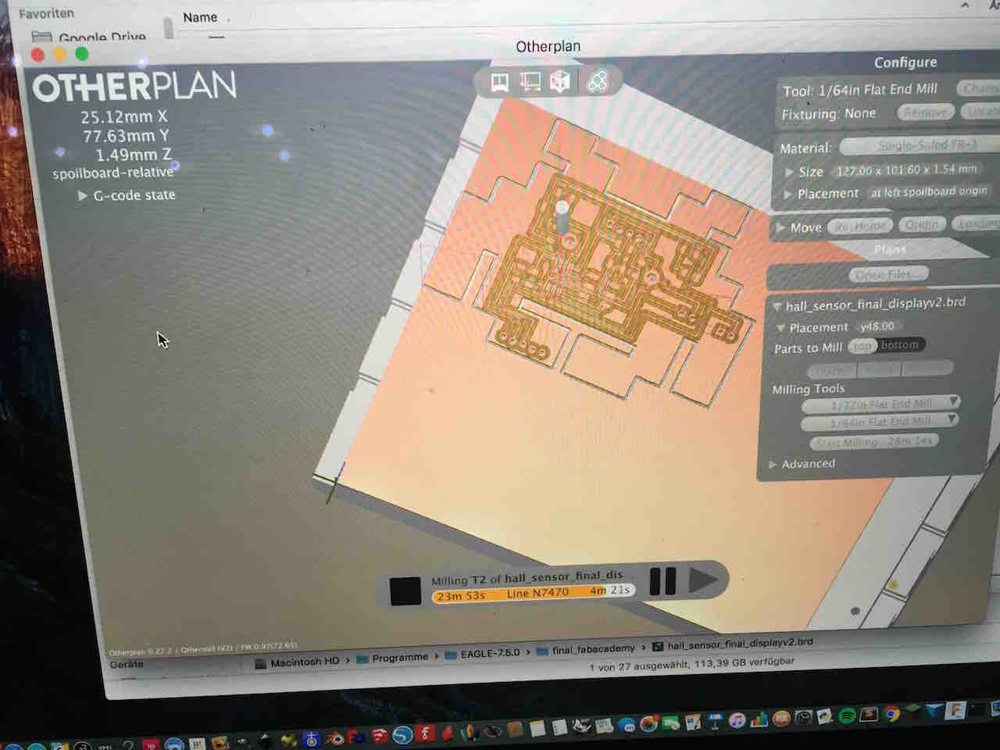
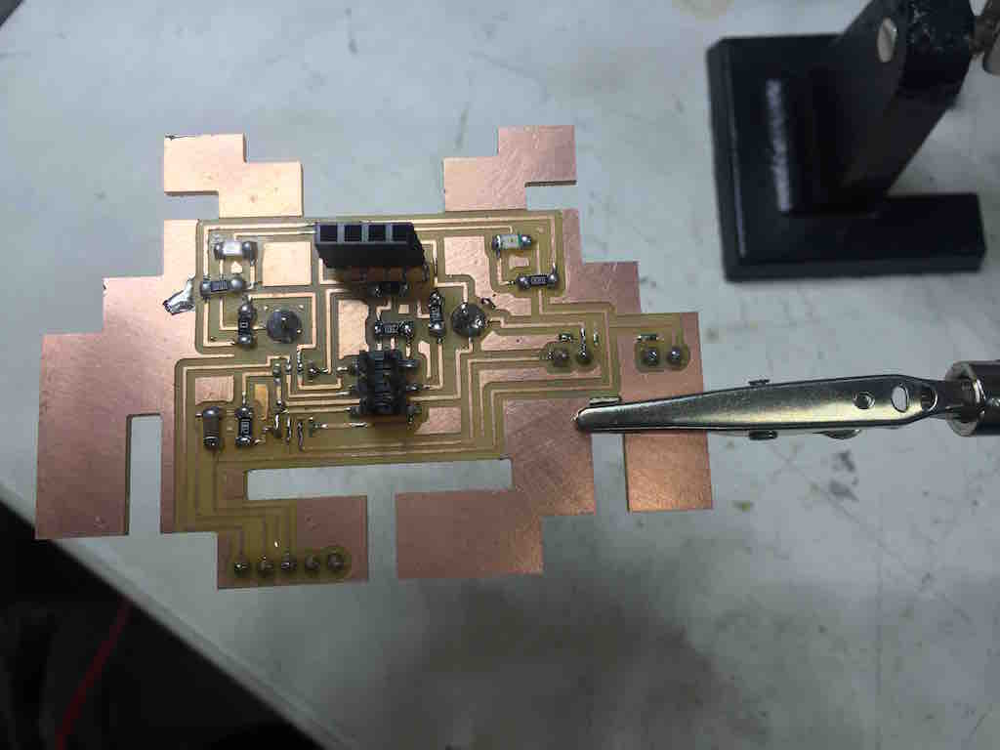
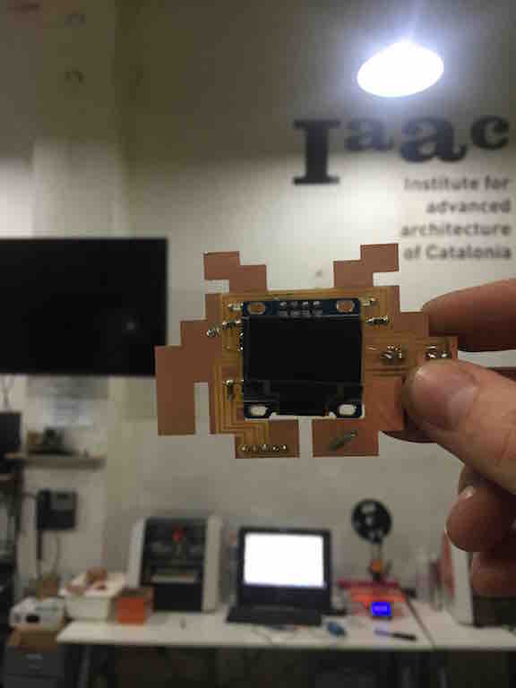


***Update 11. June***

It took me like 4 hours again to solder my Speedinvader and I needed 4 jumpers to debug it. Now I know I only should use small jumpers and not big cables and be very careful to not rip of the lines when trying to cut of the jumpers. 

After bootloading I tested the invader first with a Arduino blink code and then managed to find a code in c for the display and got it running. Still I did not got it to run with Arduino because some libraries were to recognized. They are special libaries for the Attiny from 


```
sudo make

```


```
avrdude -c avrisp2 -p t85 -U flash:w:"main.hex":a

```


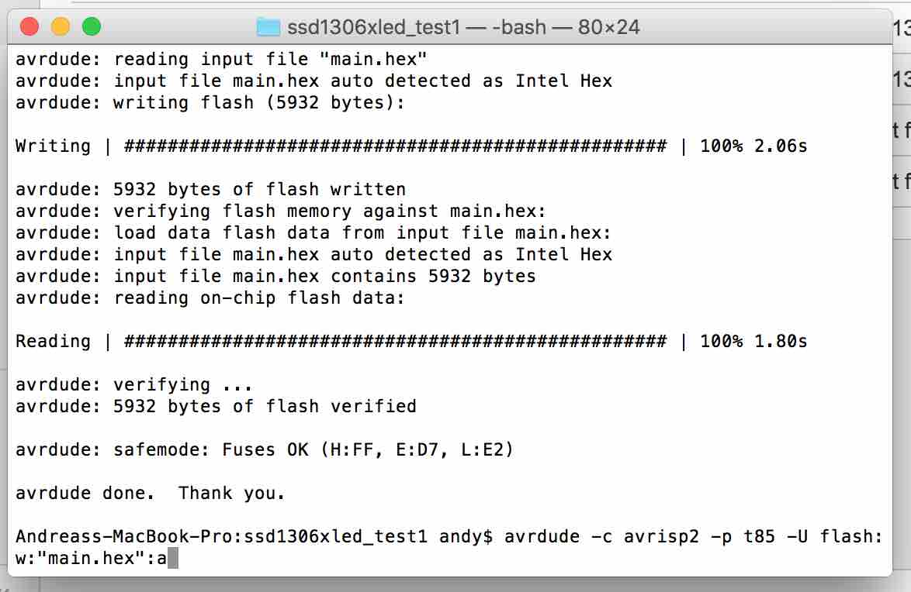

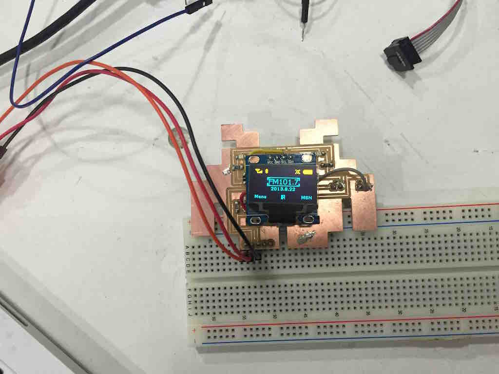

I am not sure if the coin cell works yet. So I made a new design and added a 5V voltage regulator 5V to it to get get the Volts of 2 3V Batteries from 6V to 5V.

***Update 12. June***

[This link](http://www.instructables.com/id/ATTiny85-connects-to-I2C-OLED-display-Great-Things/) from instructables was a great help in getting the Arduino code working. The two sketches and the libraries worked right away. 

I thought about an interface to show a big number in the middle of the screen but could not find a working library for a big font so I first decided to show RPM, km/h, mph and max speed in kmh.

To get from RPM to km/h you just need to measure the range of the wheel in m and multiply it with the RPMS times 3,6 to get to km/h.


Also I made a test with a power supply with 3V and 200 ma and I got the screen working so I wont need to add a voltage regulator and two 3V batteries. The datasheet of the screen says 3V to 5V. 

Update: I still did not got the screen working with only a coin cell. 

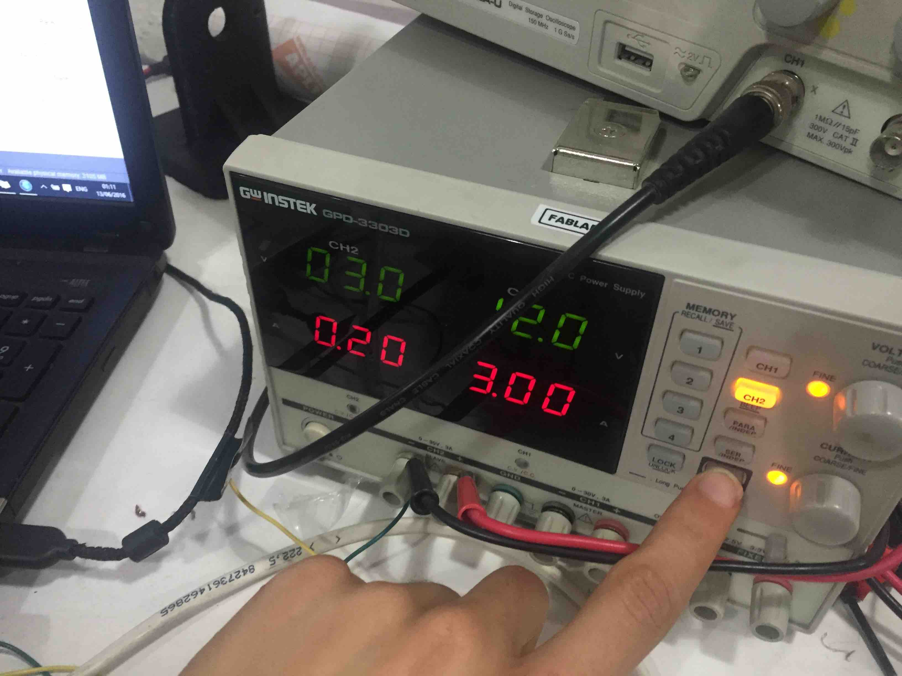

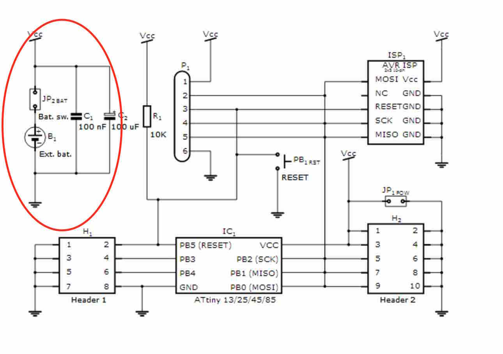

***Update 13. June***

On Monday I milled the 3rd version of my board. I added a button, and another 1uF capacitor to the design.  I was able to burn the bootloader and program the board but then suddenly I could not program the board anymore. I fixed a small break but did not find another error and could not program it anymore. 


***Update 14. June***

I had to leave Barcelona for a conference and only had time in the evening to check if the error was with the FTDI Cable or the AVR ISP. First I got the same error with another board but was then able to program it. 


***Update 16. June***

I again had to work all day at a conference and was so exhausted in the evening that I took the time to catch up on week 19 lecture videos and [final presentation presentations](http://archive.fabacademy.org/archives/2016/master/videos/06-15/index.html). 


***Update 17. June***

I am back in Barcelona! I took a very early morning flight. 
Today I want t get my final invader working and design a housing. So I checked all the connections and all worked. Ferdi helped me and at least I can now program the chip. But now the LEDs only get power when connecting the ISP Cable. Still there must be some bad solder joint. 


***Update 18. June***

Today I tried again to get my newer versions working but was not successful. But I got my first board version working and uploaded some new code. I also played around with the code and finally understood how to convert bitmaps into hex and show it on the screen. At the end of the the day I wanted to connect a voltage booster and clipped of the battery holder in the back but this was a bad idea, because the board stopped working again.

Also sometimes I cant program the board when I know that all connections are working. I read that it may be a problem with my USB port. 


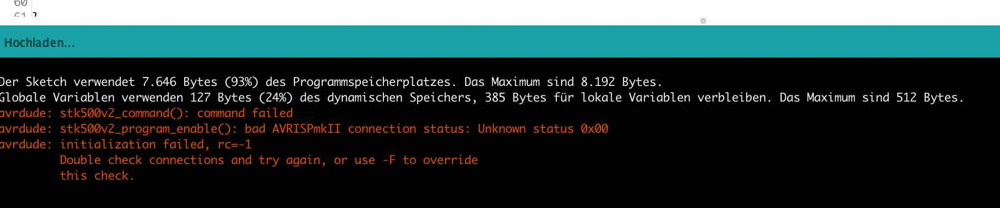

***Update 19. June***

Today is the last day to work on the final project before the presentation. I know I should have done demand side time management but the  So I will focus on the housing today the slide and the video.

I managed to finish the case for the speedinvader and got the last invader working. [Here](https://tinkercad.com/things/1azkU2S8nCk) are my design files on tikercad. I made the mistake when mirroring the component to not check that the pins are in the correct order.

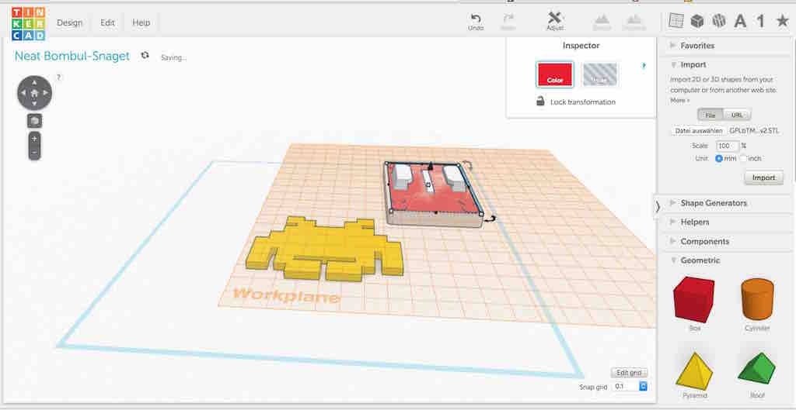
 

Now I got quite comfortable with the Attiny45/85 (with 256 and 512 bytes, 8 pins)  but it would have been easier if I would have used the ATmega328P (2KB, 27 pins) because I could used the same functions and libraries as the Arduino Uno and not look for special Attiny libraries.  

Still I think the Attiny85 is the best choice for my kind of project
[This website](http://highlowtech.org/?p=1695) and this guide on Sparfkun got my into it more. Here I read about [I2C on the Attiny85](http://playground.arduino.cc/Code/USIi2c). There they mention to use at least 4,7K pullups. But I have to find out how you can do them internally and not need to use them. The project of [Ilya](http://webboggles.com/attiny85-game-kit-assembly-instructions/) did not use pull-up also he got the screen working with 3Volts.

I am realizing that for prototyping it was not smart to do all boards in invader shape. Next time I will make it as small as possible to fit as many boards as possible on the mill.  

Also I will buy a [Tiny AVR programmer](https://www.sparkfun.com/products/11801) for future work with the Attiny.

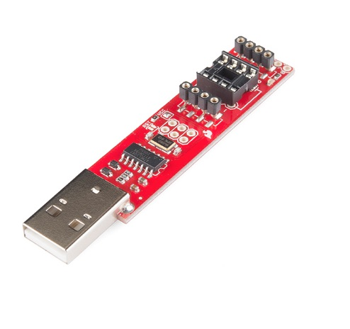


[This PDF](https://cdn.sparkfun.com/assets/e/9/1/f/5/Tiny_QuickRef_v2.pdf) from Sparkfun is great if you want to get into programming with the Attiny. 


***Update 20. June***

While documenting I watched the final [project presentations from the 17th](http://archive.fabacademy.org/archives/2016/master/videos/06-17/index.html). I really like the the [LED Board](http://archive.fabacademy.org/archives/2016/fablabtorino/students/440/presentation.png) from Torino, [soundshape](http://archive.fabacademy.org/archives/2016/opendot/students/171/presentation.png) and obviously the projects from Barcelona.[Arnau with his 1984](http://archive.fabacademy.org/archives/2016/fablabbcn2016/students/36/presentation.png), Luiz with his [drawing robot](http://archive.fabacademy.org/archives/2016/fablabbcn2016/students/20/presentation.png), [Guillaume](http://archive.fabacademy.org/archives/2016/greenfablab/students/365/presentation.png) with Aquaponics and Gregoire with his [pump](http://archive.fabacademy.org/archives/2016/greenfablab/students/13/presentation.png). I would also like to integrate a motor like Kosuke Kaneko did with his [Motorized Skateboard](http://archive.fabacademy.org/archives/2016/fablabkyushu/students/180/presentation.png) and add some lights into my board.


[Here](https://github.com/ARKopp/fabacademy2016/tree/master/final/firmware_speedinvader/firmware_speedinvader) you can find my firmware for the speedinvader so far. 

***Update 21. June***

I printed a housing all night only to realize the next day that my board is too big to fit my housing. Also I realized that I have to design a housing for my breakout board as well. 

Also I finished a slide during the night and did a [live video](http://archive.fabacademy.org/archives/2016/fablabbcn2016/students/375/presentation.mp4) of my project and presented it later to Neil.

[](http://archive.fabacademy.org/archives/2016/fablabbcn2016/students/375/presentation.png)	

***Update 7. July***


## Converting bitmaps to C Arrays

I was working late and got into the converting images into C arrays so I can display images on the screen. There are a couple of Image Converter like [this](http://www.digole.com/tools/PicturetoC_Hex_converter.php) and [this](http://www.onlinehexeditor.com/) but I did not quite understand how to use them. 

There are also software for the Mac you can download. Like [this](http://makeithappend.org/de/archives/1251). Also I went through the [adafruit tutorial.](https://learn.adafruit.com/monochrome-oled-breakouts/arduino-library-and-examples). 

And there is also bitmap to c converter for windows [here](http://www.hobbytronics.co.uk/bmp-lcd-converter).#

Finally I found the right software for me. [Its a nice bitmap to C converter]([](https://github.com/hoiberg/bitmapToC/releases)). To make a bitmap of you image you can use gimp.

Also got interested in playing music. I think it should be possible to add a little buzzer to my Attiny and play a space invader sound. 


### What is still missing?


* <del>Design and mill Hall Breakout v1</del>
* <del>Program Board v1<del>
* <del>Code for OLED Display in Arduino</del>
* <del>Add Condesator and Button v3</del>
* <del>Mill and solder board v3</del>
* <del>Design and mill Hall Breakout Double Sided</del>
* <del>Design Housing</del>
* <del>3D Print Housing</del>
* <del>make slide</del> 
* <del>make video</del> 
* Design Mold for Housing
* Mold Housing
* make a smaller board version
* send board to be made in China

* optional: Raspberry Pi Zero HAT
* optional: add Bluetooth and Radio
* optional: Make a Light blue bean hat


## Project Files

[Download](https://drive.google.com/folderview?id=0B3iYmii-HJ7Tblo1MHpuZ2stSzQ&usp=sharing) all project files of my Google Drive or from github. 


## Feedback ?

[Twitter](http://www.twitter.com/andreaskopp) me or [email me at andreasrkopp at gmail dot com](mailto:andreasrkopp@gmail.com). 


Or chat with me on gitter.

[](https://gitter.im/ARKopp/fabacademy2016?utm_source=badge&utm_medium=badge&utm_campaign=pr-badge)


[BACK to TOP](../process)
