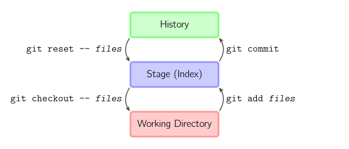

[START HERE](start) / [FINAL PROJECT](final) / [WEEK 1](week1) / [COMPUTER AIDED DESIGN](week2) / [COMPUTER-CONTROLLED-CUTTING](week3) / [ELECTRONICS PRODUCTION](week4) / [3D SCANNING & PRINTING](week5) / [ELECTRONICS DESIGN 1](week6)  / [COMPUTER-CONTROLLED MACHINING](week7) / [EMBEDDED PROGRAMING ](week8) / [MECHANICAL AND MACHINE DESIGN](week9) / [INPUT DEVICES](week10) / [3D MOULDING AND CASTING ](week11) / [OUTPUT DEVICES](week12) /  [COMPOSITES](week13) / [EMBEDDED NETWORKING & COMMUNICATIONS](week14) / [INTERFACE AND APPLICATION PROGRAMMING ](week15) / [APPLICATIONS AND IMPLICATIONS ](week16) / [INVENTION, INTELLECTUAL PROPERTY, AND BUSINESS MODELS](week17) / [PROJECT DEVELOPMENT ](week18) /

# Week 1 - Principes and Practics & Projectmanagement 

Januar 27 - Februar 3

~~~
*Weeks Assigment*

Build a personal site describing you and your final project and describe how you build the website. 

Upload website to the class archive. 

Do a git tutorial. 
~~~

##Git Tutorial

I only got into git a couple of weeks earlier and can recommend [this tutorial](http://rogerdudler.github.io/git-guide/). Some other good tutorials I found [here](http://think-like-a-git.net/) and visual guide [here](http://marklodato.github.io/visual-git-guide/index-en.html). 

I also downloaded a couple of desktop git programs like [github desktop](https://desktop.github.com/) and [tower](https://www.git-tower.com/) but decided to use the command line instead.

This are a couple of commandos you have to remember. 

`git init`  
`git clone username@host:/path/to/repository`  
`git add <filename>`  
`git commit -m "Commit message"`  
`git push origin master`

`git pull`

If you and up in vim. Type ":" and "wq" to get out of it. 

This is the basic workflow.

I created a private github repo for my files and then cloned the fablab barcelona repo as well. 

`git clone git@git.fabacademy.org:fabacademy2016/fablabbcn2016.git`
`git config --global user.name "John Doe"`

I recommend [Macdown](http://macdown.uranusjr.com/) a open source Markdown editor for Mac. 

I am travelling at the moment and I realized that its better to set up your repositories with https instead of ssh because it seems that some hotels or at my lufthansa flight ssh was blocked. 

`git remote -v`
`git remote set-url origin https://github.com/ARKopp/fabacademy2016.git`
`git remote set-url origin http://git.fabacademy.org/fabacademy2016/fablabbcn2016.git`

## My Website

### Markdown to statc html generator

Because I became quite like the Markdown languange and the documentation needs to uploaded to git lab anyway I decided to write all my documentation in Markdown and use a script to generate the html files. 

I found [this](https://github.com/mixu/markdown-styles) Markdown to static html generator with build in themes. 

That how you install it (before you need to have node js installed)

`sudo npm install -g markdown-styles`

An that is how you generate the html files. 

``bash
	generate-md --layout github --input ./ --output ../fablabbcn2016/students/375/
``

You have couple of themes to choose from. I chose the github theme.

### Preview of Website

To see how my website looks like in html I am starting a pyhton server in the fabacademy folder were I am putting my htmls files.

``bash
cd ../fablabbcn2016/students/375/
python -m SimpleHTTPServer 8000``

Then I can look at the website with under this address [http://localhost:8000/](http://localhost:8000/)

### Workflow

1. Write Documentation in Markdown in Macdown
2. put in pictures
3. make pictures as small as possible with Preview
4. push to my private git repo
5. run script to generate html
6. preview website with [http://localhost:8000/](http://localhost:8000/)
7. go to my fablabbcn2016/students/375 folder and push to gitlab

#Final Project

My idea of a [final project](final) is to build a post-it stick machine.