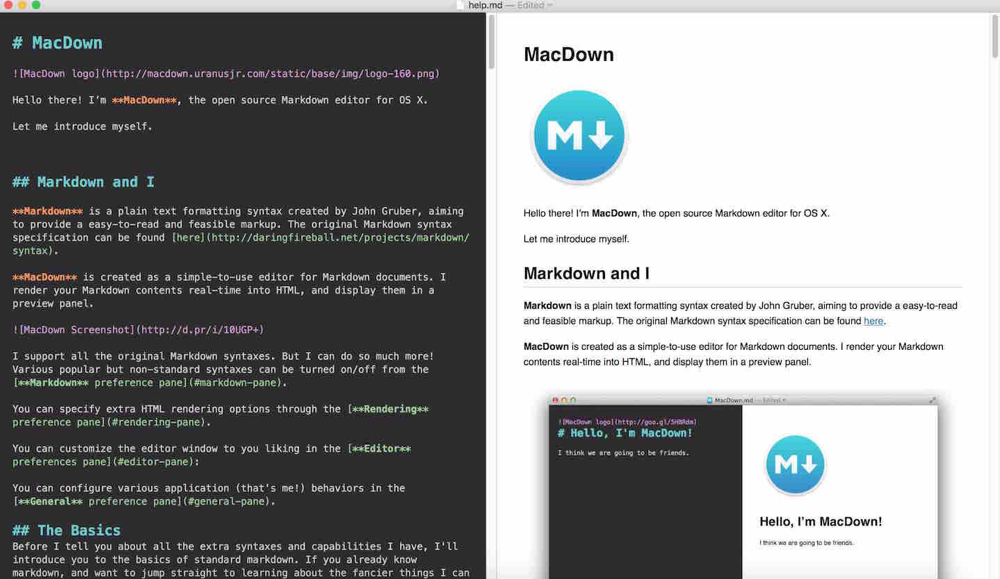

[BACK to START](../)

[FINAL PROJECT](../final) / [WEEK 1](../week1) / [COMPUTER AIDED DESIGN](../week2) / [COMPUTER-CONTROLLED-CUTTING](../week3) / [ELECTRONICS PRODUCTION](../week4) / [3D SCANNING & PRINTING](../week5) / [ELECTRONICS DESIGN](../week6)  / [COMPUTER-CONTROLLED MACHINING](../week7) / [EMBEDDED PROGRAMMING ](../week8) / [MECHANICAL DESIGN](../week9) / [MACHINE DESIGN](../week10) / [INPUT DEVICES](../week11) / [3D MOLDING AND CASTING](../week12) / [OUTPUT DEVICES](../week13) /  [COMPOSITES](../week14) / [EMBEDDED NETWORKING & COMMUNICATIONS](../week15) / [INTERFACE AND APPLICATION PROGRAMMING ](../week16) / [APPLICATIONS AND IMPLICATIONS ](../week17) / [INVENTION, INTELLECTUAL PROPERTY, AND BUSINESS MODELS](../week18) / [PROJECT DEVELOPMENT ](../week19)  

# Week 1 - Principles and Practices & Project-management 

Januar 27 - Februar 3

Lesson Link - [Principles and Practices](http://academy.cba.mit.edu/classes/principles_practices/index.html), Projectmanagement, [Video](http://connectmedia.waag.org/AcadeMany/fab-2016/01-27/), [Git Tutorial Fiore](http://archive.fabacademy.org/archives/2016/doc/gitvsmercurial.html), [Ferdis Tutorial](http://archive.fabacademy.org/archives/2016/fablabbcn2016/docu/ferdi/htm/week01_git.html#clone-archive)

~~~
*Weeks Assignment*

* Build a personal site 
* descibe you and your final project
* describe how you build the website. 

* Upload website to the class archive 

* Do a git tutorial. 
~~~

## Git Tutorial

I only got into git a couple of weeks earlier and can recommend [this tutorial](http://rogerdudler.github.io/git-guide/). Some other good tutorials I found [here](http://think-like-a-git.net/) and visual guide [here](http://marklodato.github.io/visual-git-guide/index-en.html). 

I also downloaded a couple of desktop git programs like [github desktop](https://desktop.github.com/) and [tower](https://www.git-tower.com/) but decided to use the command line instead.

A friend recommended me Xtra Finder. This way you can open a folder in Terminal by right clicking and selecting Open in Terminal.

### Create a local repository 

To create a local git folder you need to create a folder. Open the folder by right clicking in Terminal. Type the following. 

`git init`  
`git add <filename>`  
`git commit -m "initial commit"`  

### Create a remote repository

To make a remote respository create a respository on github and copy the link. 

`git remote add origin http://git ... `

`git push -u origin master`

`git clone https://...` Make local copy of remote repo

`git pull origin master` Now remote and local are in sync.
`git status` Show the working tree status
`git add .` Add all the files
`git commit -m "inital commit"` Record changes to the repository
`git push` Update remote repository

To update your remote respository you go into the folder you want to work in. Right click and open on Terminal.

`git status`  (the files that you have change are) 
 
`git add .`  (the files turn green)

`git commit -m "blaba"` 
 
`git push`  

If you and up in vim. Type ":" and "q" to get out of it. 

At fabacademy we are not using github but gitlab. So there already exists a folder for you on the fablab git hub server. You can check out gitlab by signing into it with you fablab.io account. On [http://git.fabacademy.org/](http://git.fabacademy.org/fabacademy2016/) click on fablabs.

`git clone git@git.fabacademy.org:fabacademy2016/fablabbcn2016.git`

`git config --global user.name "John Doe"`

`http://archive.fabacademy.org/archives/2016/fablabbcn2016/docu/ferdi/htm/week01_git.html#clone-archive`

I am traveling at the moment and I realized that its better to set up your repositories with https instead of ssh because it seems that some hotels or at my lufthansa flight ssh was blocked. 

Check what your remote repository is with 
`git remote -v`

Change the remote rep to the https address of github
`git remote set-url origin https://github.com/ARKopp/fabacademy2016.git` 

I still have not figured how it would work in gitlab
 
`git remote set-url origin http://git.fabacademy.org/fabacademy2016/fablabbcn2016.git`

If you want to switch back to ssh you can so with ...  

`git remote set-url origin git@git.fabacademy.org:fabacademy2016/fablabbcn2016.git`

The workflow for the fabacademy is the following. Go into the folder of the html files of your documentation. Open it in Terminal. 

`git pull`

`git add .` (its a dot)

`git commit -m "message"`

`git push`

[Here](http://archive.fabacademy.org/archives/2016/doc/gitCheatSheet.html) is also a cheat sheet that was created from one of the fabacademy student.

## My Website

### Markdown to static html generator

Because I quite like the Markdown language and the documentation needs to uploaded to git lab anyway I decided to write all my documentation in Markdown and use a script to generate the html files. As a Markdown Editor I am using  [Macdown](http://macdown.uranusjr.com/) a open source Markdown editor for Mac. 

I found [this](https://github.com/mixu/markdown-styles) Markdown to static html generator with build in themes. 

That is how you install it (before you need to have node js installed)

`sudo npm install -g markdown-styles`

An that is how you generate the html files. 

``
	generate-md --layout github --input ./ --output ../fablabbcn2016/students/375/
``

You have couple of themes to choose from. I chose the github theme.

***Update 8. Mai 2016:***

I am working on an own theme to add disqus for comments to my theme. 

### Preview of Website

To see how my website looks like in html I am starting a python server in the fabacademy folder were I am putting my html files.

``python -m SimpleHTTPServer 8000``

Then I can look at the website under this address [http://localhost:8000/](http://localhost:8000/)

### Workflow

1. Write Documentation in Markdown in Macdown
2. Take pictures and screenshots while working 
3. Use Airdrop to transfer pictures from phone to computer
4. Put pictures into folders of weeks
5. Make pictures smaller then 100KB
6. Add notes to pictures
7. Link pictures and files in Marfolder with keyboard short cut
8. Run script to generate html
9. Preview website with [http://localhost:8000/](http://localhost:8000/)
11. Go to my fablabbcn2016/students/375 folder
11. Open it in Terminal
12. Do git steps

***Update 15. April:***

Still the part where I have to transfer photos from my phone to the computer and to make pictures smaller is time consuming. Also I would like to have a Markdown editor for iphone so I can also document while not on my computer. Perfect would be voice input. 

## Final Project

My idea of a [final project](../final) is to build a robotic post-it sticking machine.

## Feedback ?

[Twitter](http://www.twitter.com/andreaskopp) me or email me at [andreasrkopp at gmail dot com](mailto:andreasrkopp@gmailcom). 

Or chat with me on gitter.

