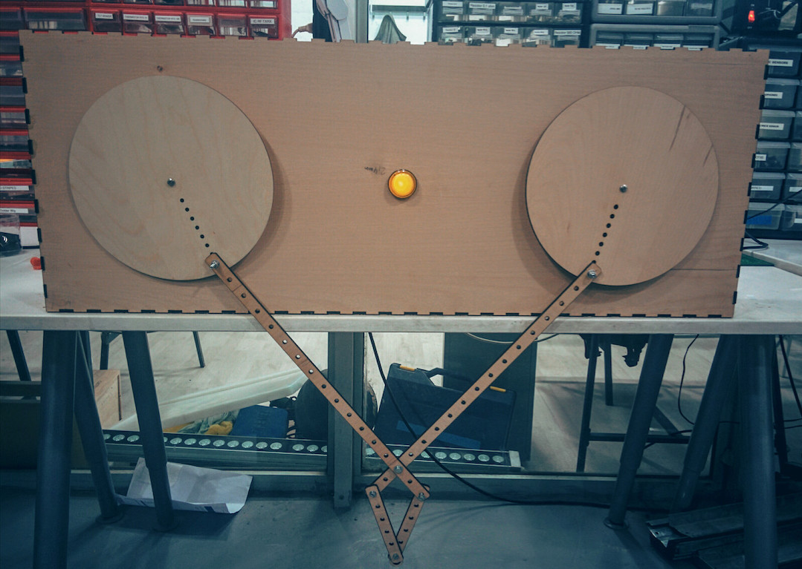
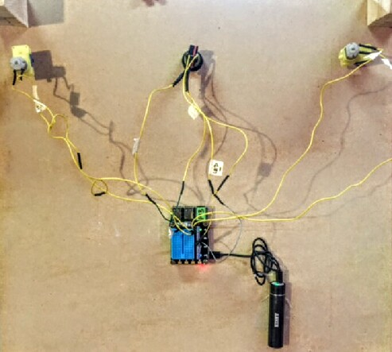
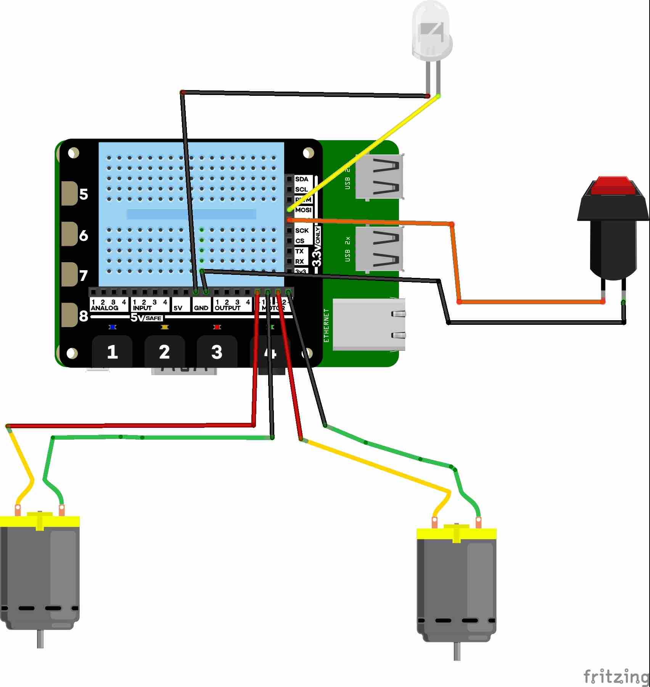
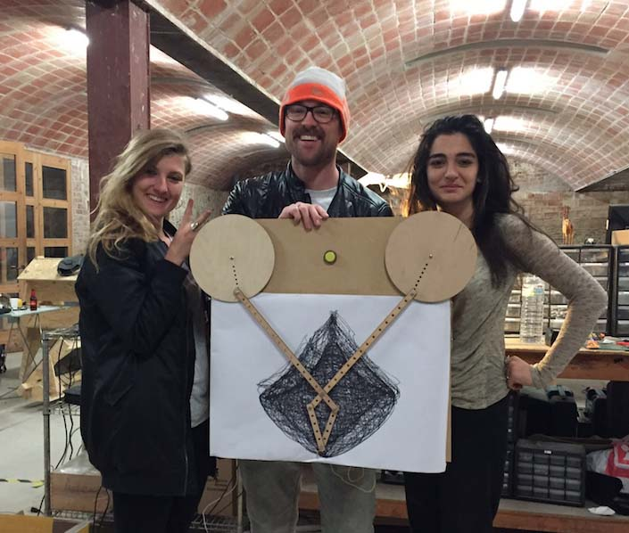
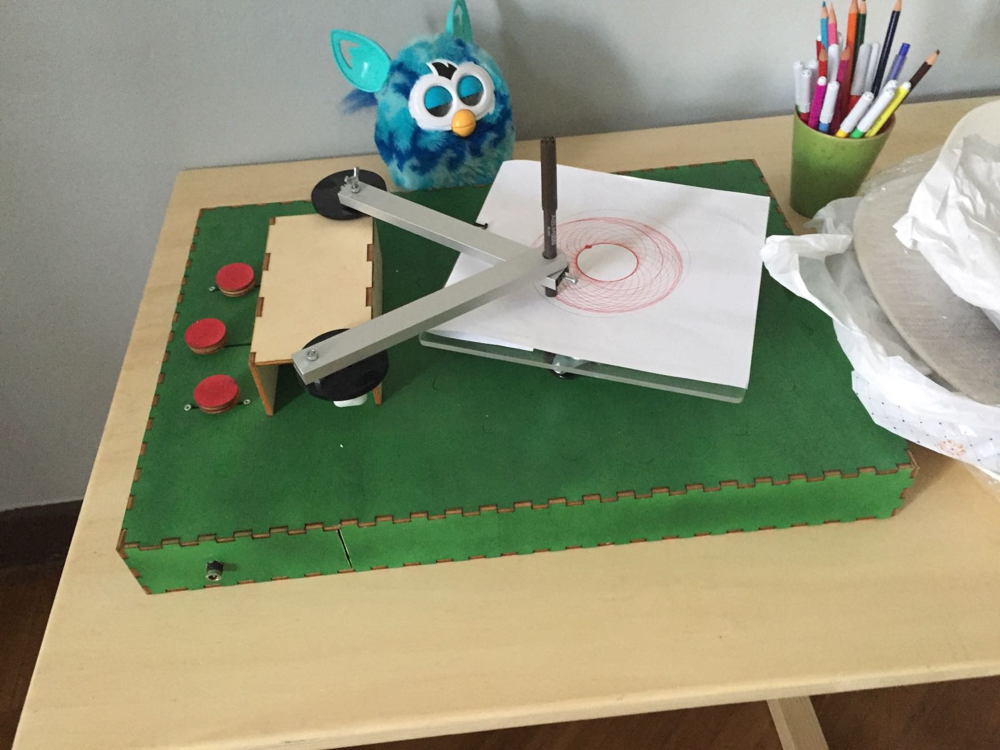

[BACK to START](../)

[FINAL PROJECT](../final) / [WEEK 1](../week1) / [COMPUTER AIDED DESIGN](../week2) / [COMPUTER-CONTROLLED-CUTTING](../week3) / [ELECTRONICS PRODUCTION](../week4) / [3D SCANNING & PRINTING](../week5) / [ELECTRONICS DESIGN](../week6)  / [COMPUTER-CONTROLLED MACHINING](../week7) / [EMBEDDED PROGRAMMING ](../week8) / [MECHANICAL DESIGN](../week9) / [MACHINE DESIGN](../week10) / [INPUT DEVICES](../week11) / [3D MOLDING AND CASTING](../week12) / [OUTPUT DEVICES](../week13) / [COMPOSITES](../week14) / [EMBEDDED NETWORKING & COMMUNICATIONS](../week15) / [INTERFACE AND APPLICATION PROGRAMMING ](../week16) / [APPLICATIONS AND IMPLICATIONS ](../week17) / [INVENTION, INTELLECTUAL PROPERTY, AND BUSINESS MODELS](../week18) / [PROJECT DEVELOPMENT ](../week19)  


# Week 10 - MACHINE DESIGN

 April 6 - April 13

[Lecture](http://academy.cba.mit.edu/classes/machine_design/index.html), [Video](http://archive.fabacademy.org/archives/2016/master/videos/04-06/index.html)

~~~
*Weeks Assignment*

This week was a group project.

* automate your machine
* document the group project and your individual contribution


~~~

To automate our primograph we decided to use a raspberry pi and a motor controller board. The video of the working machine you find on the [group page](http://archive.fabacademy.org/archives/2016/fablabbcn2016/docu/ferdi/htm/mtm_primograph.html) and on the pages of [Norma](http://archive.fabacademy.org/archives/2016/fablabbcn2016/students/284/10machinedesign.html) and [Elissa](http://archive.fabacademy.org/archives/2016/fablabbcn2016/students/79/) you can find the documentation about how they made the hardware like the box and the gears. Here you can find my part of the project which was electronics and software and a little introduction using the pi and the explorer hat.


## Bill of Materials


* Raspberry Pi 3
* Explorer Hat Pro
* 2 X DC Motors 
* Push Button with LED
* Software to burn the raspberry pi image ([PiBaker](http://www.tweaking4all.com/hardware/raspberry-pi/macosx-apple-pi-baker/))

## Design


The idea is to hit a button and in the middle of our Primograph and be able to change the speed of the motors which moves then the Primograph and draws patterns on a sheet of paper. 





## Electronics




I connected the two motors two the explorer hat board and then the button to pin 9 (MISO) and the led in the button to pin 10 (MOSI). I made this software with Fritzing. Its free to use. Download it [here](http://fritzing.org/download/) and think about a little donation to help the guys out. 




## Code


The Explorer HAT uses an output driver chip called the [ULN2003A](http://www.st.com/web/en/resource/technical/document/datasheet/CD00001244.pdf), which contains a set of transistor pairs called a Darlington Array. It transforms the small logic signal of the Pi into something capable of driving much bigger loads, such as motors, steppers, lights and more.


After a couple of ours wondering why my output does not work I found this:

> The 4 outputs on Explorer can sink 5V, but not source. This means you need to connect your load to one of the 5V pins, and then to the output. When you turn the output on it will connect your circuit to ground, allowing current to flow and your load to turn on. This is the opposite of using a bare Pi GPIO pin, where you might connect to the pin and then to ground; keep this in mind!

In the meantime I have already connected the Button and the Led of the Button to MISO (pin9) and MOSI (pin10). 

The complete code you find here and and under Project Files. What it does is when you hit the button you start the motor and when pressing it again you make the motor go faster until its maximum speed and then you turn in off again.  

```
import explorerhat
from gpiozero import Button, LED, Motor, Robot, Buzzer
from time import sleep


button = Button(9)
led1 = LED(10)
#buzzer = Buzzer(17)

#motor1 = Motor(forward=19 , backward=20) #gpio zero motor1
#motor2 = Motor(forward=21 , backward=26) #gpio zero motor2

#robot = Robot(left=(19, 20), right=(21, 26))


#the explorer hat has already some motor functions build in
#invert() - Reverses the direction of forwards for this motor
#forwards( speed ) - Turns the motor "forwards" at speed ( default 100% )
#backwards( speed ) - Turns the motor "backwards" at speed ( default 100% )
#speed(-100 to 100) - Moves the motor at speed, from full backwards to full forwards

#speed_levels = [0, 25, 50, 75, 100]
speed_levels = [0, 0.25, 0.5, 0.75]

active_speed = 0


def button_pressed():
        print("Button pressed")
        led1.on()
        explorerhat.light.toggle()

        global active_speed
        active_speed = (active_speed + 1) % len(speed_levels)
        explorerhat.motor.forwards(speed_levels[active_speed]) #with explorerhat
        #motor1.forward(speed_levels[active_speed]))   #with gpio zero Motor
		#motor2.forward(speed_levels[active_speed]))
		#robot.forward = (active_speed + 1) % len(speed_levels)

button.when_pressed = button_pressed

while True:
       sleep(5)


```


### Control the Motor

Also I looked at the Data Sheet of the Motor Driver with is a Dual [H-Bridge](https://en.wikipedia.org/wiki/H_bridge) Current Control Driver [DRV8833PWP](http://www.ti.com/lit/ds/symlink/drv8833.pdf) and I realized that I could not only control DC Motors but also Stepper Motors and I am also able to control my speed with [PWM](https://en.wikipedia.org/wiki/Pulse-width_modulation) which is the technique by which you control the speed by turning the motors on an off very fast. 


These are the commands for the Motor I can use. 

invert() - Reverses the direction of forwards for this motor  
forwards( speed ) - Turns the motor "forwards" at speed ( default 100% )  
backwards( speed ) - Turns the motor "backwards" at speed ( default 100% )  
speed(-100 to 100) - Moves the motor at speed, from full backwards to full   forwards


### Make everything boot on startup

Because I wanted to make the pi battery powered and make the machine portable I made the program start on startup.

For that you you just to the following in the terminal in your pi:


```bash
sudo crontab -e
```

insert code with ... 

```
i
```

```cron
@reboot python /home/primogrogaph/motortest4.py
```




***Team Primograph - Eva, Me and Elissa at Valldaura after just finishing the machine.*** 


We were just happy to have something working. When I was visiting the Fablab Turin is saw another primograph version at Casa Jasmina. They just made the gears much smaller (so you dont have so much wobbling around) and they put the motors on the side of the box and made the gears out of plastic and the pencil holder out of aluminum.



## Project Files 

[primograph.py](./files/primograph.py)

[primograph_schematic.fzz (fritzing file)](./files/primograph_schematic.fzz)


## Learnings

* read documentation in details
* finally made a schematic in Fritzing

## Feedback

[Twitter](http://www.twitter.com/andreaskopp) me or [email me at andreasrkopp at gmail dot com](mailto:andreasrkopp@gmail.com).


Or chat with me on gitter.

[](https://gitter.im/ARKopp/fabacademy2016?utm_source=badge&utm_medium=badge&utm_campaign=pr-badge)


[BACK to TOP](../week10)