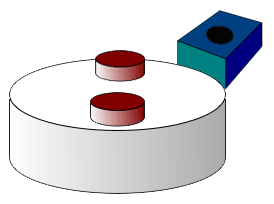
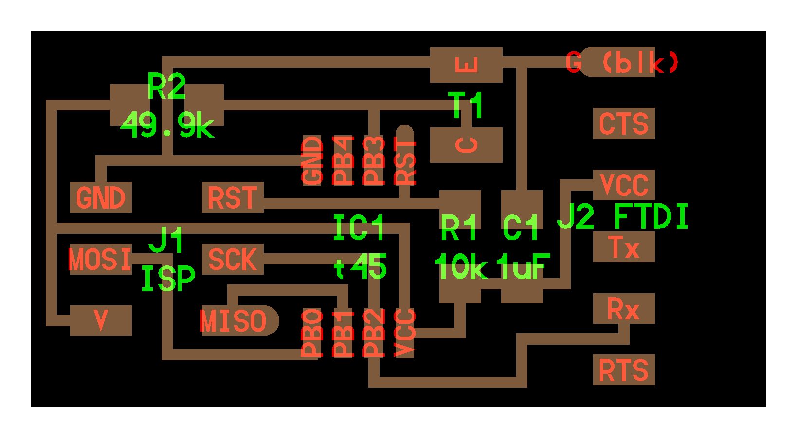

[BACK to START](../)

[FINAL PROJECT](../final) / [WEEK 1](../week1) / [COMPUTER AIDED DESIGN](../week2) / [COMPUTER-CONTROLLED-CUTTING](../week3) / [ELECTRONICS PRODUCTION](../week4) / [3D SCANNING & PRINTING](../week5) / [ELECTRONICS DESIGN](../week6)  / [COMPUTER-CONTROLLED MACHINING](../week7) / [EMBEDDED PROGRAMING ](../week8) / [MECHANICAL DESIGN](../week9) / [MACHINE DESIGN](../week10) / [INPUT DEVICES](../week11) / [3D MOLDING AND CASTING](../week12) / [OUTPUT DEVICES](../week13) / [COMPOSITES](../week14) / [EMBEDDED NETWORKING & COMMUNICATIONS](../week15) / [INTERFACE AND APPLICATION PROGRAMMING ](../week16) / [APPLICATIONS AND IMPLICATIONS ](../week17) / [INVENTION, INTELLECTUAL PROPERTY, AND BUSINESS MODELS](../week18) / [PROJECT DEVELOPMENT ](../week19)  

# Week 11 - INPUT DEVICES
April 13 - April 20 

[Lecture](http://academy.cba.mit.edu/classes/input_devices/index.html), [Video](http://archive.fabacademy.org/archives/2016/master/videos/04-20/index.html)


~~~
*Weeks Assignment*

* measure something
* add a sensor to a micro controller board that you have designed and read it

~~~

## Hall effect Sensor Board

I was waiting for this assignment as I already wanted to measure the speed of my penny board for some time so I decided to make the Hall effect Sensor Board.

First I looked in the Fab Academy Inventory for the parts number of the Hall Sensor called A1301 from Allegro with the Part Number 620-1021-1-ND and then I looked on the Digikey website for the [datasheet](http://www.digikey.de/product-search/de?keywords=620-1021-1-ND). If you would order it from Digikey Germany a sensor would be 1,77€ when you buy ten the cost would be 1,38€.


### The Hall Effect (part 2 on the [Output](../week13) page)


The Hall Effect describes a voltage difference across an conductor whenever a magnetic field is applied in a direction prependicular to the flow of the current of the conductor.

This means whenever the hall sensor detects a magnet it outputs a High Voltage to its Output pin (VOUT). So by clueing a magnet to the wheel of my pennyboard and putting the Hall Sensor Board next to it I can measure the times I get an Output and then with the radius of my wheel I can calcualte the speed of my board in m/s and km/h.

After reading the datasheet I understood that the Hall Sensor A1301 I got has a maximum Output voltage of 50% of the input Voltage and the Output Voltage proportional to the magnetic field supplied. So I decided to use a neodyne magnet to make sure I get a good output. 





### Bill of Materials

SMD Components for the Hall Sensor:	

* IC2 A1324 (SOT-23) (Hall Sensor)
* FTDI Connector
* 2x3 ISP Connector
* Attiny45
* 10k Resistor
* 1uF Capacitor
* neodyn magnet
* a skaeteboard

I also decided to add 2 LEDs.

* 2 X LED green
* 2 X Resistor 499 Ohm 


Neils design I started with.


### My Schematic


I got all the components together and added them to my schematic. I just  could not find the hall sensor at first in eagle.  Finally I looked in the datasheet and found that the name for the hall sensor is A1324-26 or SOT-23. With SOT-23 I found it at last. I  decided this time to also connect all the components to understand the schematic better. The LEDS I connected to MISO and to MOSI. Also I added GND and VCC to all the components. I had to look in another library for them called Supply1.


### Setting up your libraries correctly

After that problem of not finding the components I did some more research into how I can set up my libraries correctly. I figured out that I have to click on the button "load all libraries". I also installed the adafruit library. [This tutorial](https://learn.sparkfun.com/tutorials/how-to-install-and-setup-eagle/using-the-sparkfun-libraries) on sparkfun helped me out. 
And now I finally see all the libraries wenn I click on add components. 


### Designing the traces

To make things a bit more fun I wanted to make a space invader design of my board. So I first drew a rough design with the eyes on top but I did not manage to connect all the components without using 0Ohm Resistors so I took Neils Design as a guideline and went from there. I also put the leds in the bottom. Then I did a first export and overlaid it with a space invader in gimp. I realized I need much more practice in gimp. I could not use photoshop because I do not have a license anymore. 


After like 15 iteration going back and forth between eagle and gimp making the traces smaller and splitting up the pads I finally got my final space invader hall sensor board Version1 at the end of the day.


To get the design through the Design Rules I had to make the traces smaller. Still I did not manage to go through the hall sensor with the ground but I will fix that later with my knife.  


###  Prepare and Mill

My first try was a fail as I used 8mil in eagle Design Rules instead if 16 mil so the traces where to small. 


So I changed the Design Rules to 16 mil and exported the boad again and did the gimp operation.


### Postprocess, Stuffing and Soldering

***Update 23. April***

Finally in Valldaura on Saturday I finished stuffing and soldering the Invader. 

Before soldering I used my knife to get rid of some thin copper in between the traces. 


I think I got these problems because I made my traces thinner and then I would need to put in fabmodules that I want more the 50% overlap. 

### Connecting the Cables

This time we are using Rx, 5v and GND of the FTDI cable and connect them to the Invader.  


### Flash Attiny with Neils C code

For programing I saved the make, the c and the python file from the academy site in one directory and opened the folder in Terminal.

```
sudo make -f hello.mag.45.make program-usbtiny
```

and it worked. 

 


### Program Attiny with Neils Python Code

Then I tried to run the python program.

I needed to install brew, python and pyserial

```
brew install python
```


```
python hello.mag.45.py /dev/tty.
```

And then hit TAB to autocomplete your serial port. In my case it was this. 

```
python hello.mag.45.py /dev/tty.SLAB_USBtoUART
```

But I got an error that the serial modul is not installed. So I installed it. 


```
sudo easy_install pyserial
```


Now I am getting an error that the port is not working.


After not getting it to work with my FTDI Cable I used a different Cable and got it to worked. 

***Update 30. April 2016:***

It was not the cable I have just connected the pins wrongly. 

```
python hello.mag.45.py /dev/tty.usbserial
```


Also when I put a magnet close to it it worked. 


To show the output of the sensor I installed [python-tk](https://wiki.python.org/moin/TkInter) before  which is a python Web User Interface.


### Change the code to turn on the LEDs

Ok the next step is to look into the C ode Neil and change it to turn on my LED. I looked at the C Code but I still understand too little C so I decided to switch to the Arduino IDE. 

First I looked at the [Attiny45 Datasheet ](http://www.atmel.com/images/atmel-2586-avr-8-bit-microcontroller-attiny25-attiny45-attiny85_datasheet-summary.pdf) to find out the pin Numbering and then also googled what would be the pins then in Arduino.  

I remember I connected the LEDs to MISO and MOSI which would be Leg6/Pin 1 and Leg5/PIN0.


I opened the Ardunio IDE, chose Platine --> ATtiny x5 series, Chip --> Attin45, Clock --> 8Mhz internal (standard is 1mhZ), Port --> dev/cu.SLAB_USBtoUART and --> Programmer USBtinyISP. 

The upload workded but I do not get the LEDs to turn on. I tried every pin. I think that is a great strategy to find the the right pin. 

 

So first I checked the the LEDs again. I have soldered them correctly with the Green Line to the Ground. So I check the Value again. I used red Led and after looking into the [Fabacademy Inventory](https://docs.google.com/spreadsheets/d/1U-jcBWOJEjBT5A0N84IUubtcHKMEMtndQPLCkZCkVsU/pub?single=true&gid=0&output=html) I found the Red Led had the number 160-1167-2-ND. Looking that up on the digikey website I found the Forward Voltage is 1.8 V and the forward current is 40 mA which resulted in a Resistor of 82 Ohms and I am using 499 Ohms at the moment so I will change the resistor to 100 Ohms. 

In [Output Devices](../week13) I resolved that issue finally and got the LEDs to light up. 


## Otherduino

I already tried to cut the Otherduino as a second project with my new othermill but I used only a once sided FR2 board and the design was two sided. I only used the mill for two cuts but the otherplan software is great. You can directly use the brd files from Eagle and do not have to prepare traces and outline images in gimp or photoshop.


I will try again when I am home in Munich. There is a great [instructable](http://www.instructables.com/id/Unlimited-Arduino-clones-the-Otherduino/?ALLSTEPS) for it. 

**Update 3. Mai 2015:**

Now I got a 2 sided FR2 and I tried to cut the Arduino again. It cut beatfifully with the Othermill I just had to postprocess a little. The machine is great it tells you when to change tool and you can easily produce two sided PCBs

**The process with the Othermill:** 


Bill of Material (all through hole components)

* Circuit board, double-sided
* Clock crystal, 16MHz
* Resistor, 10K*
* 2x Capacitor, 0.1uF
* 2x Capacitors, 22pf
* LED, amber and green or pick your two favorite colors*
* Resistors, 220 ohm (2)*
* Male header, 6-pin, right angle
* Female headers, 20-pin, straight (2)
* ATmega328 microcontroller with Arduino bootloader 
* Chip socket, 28-pin

I did not buy any of the components but looked around at my used electronics and found all the parts. 

First I soldered the Vias which are the connections between the bottom and the top. 


The Otherduino next to my first [Arduino Duemilanove from 2009](https://www.arduino.cc/en/Main/arduinoBoardDuemilanove) which I took the ATmega328 chip and the 16 mhz clock from. 


Then I soldered the chip and the other components. At first I soldered the chip wrongly so I had to desolder it and resolder it.


I checked everything put I could not upload a sketch yet. 


***Update 23. Mail 2016***

I checked all connections and was able to upload a sketch but could not get the light to blink.

I will try to get anothter light to blink tomorrow.


Optional external power materials:

* DC barrel jack, 2.1mm if you want to connect to a wall-wart style power supply
* Regulator, 5V if you want to regulate the wall jack or other power supply to 5V; some are already 5V
* Regulator, 3.3V if you want the option of 3.3 volts. If you want a barrel jack, the 5V regulator is also required.
* Capacitor, 10uF* for each regulator; you'll need two if you're using both regulators

## AAduino

In this week I saw an article on techcrunch of an Arduino in a AA Battery case.

I am also getting together all the components to make [this arduino](https://github.com/kanflo/aaduino) as well. 


* 1/100 flat and mill (
* [x] double sided PCB
* [x] ATMega328p --> [digikey](http://www.digikey.com/product-detail/en/atmel/ATMEGA328P-AUR/ATMEGA328P-AURTR-ND/2357086))
* [ ] temp sensor DS18B20 -> [digikey](http://www.digikey.com/product-detail/en/maxim-integrated/DS18B20/DS18B20-ND/420071)
* [x] 1 x 0603 10K resistor
* [ ] 5 x 0603 0.1uF ceramic capacitors
* [ ] 1 x 0603 1uF ceramic capacitor
* [x] 0603 10uF ceramic capacitor
* [ ] SMT ceramic resonator 16.0MHz
* [x] 2x3 Header
* [x] 3x1 Header
* [ ]  RFM69C Sub-GHz transceiver module


***Update 19. Mai 2016:***

After doing almost all output device boards I got a better understanding of Eagle. I think taking a design of somebody else and look for the components and then change it is a great way to get even a step further. 


[Here](https://nathan.chantrell.net/20130923/tiny328-mini-wireless-arduino-clone/) are all the files and a good explanation. 


## Other Input Devices I want to do later

### Switch


* Attiny45
* Switch
* 2x3 Connector
* FTDI Connector
* 10k 
* 1uF

### Motion


* Attiny45
* FTDI
* 2x3 ISP
* 10k
* 1uF
* HC-Sr04

### Distance


* HC-SR501
* Attiny45
* 1uF
* 10k
* FTDI
* 2x3 ISP


### Temperature


* 4x10k
* 1uF
* FTDI
* Attiny45


### Light



* 49.9k
* Attiny45
* 10k
* T1
* 1uF

### Acceleration 


* ADXL343
* 3 x 10K
* 3V Regulator
* 2x3 ISP Connector
* 1uF
* FTDI


### Sound


* FTDI 
* Attiny45
* 2x3 ISP
* 4 x 10k
* O Ohm
* 3x  1 uF
* 

### Step Response

#

* 2x2 ISP
* 2x3 ISP
* Attiny 45
* 10K
* 1uF
* 1M
* FTDI

## Project Files

[Download](https://drive.google.com/folderview?id=0B3iYmii-HJ7TaWk0RDZWTGktM00&usp=sharing) all project files from this assignment from my Google Drive.


## Learnings

 * Deeper knowledge in Gimp now
 * Code in C
 * Calculate LED Resistors
 * Solder Vias
 * Mill a two sided board
 * Troubleshot a PCBr


## Feedback

[Twitter](http://www.twitter.com/andreaskopp) me or [email me at andreasrkopp at gmail dot com](mailto:andreasrkopp@gmail.com).

Or chat with me on gitter.

[](https://gitter.im/ARKopp/fabacademy2016?utm_source=badge&utm_medium=badge&utm_campaign=pr-badge)
