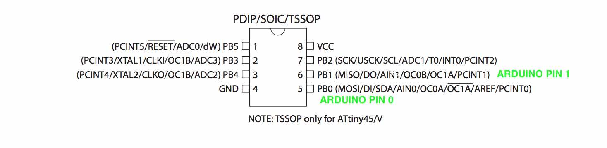
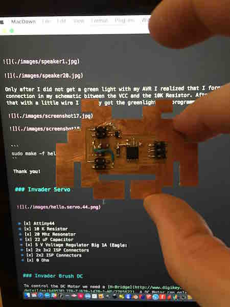

[BACK to START](../)

[FINAL PROJECT](../final) / [WEEK 1](../week1) / [COMPUTER AIDED DESIGN](../week2) / [COMPUTER-CONTROLLED-CUTTING](../week3) / [ELECTRONICS PRODUCTION](../week4) / [3D SCANNING & PRINTING](../week5) / [ELECTRONICS DESIGN](../week6)  / [COMPUTER-CONTROLLED MACHINING](../week7) / [EMBEDDED PROGRAMING ](../week8) / [MECHANICAL DESIGN](../week9) / [MACHINE DESIGN](../week10) / [INPUT DEVICES](../week11) / [3D MOLDING AND CASTING](../week12) / [OUTPUT DEVICES](../week13) / [COMPOSITES](../week14) / [EMBEDDED NETWORKING & COMMUNICATIONS](../week15) / [INTERFACE AND APPLICATION PROGRAMMING ](../week16) / [APPLICATIONS AND IMPLICATIONS ](../week17) / [INVENTION, INTELLECTUAL PROPERTY, AND BUSINESS MODELS](../week18) / [PROJECT DEVELOPMENT ](../week19)


# Week 13 - OUTPUT DEVICES

May 10

[Lecture](http://academy.cba.mit.edu/classes/output_devices/index.html), [Video](http://archive.fabacademy.org/archives/2016/master/videos/04-20/index.html)


~~~
*Weeks Assignment*

* add an output device to a micro controller board you've designed 
* program it to do something

~~~

For this assignment I decided to get the LEDs of my space invader to work and make a second version with two RGB LEDs. In the end I did all output devices and made a little invader army.


## Change the code to turn on the LEDs

For [Input Devices](../week11) I had made a space invader but failed to get the LEDs to turn on. 

I first checked if I had soldered them correctly with the Green Line to the Ground. And I had. I also checked the Resistor Value again. I used the red LED and after looking into the [Fabacademy Inventory](https://docs.google.com/spreadsheets/d/1U-jcBWOJEjBT5A0N84IUubtcHKMEMtndQPLCkZCkVsU/pub?single=true&gid=0&output=html) I found the Red Led had the number 160-1167-2-ND. Looking that up on the digikey website I found the Forward Voltage is 1.8 V and the forwward current is 40 mA which result in a Resistor of 82 Ohms and I am using 499 Ohms at the moment so I will change the resistor to 100 Ohms. 

***Update 8. Mai 2016:***

I changed the Resistors from 499 Ohm to 100 Ohms and finally got the invader eyes to light up! But the LEDs I connected to and MOSI and MISO which turned out to be Pin 0 and Pin 1 in then Arduino IDE.




***Update 14. Mai 2016:***

Next I wanted to get finally get my hall effect Sensor working. The sensor has 3 legs, VCC, GND and VOUT which I connected to PB4. 


Because I still did not learn enough C I looked for some Arduino Code. 

But I found [some code](http://playground.arduino.cc/Code/HallEffect) on the Arduino Website and some other code [here](http://www.hobbytronics.co.uk/arduino-tutorial11-hall-effect) and [here](http://www.instructables.com/id/DIY-bike-tachometer/step3/Upload-code/).

Still I was not able to get any reading. 

I check with the python file from Neil and with a different cable but still no reading. So I think I destroyed my sensor somehow. I will check the sensor on an Arduino to see if its really the sensor. 


***Update 22. Mai 2016:***

I finally found the time to revise my space invader board and added a through hole connector, I think the chance that they break off is much lower then the ISP Connectors that only have a connection with the top of the board. You can find the design in the project download in input devices. I think I found this connector in the sparkfun library (Eagle: 1x5 Lock).


http://www.instructables.com/id/Hall-effect-sensor/step2/Range-of-a-Hall-effect-Sensor/

http://www.instructables.com/id/Arduino-Skateboard-Speedometer/step3/The-Arduino-Code/

http://www.instructables.com/id/DIY-SPEEDOMETER-AND-ODOMETER/step3/THE-CODE/


## Invader RGB

Next I wanted to turn my invader into an RGB Invader. Also I wanted to avoid doing the fabmodules step and the step to turn create the black and white images. I first Vectorized my space invader image with Inkscape and exported as dxf and imported into Eagle in the Dimension Layer with File>Import>DXF.


I started with Neils Design and added another LED and resistor.  


### Bill of Material

* [x] 1 x RGB Led
* [x] 2 x 1k Resistor 
* [x] 1 x 499 ohm
* [x] 1x 1Ok Resistor
* [x] 1 x 1uF Capacitor
* [x] 1x Attiny 45
* [x] 1x 2X3 AVR ISP Connector
* [x] 1x 2X2 AVR ISP Connector (Eagle:PINHD-2x2-SMD) <--- look exactly with this name when your searching
* [x] 1x LM3480IM3-5.0 Voltage Regulator (Eagle: RegulatorSot23)
* [x] 1x 100 Ohm Resistor
* [x] 1x Red LED


### Schematic and Board Design


First I looked at the Datasheet of the RGB LED to find how I need to connect it. 


I connected it like this. 


Then I added all the parts to the board. I had some problems to find the Voltage Regulator and the 2x2 Connector but managed in the end. 

It was the first time I used the 5V Voltage Regulator 100MA (LM3480IM3-5.0/NOPBCT-ND) so I looked it on Digikey and found out the you can put in as much as 30V and it always puts out 5V.


***Update 17. Mai 2016***

After doing all the output board I realized that their are two different 5V voltage regulators in the Inventory one small one with a small 100mA footprint (LM3480IM3-3.3/NOPBCT-ND)  ... 


and a 1A one (LM3480IM3-5.0/NOPBCT-ND) with a big foot print. 


All the boards are usign the small one only the SERVO board is using the big one. 


For my RGB Board with the extra LED I did not manange to connect the RGB and the LED with out adding a O Ohm Resistor and two jumpers. 


In the end I did a new board just with one RGB LED. 


```
sudo make -f hello.speaker.45.make program-avrisp2

```


### Milling

I saved the Brd file and milled with my Othermill.  

### Stuffing and Programming 

Then I stuffed the board and tried to program it but got an error. Only after checking all connections and using another ISP I found that I had positioned the RGB LED wrongly. The little white corner is not the Power put R for Red. In my case it is on the right top side. 


For Programming you download the [Make](http://academy.cba.mit.edu/classes/output_devices/LCD/hello.LCD.44.make) and the [C](http://academy.cba.mit.edu/classes/output_devices/LCD/hello.LCD.44.c) file into a folder and open them in Terminal. Because I stepped on my FabISP and damaged the connector I used the AVRisp I bought. I also find it quite difficult to remember the GND and VCC Side of the Cable of my FabISP.  

I would love to do some screen printing soon to print lables on the boards before I mill them. 

```
sudo make -f hello.RGB.45.make program-avrisp2

```
And it was successful! Because I could not get my board to work but the second board without the extra LED worked.


The first board I also tried to fix but damaged the Pads of the LED when desoldering and could not fix it again.


### Invader LCD Screen


* [x] Attiny44
* [x] 20 MHz Resonator
* [x] 10 K Resistor
* [x] 2x3 ISP Connector
* [x] 1 uF Cap
* [x] 5V Voltage Regulator
* [x] 100 K Resistor
* [x] 1K Resistor
* [x] 5x2 Connector
* [x] 2x3 Connector


### Invader Speaker


* [x] speaker
* [x] Attiny45
* [x] 10k Resistor
* [x] Voltage Regulator 5V
* [x] 2X 2x2 Connector
* [x] 1X 2x3 Connector


Only after I did not get a green light with my AVR I realized that I forgot a connection in my schematic bitween the VCC and the 10K Resistor. After fixing that with a little wire I finally got the greenlight and programmed it. 





```
sudo make -f hello.speaker.45.make program-avrisp2
```

Thank you!


### Invader Servo


* [x] Attiny44
* [x] 10 K Resistor
* [x] 20 Mhz Resonator
* [x] 22 uF Capacitor
* [x] 5 V Voltage Regulator Big 1A (Eagle: 
* [x] 2x 3x2 ISP Connectors
* [x] 2x2 ISP Connectors
* [x] 0 Ohm 


### Invader Brush DC

To control the DC Motor we need a [H-Bridge](http://www.digikey.com/product-detail/en/A4953ELJTR-T/620-1428-1-ND/2765622). A DC Motor can only run at one speed and  forward or backwards. So I am using a A4952 from Allegro to turn the Motor on and off really fast to control the speed this way. 


* [x] Attiny44
* [x] 10K Resistor
* [x] 10uF Cap
* [x] 2x 1uF Cap
* [x] A 4953 H-Bridge
* [x] 5 V Voltage Regulator
* [x] 2x  2x2 ISP Conncetors

First I forget to connect some line but I realized it before soldering. Here I realize I have to be more careful and check all lines and if I have added all components. So I milled again and finished the board. 


Always I have to cut the line for the voltage generator with a knife. So I wander how can I avoid this?


### Invader Stepper Uni


* [x] Attiny44
* [x] 3 x 1uF Capacitator 
* [x] 2 x 10uF Capacitator (I forgot this at first!)
* [x] 10 K
* [x] 5 V Regulator
* [x] 2 X 2x3 Connectors
* [x] 2x2 Connector
* [x] 4 x N Mosef


### Invader LED Array (coming soon)


This one I would like to do on a two sided PCB. So I have the microcontroller on the back and all the led on the front of the Invader. 


* 20 X O hm 
* 5 x 499 Ohm
* 1 uF
* 10 K Resistor
* 2x3 ISP Connector
* 2x2 ISP Connector
* Voltage Regulator 5V

### Invader Video (Coming soon)

Coming soon. 


* [x] Attiny44
* [x] 20 MHz Resonator
* [x] 10 K Resistor
* [x] 1 K Resistor
* [x] 1 uF Cap
* [x] 499 Resistor
* [x] 2x2 Connector
* [x] 5x2 Connector


## Project Files

[Download](https://drive.google.com/folderview?id=0B3iYmii-HJ7TdHh1VUJGRzdHalE&usp=sharing) all project files from this assignment from my Google Drive.


## Learnings

* get faster in designing in Eagle
* master my Othermill machine
* understand all electronic components used better
* trouble shoot a board (first check all connections from connector to chip, shorts on connector, then if chip gets 5V)

## Feedback

[Twitter](http://www.twitter.com/andreaskopp) me or [email me at andreasrkopp at gmail dot com](mailto:andreasrkopp@gmail.com).
