[BACK to START](../)

[FINAL PROJECT](../final) / [WEEK 1](../week1) / [COMPUTER AIDED DESIGN](../week2) / [COMPUTER-CONTROLLED-CUTTING](../week3) / [ELECTRONICS PRODUCTION](../week4) / [3D SCANNING & PRINTING](../week5) / [ELECTRONICS DESIGN](../week6)  / [COMPUTER-CONTROLLED MACHINING](../week7) / [EMBEDDED PROGRAMING ](../week8) / [MECHANICAL DESIGN](../week9) / [MACHINE DESIGN](../week10) / [INPUT DEVICES](../week11) / [3D MOULDING AND CASTING](../week12) / [OUTPUT DEVICES](../week13) / [COMPOSITES](../week14) / [EMBEDDED NETWORKING & COMMUNICATIONS](../week15) / [INTERFACE AND APPLICATION PROGRAMMING ](../week16) / [APPLICATIONS AND IMPLICATIONS ](../week17) / [INVENTION, INTELLECTUAL PROPERTY, AND BUSINESS MODELS](../week18) / [PROJECT DEVELOPMENT ](../week19) 

# Week 14 - Composits

May 4

[Lecture](http://academy.cba.mit.edu/classes/composites/index.html), Video

~~~
*Weeks Assignment*

design and make a 3D mold (~ft2), and produce a fiber composite part in it

~~~

So this week goal is to produce a a composite. What is a composite? A "composite" is when two or more different materials are combined together to create a superior and unique material. Here in Barcelona we will use a big vaccum table and use burlap and epoxs resin. 

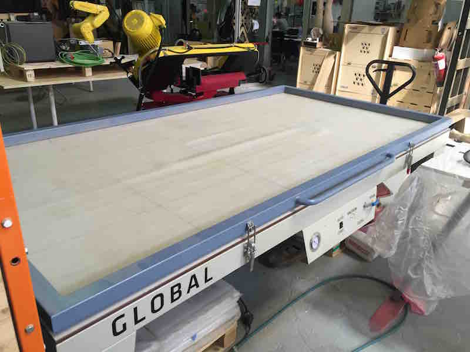 

## Bill of Material

I looked into the fabacademy to understand with which material we are working with this weak.  

* Foam
* Release Film
* Breather Material
* Perforated Material
* Fiber layers
* Epoxy Resin (fab iventory: [Super SAP 100](https://entropyresins.com/product/super-sap-100-1000/))

## Research

To understand this week better I again did some research and found these helpful resources.  

* [How to Super SAP](https://entropyresins.com/how-to-guide/)

Also I looked at a couple of Videos and Sites how Skateboards a made normally. Where I found that most are using wood or conrete molds or use a vaacum bag. 

[http://diyskate.com/](http://diyskate.com/)
[http://www.instructables.com/id/How-to-Make-a-Skateboard/](http://www.instructables.com/id/How-to-Make-a-Skateboard/)
[http://www.wikihow.com/Make-a-Skateboard](http://www.wikihow.com/Make-a-Skateboard)

## Test

First I made a little test with my darth vader nob and but it in the massive vaccum table at the Fablab Barcelona.

## Design 

I wanted to make a skateboard and tried first in tinkercad but then [Caro](http://archive.fabacademy.org/archives/2016/fablabbcn2016/students/346/Week14.htm) helped me with the Rhino design. For Composites we only need one part of the mold so I only will use the mold to give my skateboard the typical pennyboard tail.  

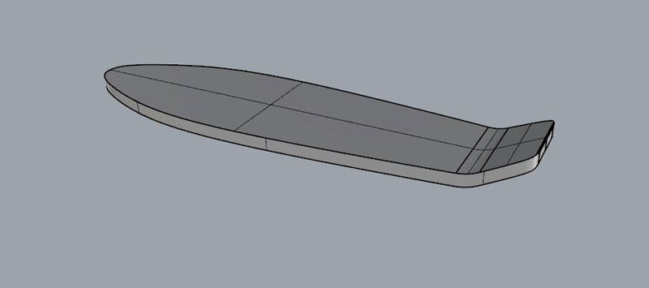

## Cam

As CAM program we used Pathworks3d but I would rather do it in Fusion360 the next time. This time we got a couple people together so [Cit](http://archive.fabacademy.org/archives/2016/fablabbcn2016/students/139/), [Caro](http://archive.fabacademy.org/archives/2016/fablabbcn2016/students/346/) and me use the same board for cutting. So we imported all our files in the same file and generated the gcodes. 

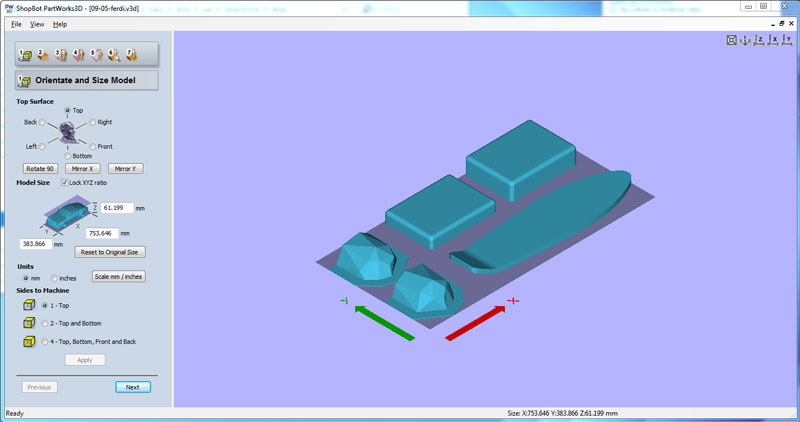

## Mill

For milling we used the Shopbot in the Fablab Barcelona but hat a lot of difficulties to set it up 

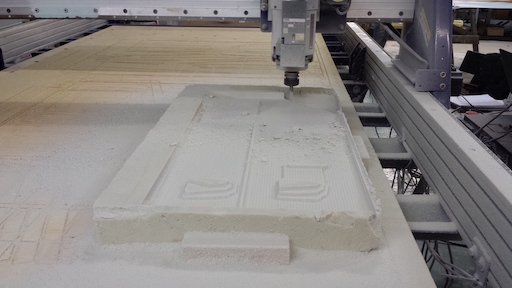
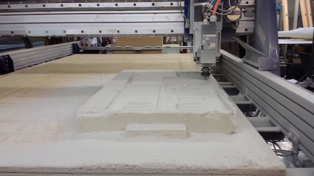
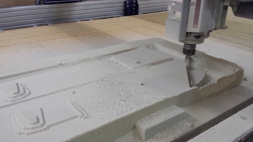
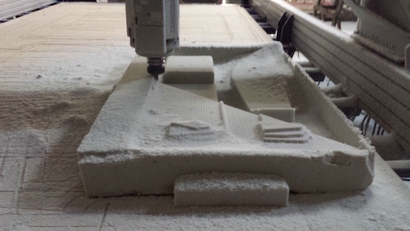
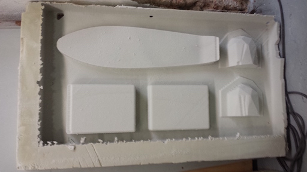
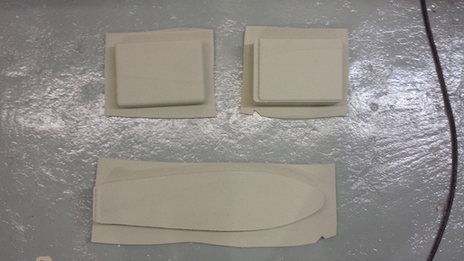

## Molding

First I gut two bamboo pieces with the laser but the laser was so bad so I had to use a chigsaw. Then I traced the shape with a pencil on the burlap material we are using here in Barcelona two make two layers in the inside of my board. Then I mixed the epoxy resin. Its 2:1 by volume and 100:47 by weight.

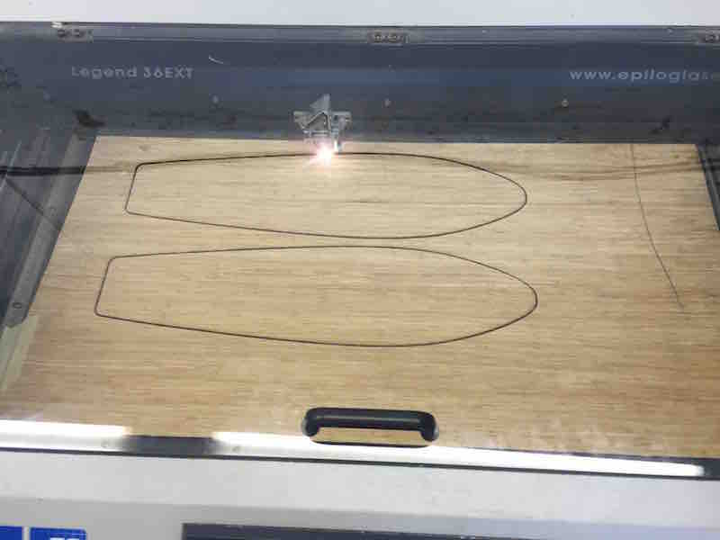
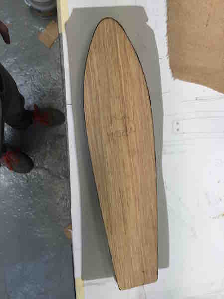

Here are all the layers I used from top to bottom.

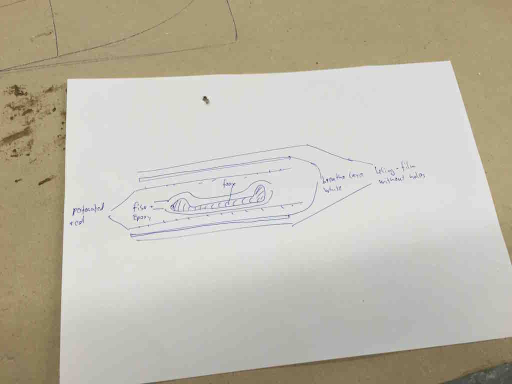

1. Plastic without holes to protect the vacuum machine
2. white breather material to distrpibute the vaccum evenly 
3. perforated plastic
4. bambo
5. burlap soaced in resin
6. burlap soaced in resin
7. bamboo
8. perforated plastic
9. Plastic without holes to protect the vacuum machine

Additionally we drilled in a hole on the top and the bottom to make sure the top and  

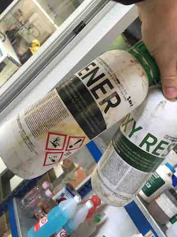

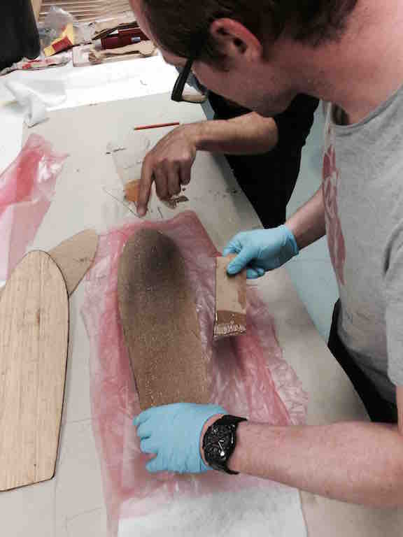

In the end I put it overnight in the vaccum table.

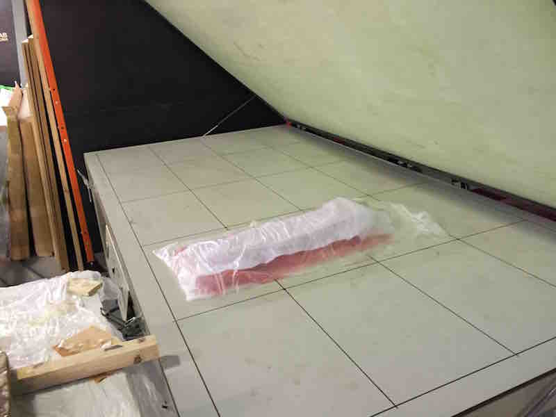

## Post processing the board

I got it out of the vaacum table and realized that the back did not bend as much as I wanted. The reason could be that the foam is not hard enough to bend the bambu so I would do a would mold next time. 

After getting it out of the vacuum I sanded the top with 80 and 120 grid sandpaper and also sanded off the edges because I got some burlap sticking out. 

I drilled in the holes and made a first driving test. 

Then I applied another resin coat on top and botton with a brush and also sprinkeld on some sugar to get a better grip on top. I used some Reisnägel which I clued to two sticks to only have a small contact point when flipping over the board when painting two sides at the same time. 

What I learned from that is to better only coat one side of the board at one time and then the other because I got a lot of drip bubbles when flipping it over. Also I would cover the board next time so no dust can get on the resin. Also I had applied way to much resin and I will next time only apply a thin coat. 

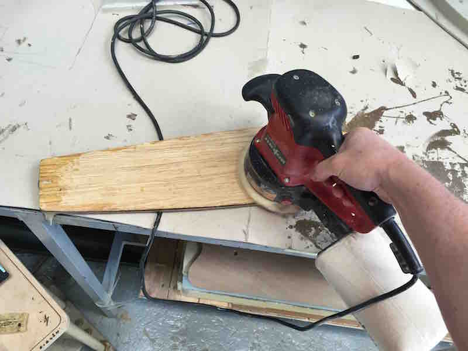
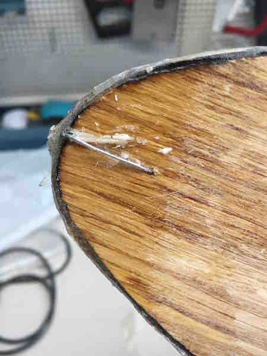

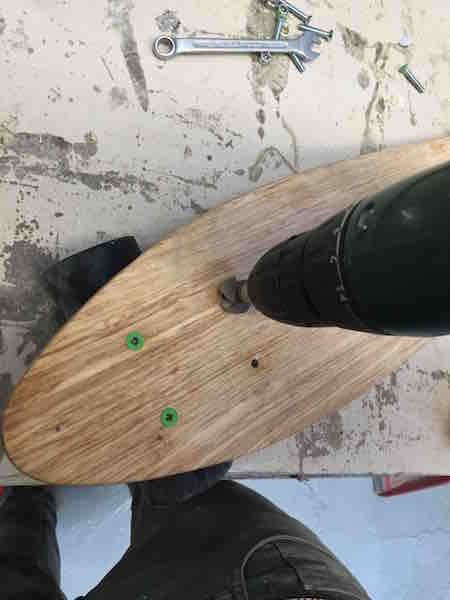

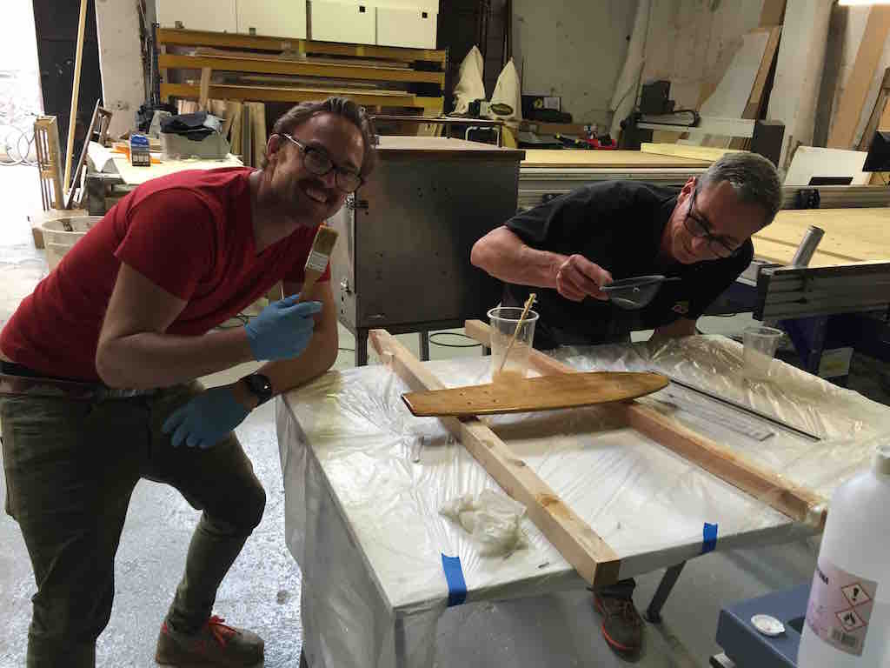

## Project Files

[Download](https://drive.google.com/folderview?id=0B3iYmii-HJ7TbWsxOGVrYjhSV0k&usp=sharing) all project files from this assignment from my Google Drive.

## Learnings

* better only one resin coat at the time
* bambo needs a stronger mold then foam 
* cover the board when drying to protect from the dust
* only apply a thin coat of resin
* use a standing drill to drill holes or cut holes before with laser

## Feedback

[Twitter](http://www.twitter.com/andreaskopp) me or [email me at andreasrkopp at gmail dot com](mailto:andreasrkopp@gmail.com).