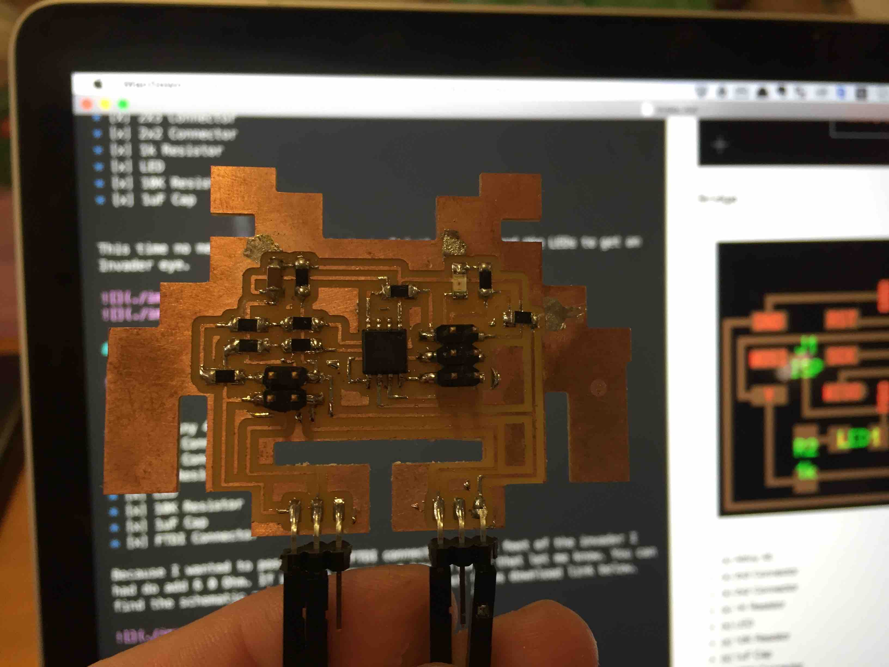
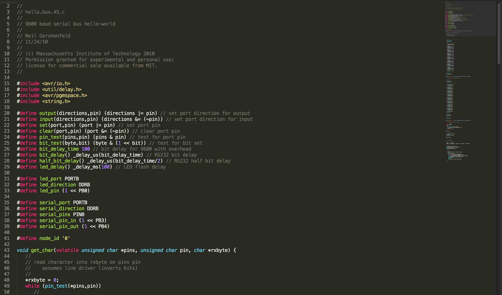
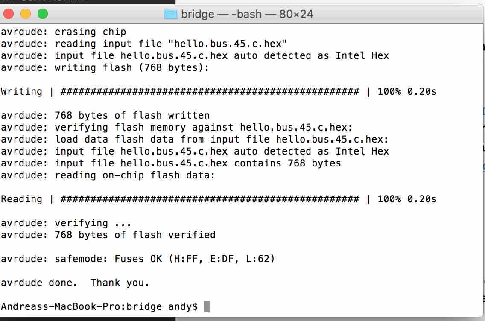
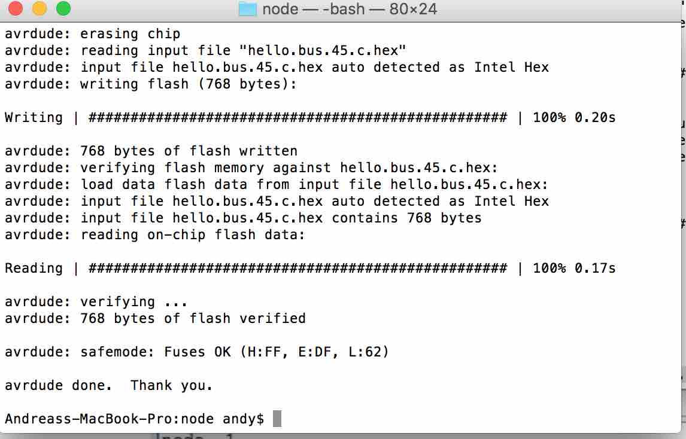
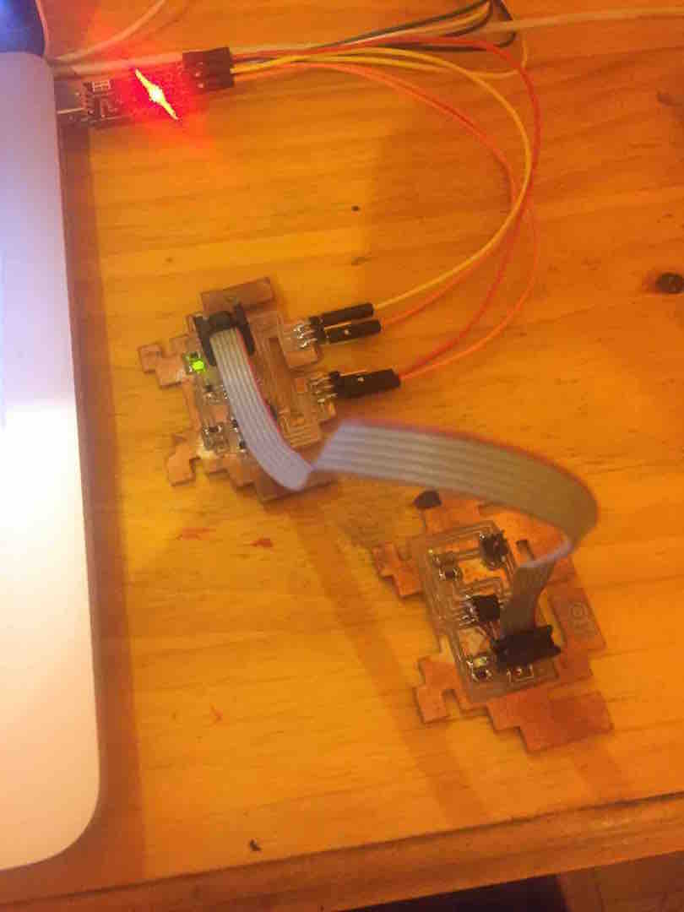
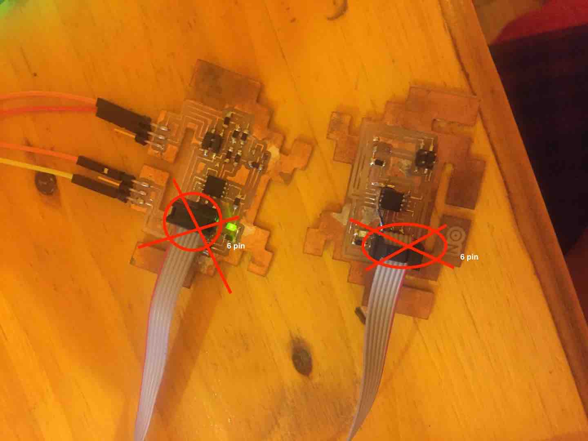
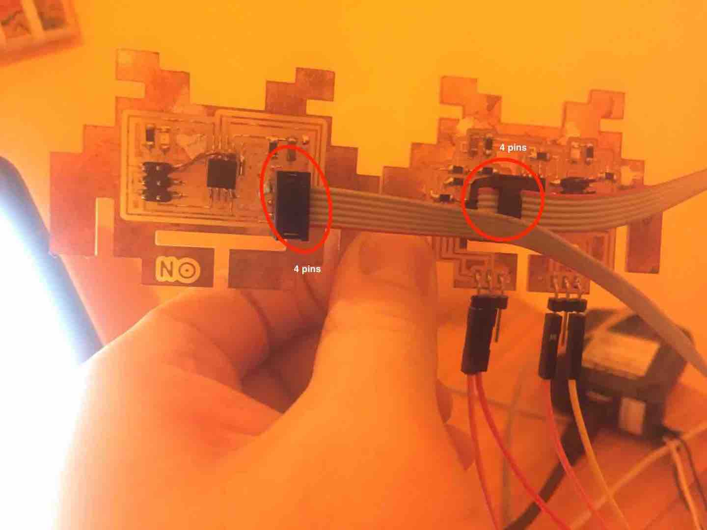

[BACK to START](../)

[FINAL PROJECT](../final) / [WEEK 1](../week1) / [COMPUTER AIDED DESIGN](../week2) / [COMPUTER-CONTROLLED-CUTTING](../week3) / [ELECTRONICS PRODUCTION](../week4) / [3D SCANNING & PRINTING](../week5) / [ELECTRONICS DESIGN](../week6)  / [COMPUTER-CONTROLLED MACHINING](../week7) / [EMBEDDED PROGRAMING ](../week8) / [MECHANICAL DESIGN](../week9) / [MACHINE DESIGN](../week10) / [INPUT DEVICES](../week11) / [3D MOULDING AND CASTING](../week12) / [OUTPUT DEVICES](../week13) / [COMPOSITES](../week14) / [EMBEDDED NETWORKING & COMMUNICATIONS](../week15) / [INTERFACE AND APPLICATION PROGRAMMING ](../week16) / [APPLICATIONS AND IMPLICATIONS ](../week17) / [INVENTION, INTELLECTUAL PROPERTY, AND BUSINESS MODELS](../week18) / [PROJECT DEVELOPMENT ](../week19)  


# Week 15 - Networking & Communications

May 11 - May 18

[Lecture](http://academy.cba.mit.edu/classes/networking_communications/index.html), [Video](http://archive.fabacademy.org/archives/2016/master/videos/05-11/index.html)

~~~
*Weeks Assignment*

design and build a wired &/or wireless 
network connecting at least two processors

~~~

I decided to make all the boards and started with the two Serial Boards. One is the node and one the bridge. 


## Invader Serial asynchronous

### Making Cabels 

First I put together 3 serial cables like for the FabISP as well. Then i started designing. 

### Node


* [x] Attiny 45
* [x] 2x3 Connector
* [x] 2x2 Connector
* [x] 1k Resistor
* [x] LED
* [x] 10K Resistor
* [x] 1uF Cap


This time no new components to look at. I just repositioned the LEDs to get an Invader eye. 


### Bridge


* [x] Attiny 45
* [x] 2x3 Connector
* [x] 2x2 Connector
* [x] 1K Resistor
* [x] LED
* [x] 10K Resistor
* [x] 1uF Cap
* [x] FTDI Connector

Because I wanted to position the FTDI connectors on the feet of the invader I had do add 6 0 Ohm. If you can figure out how to avoid that let me know. You can find the schematic and the brd file in the project files download link below.





### Milling and Stuffing 

Here my boards are in my other mill. I really got better in working with my mill after making all output devices. As I broke a bit because after pulling out one Invader the PCB was not sticking to the plate so good anymore I first finish milling all 4 invaders and the pull out all 4 at the same time or will use a smaller board when I only want to mill one little thing. Also it is crucial to always check with an angle if your blank board is orthogonal. 


## Programming 

Download the c and the make file from Neil and in duplicate the c code. In one you write id 0, that is the code for the bridge and in the other 1, that the code for your node 1. 

Put the two c program in a folder with the make file and type.

```
make -f hello.bus.45.make program-avrisp2
```


Before I had the bridge connected to the programmer and the FTDI of course. Then I connected the programmer to the node opened the second folder where I had  put the c file with the id 1 and tpyed.

```
make -f hello.bus.45.make program-avrisp2

```











## Testing the Network Communication

Then I opened up the Arduino ID and the serial monitor to check if the connection is working. 

Type 0 the bridge should blink, type 0 the node should blink. [Here](https://drive.google.com/file/d/0B3iYmii-HJ7TZzc0N3pXeGpYNFE/view?usp=sharing) a video showing it all at once when I type node 0 and node 1. At least the serial communication is working. I guess I have to dig in the code and see why all blink at once. It seems it is the c code because also in [Neils Video](http://academy.cba.mit.edu/classes/networking_communications/bus/bus.mp4) all lights blink at once.

After doing more research and checking the code I found out this: 

* A random input will cause both boards to blink

* Sending "0" will cause both to blink once and node 0 to blink one more time, node 0 will be written in the serial monitor

* Sending "1" will cause both to blink then node 1 more to blink one more time, node 1 will be written in the serial monitor1

To check each part if it worked I first connected only the bridge and typed 0 and I got a node 0 in the serial monitor and the got the double blink. With the node I also got the double blink just I did not get anything in the terminal. 


So I know that each part works apart so I connected the node and the bridge to each other. 


First I had the bridge and the node over the ISP connector but its correct to connect them over the connector with the 4 Pins. I checked at other students pages and it seems many are connecting the 6 pin connectors.  When I connect the board via the 6-Pin Connector the both lights are blinking all the time. 




I connected the node and the bridge again. Always checking that I connect ground to ground and VCC to VCC and finally I got it to work. The node is blinking two times and the bridge once when I type 1. And the bridge is blinking two times and the node once when I type 0. 

[VIDEO PROOF :-)](https://drive.google.com/file/d/0B3iYmii-HJ7TQXJCRTVUYV9mX0k/view?usp=sharing)


## Invader Serial I2C

During the last years I worked with Arduino and Pis I always heard these three letters but never quite understood. 

So this time I first read a couple of articles about I-squared-C to understand it better. It was invented in 1982 to use as communication between Integrated Circuits in CD Players and TVs. In Atmel I2X is called TWI (Two-Wire-Interface in their chops which is technically the same.

I2C needs two data lines. One seriell Clock line (SCL) and one for Data (SDA) and is used for communication for short distances. The speed is 100kbit/s standard and 10kbit/s low-speed mode. 


### Node


* [x] Attiny 45
* [x] 2x3 Connector
* [x] 2x2 Connector
* [x] 1k Resistor
* [x] LED
* [x] 3 x 10K Resistor
* [x] 1uF Cap


### Bridge


* [x] Attiny 45
* [x] 2x3 Connector
* [x] 2x2 Connector
* [x] 3x  10K Resistor
* [x] 1uF Cap
* [x] FTDI Connector


### Programming

When programming the node and the bridge with the c code you your are using the same code only that the bridge gets a `0` and the node gets a `1` you can then add more node with '2', '3' etc. 


###SPI (Serial Peripheral Interface)

Also when working with Arduino and Pi hats I have came across theses three letters SPI. Here a great [introduction](https://www.arduino.cc/en/Reference/SPI) of SPI on the Arduino homepage. 

For example I have the explorer hat from Pimoroni. There the Raspberry pi would be the master and the the chip on the explorer hat would be the slave.

These are the lines used:

* MISO (Master In Slave Out) - The Slave line for sending data to the master,
* MOSI (Master Out Slave In) - The Master line for sending data to the peripherals,
* SCK (Serial Clock) - The clock pulses which synchronize data transmission generated by the master

and one line specific for every device:
* SS (Slave Select) - the pin on each device that the master can use to enable and disable specific devices.

[Here](https://learn.sparkfun.com/tutorials/serial-peripheral-interface-spi) also a great article on Sparkfun.


### Bluetooth, RF and Wifi after fabacademy deadline


## Project Files

[Download](https://drive.google.com/folderview?id=0B3iYmii-HJ7TOWdGSWFwd1ZlZG8&usp=sharing) all project files from this assignment from my Google Drive or directly here from the repository. 


[invader_asyn_bridge.brd](./files/asyn/bridge/invader_asyn_bridge.brd)

[invader_asyn_bridge.sch (save as)](./files/asyn/bridge/invader_asyn_bridge.sch)

[hello.bus.45.c (bridge)](./files/asyn/bridge/hello.bus.45.c)

[hello.bus.45.make (bridge)](./files/asyn/bridge/hello.bus.45.make)


[invader_asyn_node.brd (node)](invader_asyn_node.brd)

[invader_asyn_node.sch (node)](./files/asyn/node/invader_asyn_node.sch)


[hello.bus.45.make (node)](./files/asyn/node/hello.bus.45.make)

[hello.bus.45.make (node)](./files/asyn/node/hello.bus.45.make)


## Learnings

* got faster in designing in Eagle
* mastered my Othermill machine
* understood different networking protocols
* check each part of the system
* need label my pins in the future (really want to print them on the board)


## Feedback

[Twitter](http://www.twitter.com/andreaskopp) me or email me at [andreasrkopp at gmail dot com](mailto:andreasrkopp@gmail.com).

[](https://gitter.im/ARKopp/fabacademy2016?utm_source=badge&utm_medium=badge&utm_campaign=pr-badge)