[BACK to START](../)

[FINAL PROJECT](../final) / [WEEK 1](../week1) / [COMPUTER AIDED DESIGN](../week2) / [COMPUTER-CONTROLLED-CUTTING](../week3) / [ELECTRONICS PRODUCTION](../week4) / [3D SCANNING & PRINTING](../week5) / [ELECTRONICS DESIGN](../week6)  / [COMPUTER-CONTROLLED MACHINING](../week7) / [EMBEDDED PROGRAMING ](../week8) / [MECHANICAL DESIGN](../week9) / [MACHINE DESIGN](../week10) / [INPUT DEVICES](../week11) / [3D MOULDING AND CASTING](../week12) / [OUTPUT DEVICES](../week13) / [COMPOSITES](../week14) / [EMBEDDED NETWORKING & COMMUNICATIONS](../week15) / [INTERFACE AND APPLICATION PROGRAMMING ](../week16) / [APPLICATIONS AND IMPLICATIONS ](../week17) / [INVENTION, INTELLECTUAL PROPERTY, AND BUSINESS MODELS](../week18) / [PROJECT DEVELOPMENT ](../week19)  

# Week 15 - Networking & Communications (WIP)

May 11 - May 18

[Lecture](http://academy.cba.mit.edu/classes/networking_communications/index.html), [Video](http://archive.fabacademy.org/archives/2016/master/videos/05-11/index.html)

~~~
*Weeks Assignment*

design and build a wired &/or wireless 
network connecting at least two processors

~~~

I can decided to make all the boards and started with the two Serial Boards. One is the node and one the bridge. 

## Invader Serial asynchronous

### Making Cabels 

First I put together 3 serial cables like for the FabISP as well. Then i started designing. 

### Node

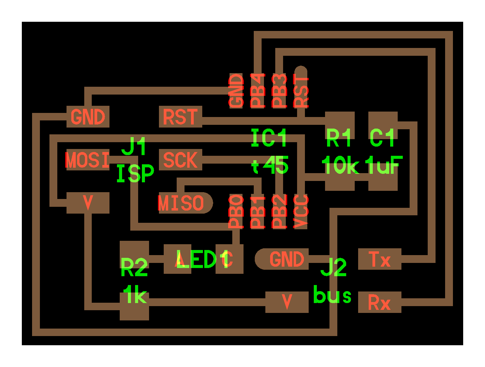

* [x] Attiny 45
* [x] 2x3 Connector
* [x] 2x2 Connector
* [x] 1k Resistor
* [x] LED
* [x] 10K Resistor
* [x] 1uF Cap

This time no new components to look at. I just repositioned the LEDs to get an Invader eye. 

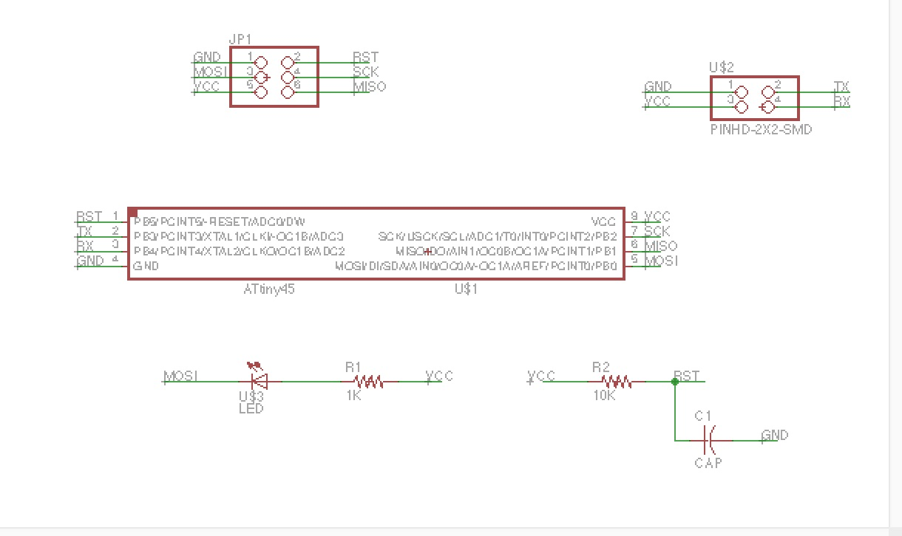
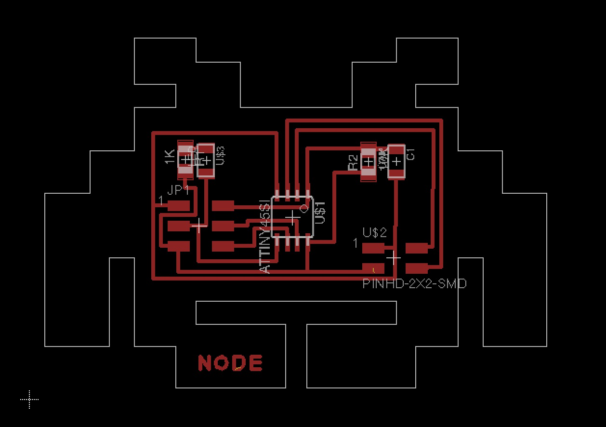
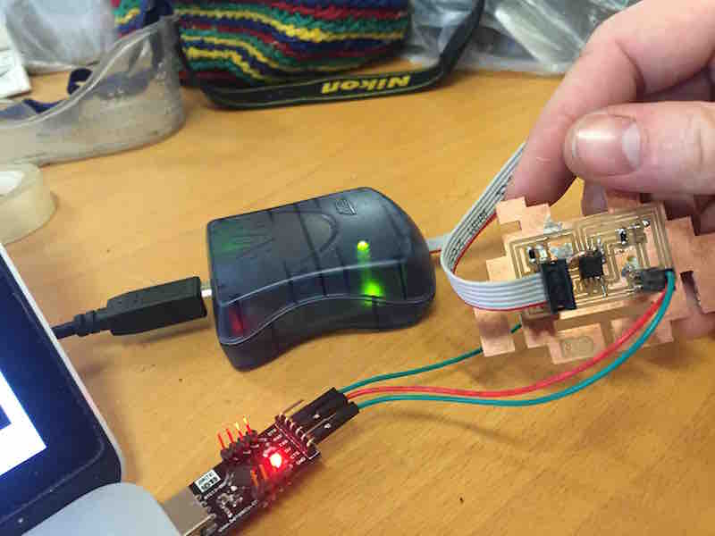

### Bridge

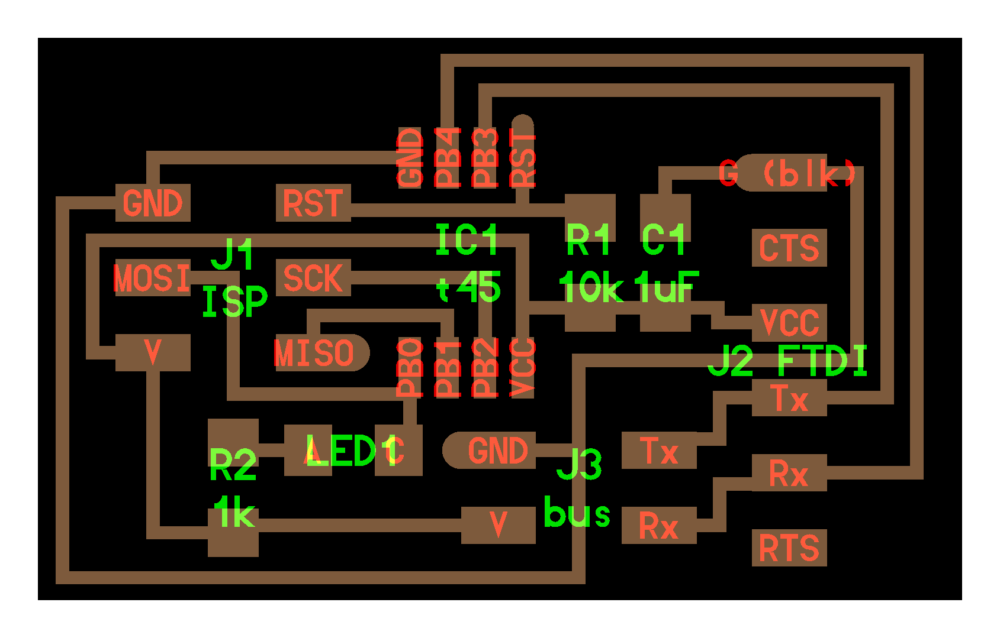

* [x] Attiny 45
* [x] 2x3 Connector
* [x] 2x2 Connector
* [x] 1K Resistor
* [x] LED
* [x] 10K Resistor
* [x] 1uF Cap
* [x] FTDI Connector

Because I wanted to position the FTDI connectors on the feet of the invader I had do add 6 0 Ohm. If you can figure out how to avoid that let me know. You can find the schematic and the brd file in the project files download link below.

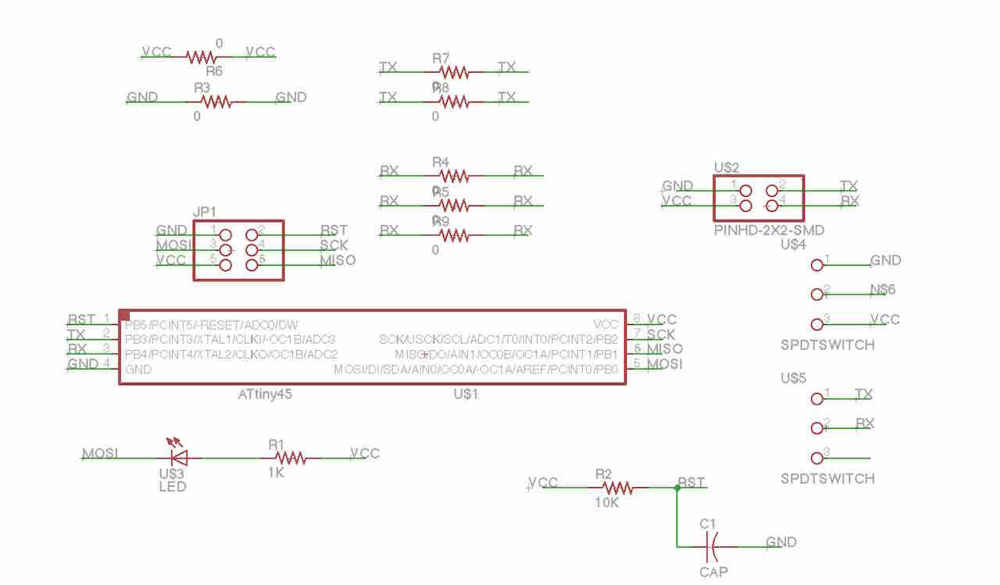
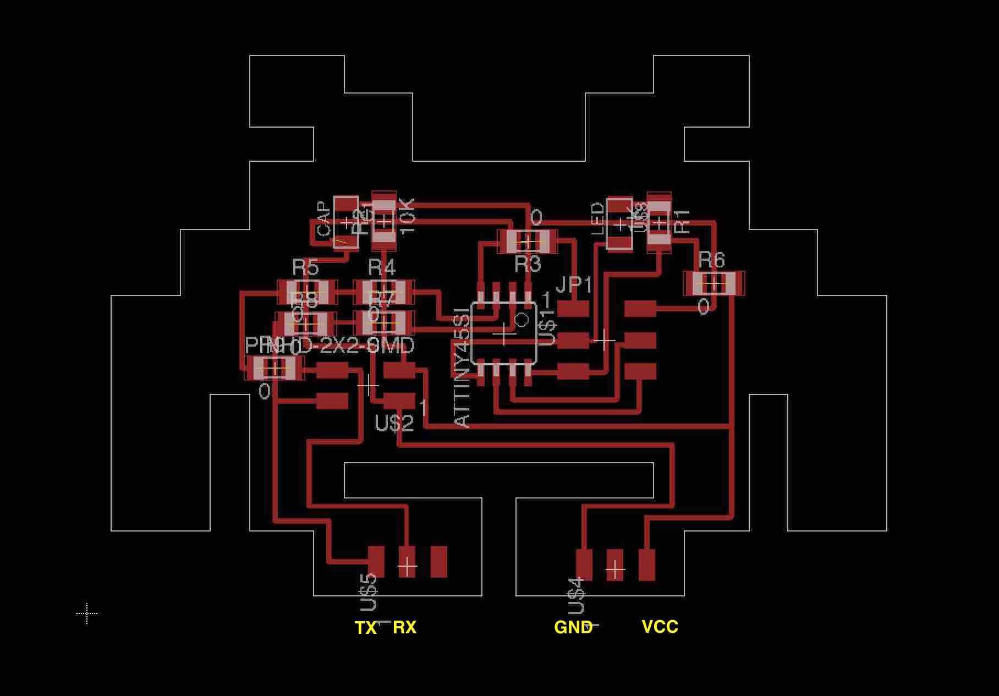

### Milling and Stuffing 

Here my boards are in my other mill. I really got better in working with my mill after making all output devices. As I broke a bit because after pulling out one Invader the PCB was not sticking to the plate so good anymore I first finish milling all 4 invaders and the pull out all 4 at the same time or will use a smaller board when I only want to mill one little thing. 

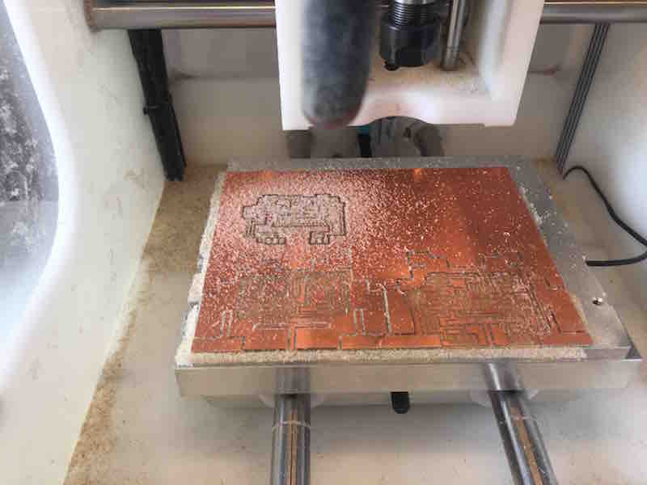

## Programming 

The node I could program without problem. What you have to do is to assign the   bridge a 0 and the nodes a 1, 2, 2 etc.

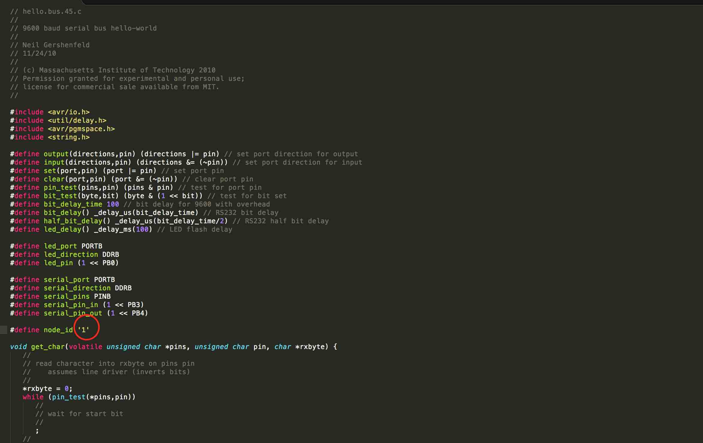

## Invader Serial I2C

During the last years I worked with Arduino and Pis I always heared these three letters but never quite understood. 

So this time I first read a couple of articles about I-squared-C to understand it better. It was invented in 1982 to use as communication betweend Integrated Curcuits in CD Players and TVs. In Atmel I2X is called TWI (Two-Wire-Interface in their chops which is technically the same.

I2C needs two data lines. One seriell Clock line (SCL) and one for Data (SDA) and is used for communication for short distances. The speed is 100kbit/s standard and 10kbit/s low-speed mode. 

### Node

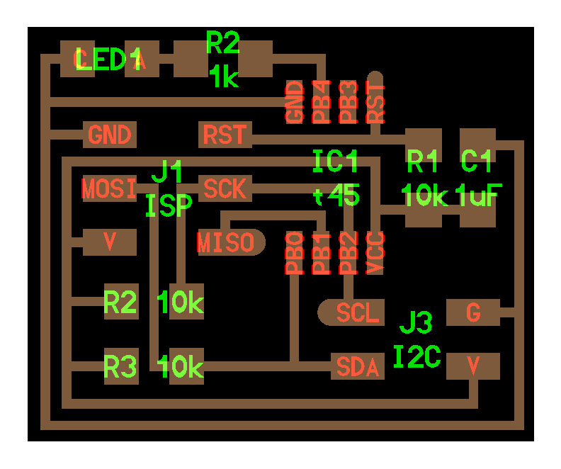

* [x] Attiny 45
* [x] 2x3 Connector
* [x] 2x2 Connector
* [x] 1k Resistor
* [x] LED
* [x] 3 x 10K Resistor
* [x] 1uF Cap

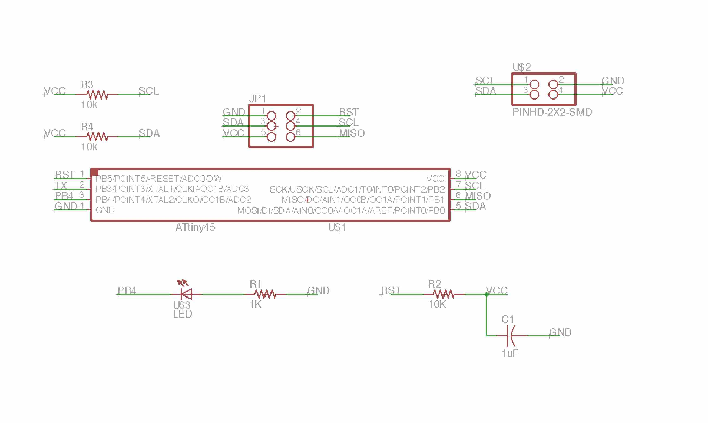
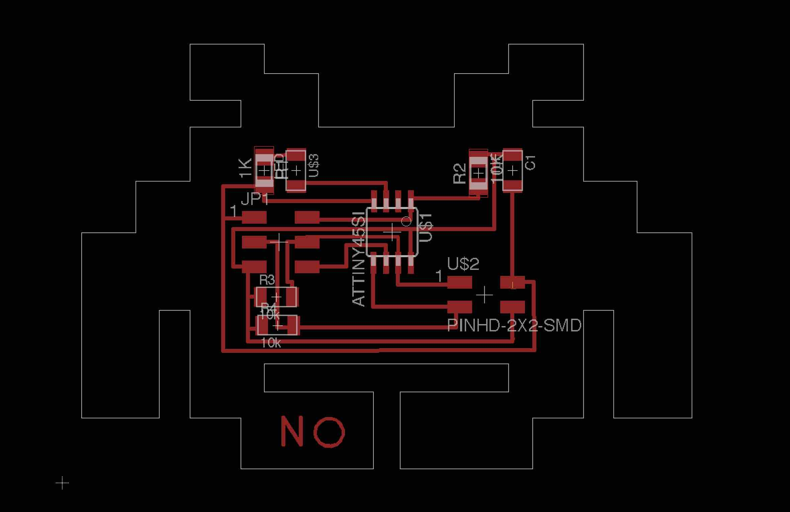

### Bridge

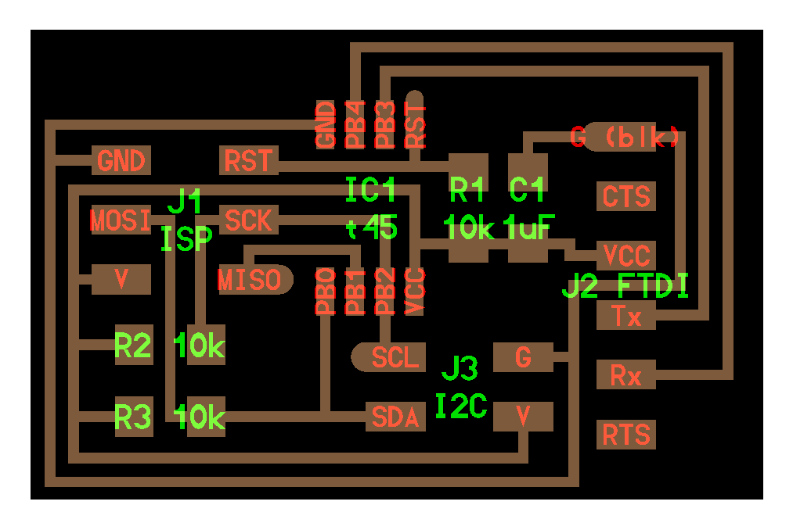

* [x] Attiny 45
* [x] 2x3 Connector
* [x] 2x2 Connector
* [x] 3x  10K Resistor
* [x] 1uF Cap
* [x] FTDI Connector

### Programming

When programming the node and the bridge with the c code you your are using the same code only that the bridge gets a `0` and the node gets a `1` you can then add more node with '2', '3' etc. 

###SPI (Serial Peripheral Interface)

Also when working with Arduino and Pi hats I have came across theses three letters SPI. Here a great [introduction](https://www.arduino.cc/en/Reference/SPI) of SPI on the Arduino homepage. 

For example I have the explorer hat from Pimorino. There the Raspberry pi would be the master and the the chip on the explorer hat would be the slave.

These are the lines used:

* MISO (Master In Slave Out) - The Slave line for sending data to the master,
* MOSI (Master Out Slave In) - The Master line for sending data to the peripherals,
* SCK (Serial Clock) - The clock pulses which synchronize data transmission generated by the master

and one line specific for every device:
* SS (Slave Select) - the pin on each device that the master can use to enable and disable specific devices.

[Here](https://learn.sparkfun.com/tutorials/serial-peripheral-interface-spi) also a great article on Sparkfun.

### Invader Bluetooth

Coming up.

### Invader ESP

Coming up. 

## Project Files

[Download](https://drive.google.com/folderview?id=0B3iYmii-HJ7TOWdGSWFwd1ZlZG8&usp=sharing) all project files from this assignment from my Google Drive.

## Learnings

* get faster in designing in Eagle
* master my Othermill machine

## Feedback

[Twitter](http://www.twitter.com/andreaskopp) me or email me at [andreasrkopp at gmail dot com](mailto:andreasrkopp@gmail.com).

