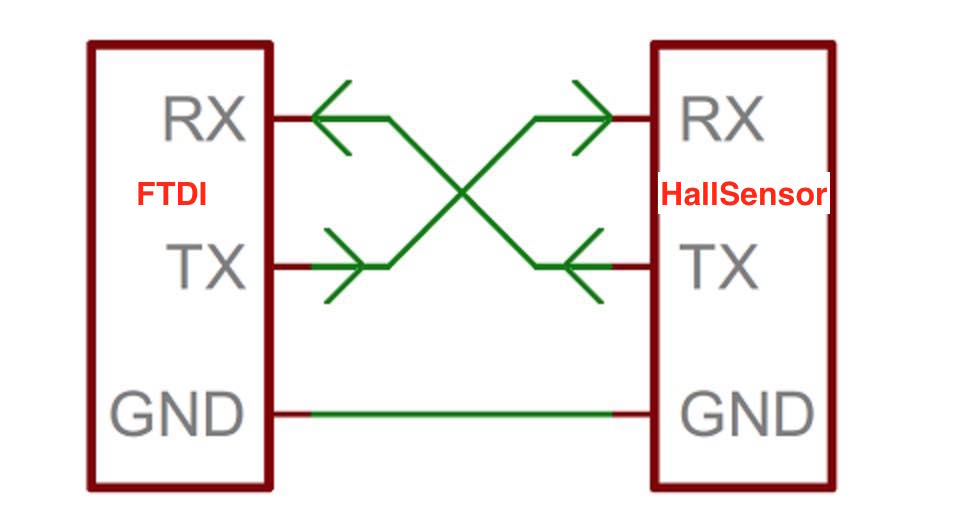
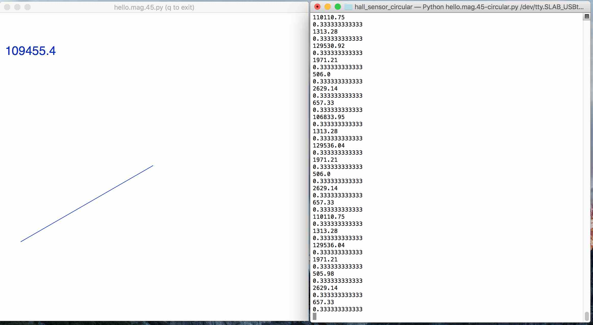
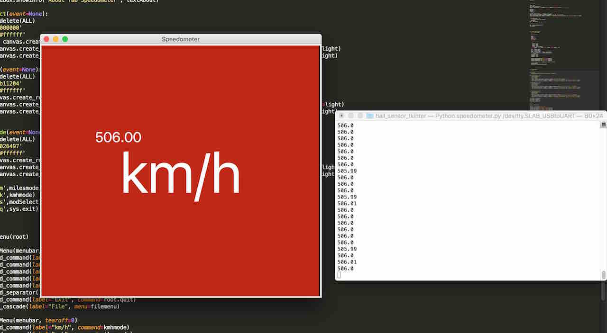
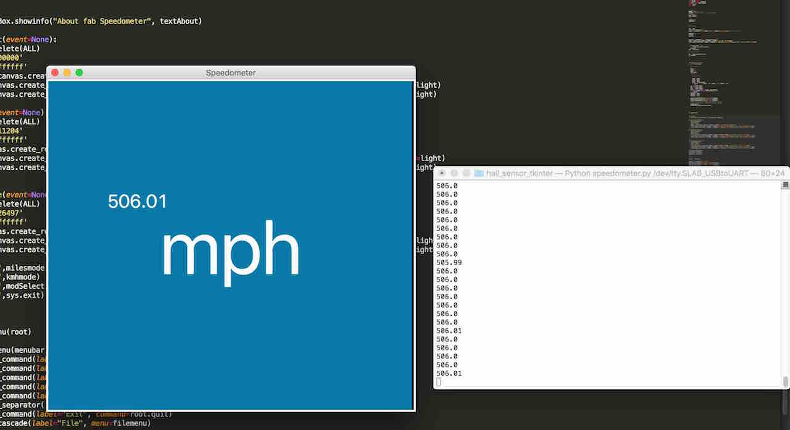
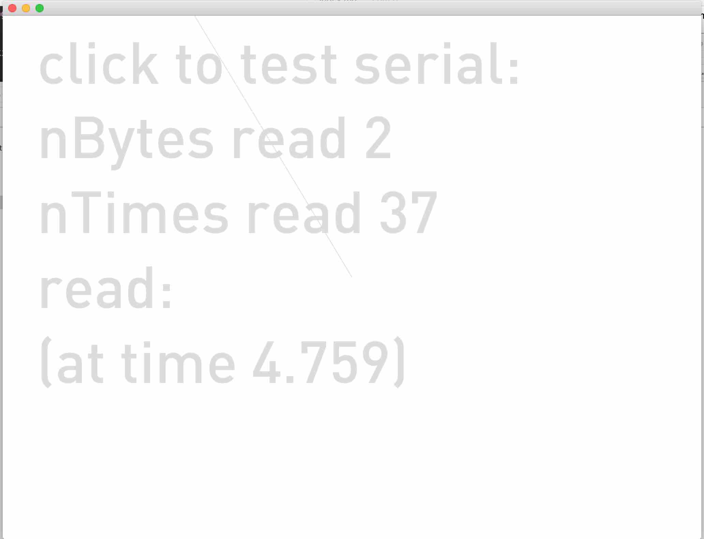

[BACK to START](../)

[FINAL PROJECT](../final) / [WEEK 1](../week1) / [COMPUTER AIDED DESIGN](../week2) / [COMPUTER-CONTROLLED-CUTTING](../week3) / [ELECTRONICS PRODUCTION](../week4) / [3D SCANNING & PRINTING](../week5) / [ELECTRONICS DESIGN](../week6)  / [COMPUTER-CONTROLLED MACHINING](../week7) / [EMBEDDED PROGRAMING ](../week8) / [MECHANICAL DESIGN](../week9) / [MACHINE DESIGN](../week10) / [INPUT DEVICES](../week11) / [3D MOULDING AND CASTING](../week12) / [OUTPUT DEVICES](../week13) / [COMPOSITES](../week14) / [EMBEDDED NETWORKING & COMMUNICATIONS](../week15) / [INTERFACE AND APPLICATION PROGRAMMING ](../week16) / [APPLICATIONS AND IMPLICATIONS ](../week17) / [INVENTION, INTELLECTUAL PROPERTY, AND BUSINESS MODELS](../week18) / [PROJECT DEVELOPMENT ](../week19) 


# Week 16 Applications and Interface

Mai 18 - Mai 25

[Lecture](http://academy.cba.mit.edu/classes/interface_application_programming/index.html), [Video](http://archive.fabacademy.org/archives/2016/master/videos/05-18/index.html)

~~~
*Weeks Assignment*

write an application that interfaces with an input &/or output device that you made

~~~

For this week my goal is to make a space invader game and control it with my input hall sensor. I also want to try out a couple of different programming languages and frameworks I have not tried yet like Scratch for Arduino. 


https://processing.org/examples/tree.html


## Connect an Input Device with your Computer

First you need to take one of your input or output devices and connect via the FTDI Cable to your Computer.  

To understand Serial Communication better I read this article from [Sparkfun](https://learn.sparkfun.com/tutorials/serial-communication) which explains data bits, synchronization bits, parity bits and baudrate.

A serial bus consists of two wire TX (Transmit) and RX (Recieve). As I wanted to use my hall sensor so connected the cable to RX of the computer and the TX of the Hall Sensor. So the RX from one device goes to the TX of the other device and vice versa. 




## Serial with tkinter

Then I tried to adapt the python program from Neil to create an my own interface. I want to to a Speedometer for my final project so I tried to create a Speedometer interface with tkinter. 

I did a [tkinter tutorial](http://www.tkdocs.com/tutorial/install.html#helloworld) first. And then programmed a needle interface in python. 




Then I adapted a program from [Francisco](http://fabacademy.org/archives/2013/students/sanchez.francisco/weekly-assignments/week-12/index.html) to switch between kmh and mph and show the speed digitally. I am planing for my final project to calculate the rpm with interrupts on my attiny and then make the math for km/h and mph on my interface. You can find all the code under Project Files on my google drive.






# Serial + Openframeworks

Also I wanted to try out t read a serial and write an Openframeworks Application. Luckily there already exists a serial communication example. I just need to change the tty of my FTDI Kabel to read the serial data of my input invader. 

In my case it is this. 

```
serial.setup("/dev/tty.SLAB_USBtoUART", baud); 
```

Then a friend helped me to do create a tachoneedle. 


Ok at least I am reading something. Now I need to think about a nice interface that shows me km/s, average and max speed. 




I want to come back to here to also make my speedometer interface also in openframeworks.

For that I am going to the [documentation](http://openframeworks.cc/setup/xcode/) of openframeworks to undestand the system and then also looked at the [Documentation for Serial Communication.](http://openframeworks.cc/ofBook/chapters/hardware.html) 

I created a fist app with the ProjectGenerator and then tried got ghet the serial connection going with uploading the firmata sketch to my hello_world board with arduino. 


## Project Files

[Download](https://drive.google.com/folderview?id=0B3iYmii-HJ7TcHc2c2s3WVNJUlk&usp=sharing) all project files from this assignment from my Google Drive.


## Learnings

* how to read a serial output
* connect Processing to Attiny
* got into Openframeworks
* got into Processing
* got into tkinter


## Feedback

[Twitter](http://www.twitter.com/andreaskopp) me or email me at [andreasrkopp at gmail dot com](mailto:andreasrkopp@gmail.com).

Or chat with me on gitter.

[](https://gitter.im/ARKopp/fabacademy2016?utm_source=badge&utm_medium=badge&utm_campaign=pr-badge)