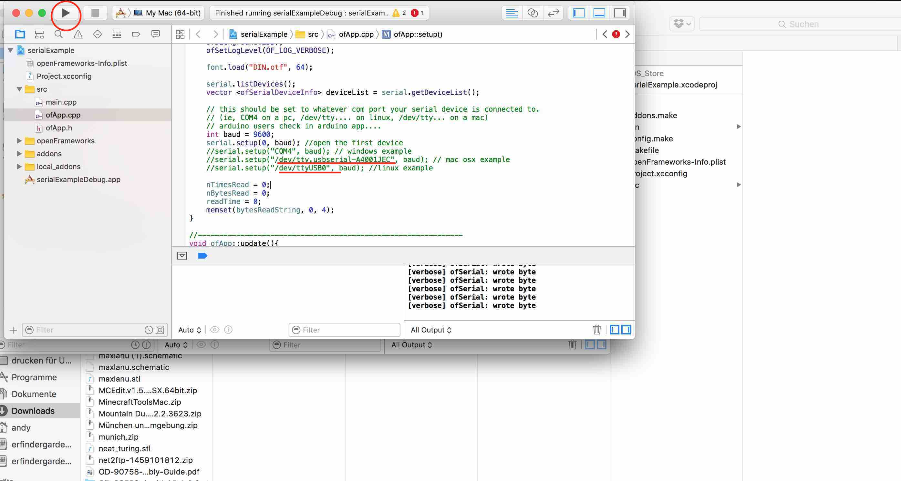
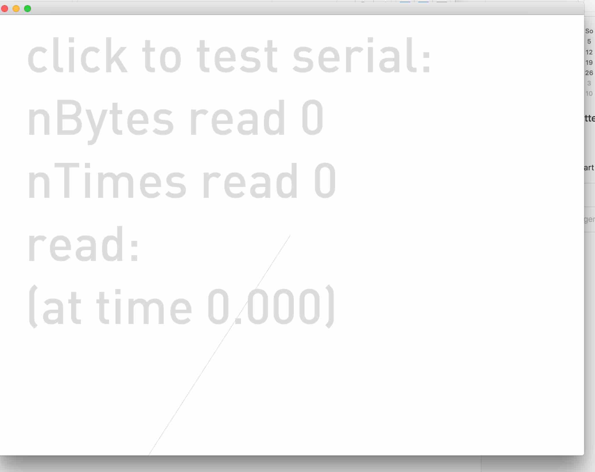

[BACK to START](../)

[FINAL PROJECT](../final) / [WEEK 1](../week1) / [COMPUTER AIDED DESIGN](../week2) / [COMPUTER-CONTROLLED-CUTTING](../week3) / [ELECTRONICS PRODUCTION](../week4) / [3D SCANNING & PRINTING](../week5) / [ELECTRONICS DESIGN](../week6)  / [COMPUTER-CONTROLLED MACHINING](../week7) / [EMBEDDED PROGRAMING ](../week8) / [MECHANICAL DESIGN](../week9) / [MACHINE DESIGN](../week10) / [INPUT DEVICES](../week11) / [3D MOULDING AND CASTING](../week12) / [OUTPUT DEVICES](../week13) / [COMPOSITES](../week14) / [EMBEDDED NETWORKING & COMMUNICATIONS](../week15) / [INTERFACE AND APPLICATION PROGRAMMING ](../week16) / [APPLICATIONS AND IMPLICATIONS ](../week17) / [INVENTION, INTELLECTUAL PROPERTY, AND BUSINESS MODELS](../week18) / [PROJECT DEVELOPMENT ](../week19) 

# Week 16 Applications and Interface (WIP)

Mai 18 - Mai 25

[Lecture](http://academy.cba.mit.edu/classes/interface_application_programming/index.html), [Video](http://archive.fabacademy.org/archives/2016/master/videos/05-18/index.html)

~~~
*Weeks Assignment*

write an application that interfaces with an input &/or output device that you made

~~~

For this week my goal is to make a space invader game and control it with my input hall sensor. I also want to try out a couple of different programming languages and frameworks I have not tried yet like Scratch for Arduino. 

https://processing.org/examples/tree.html

## Arduino-Scratch Space Invader Game

### Hello World

First I wanted to show you how you would program hello world in Scratch

First I wanted to make a space invader game and use my Otherduino and control it with a button and then redo a button invader. 

First I just looked for any game and added two buttons.  

# Arduino + Minecraft 

# Serial + Processing

We had a review by Ferdi where he eplained how  we could 

# Serial + Arduino

# Serial + Openframeworks

Also I wante to try out t read a serial and write an Openframe Works Application. Luckily there already exists a serial communication example. I just need to change the tty of my FTDI Kabel to read the serial data of my input invader. 

I wanted to also programme a tachneedle like in tkinter and a friend helped mt to do it. 

# pygame

# sratch

# matplotlib

http://academy.cba.mit.edu/classes/interface_application_programming/matline.py

## Project Files

[Download](https://drive.google.com/folderview?id=0B3iYmii-HJ7TcHc2c2s3WVNJUlk&usp=sharing) all project files from this assignment from my Google Drive.

## Learnings

* how to read a serial output
* connect Processing to Attiny
* 

## Feedback

[Twitter](http://www.twitter.com/andreaskopp) me or email me at [andreasrkopp at gmail dot com
](mailto:andreasrkopp@gmail.com).

Or chat with me on gitter.

