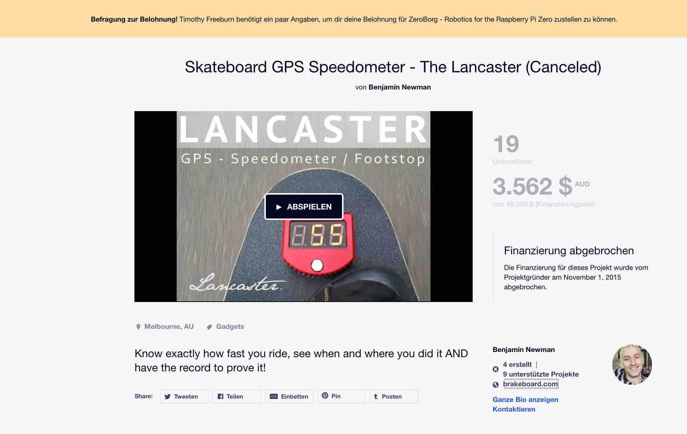
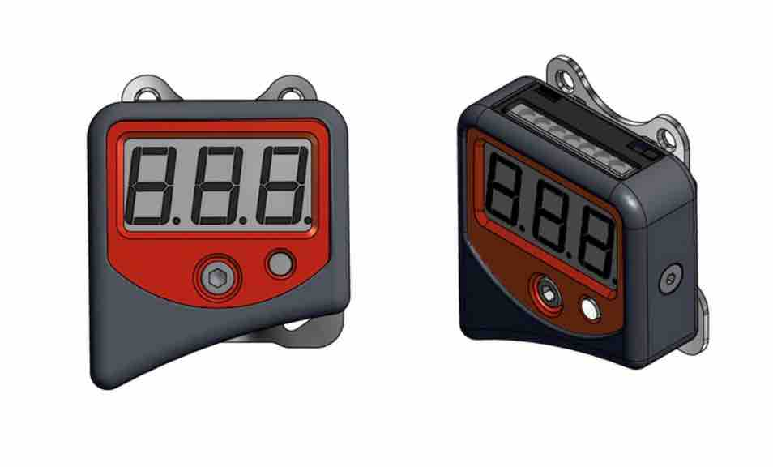
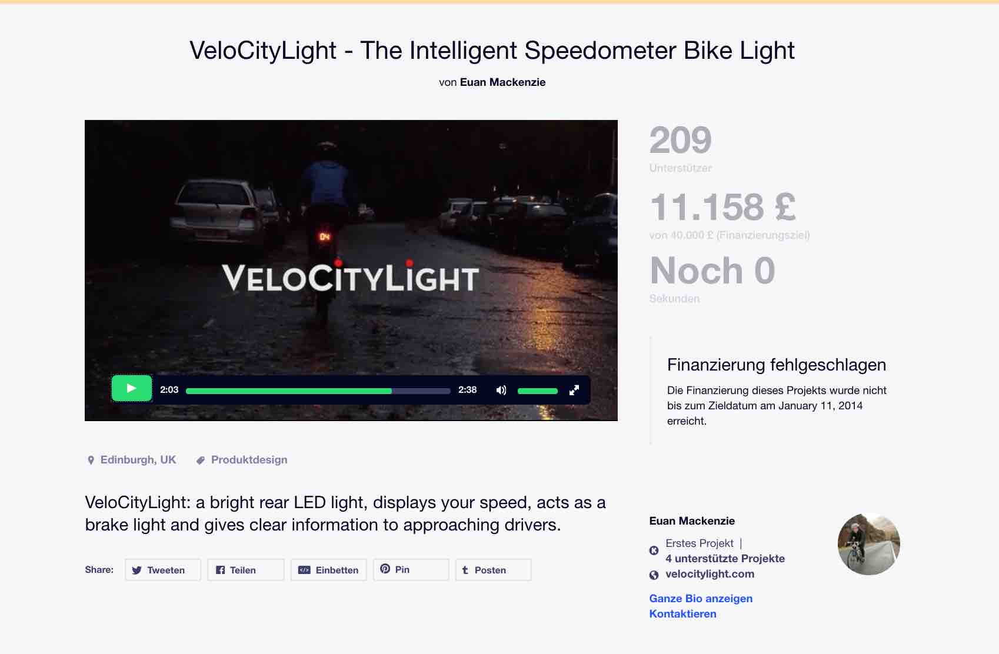
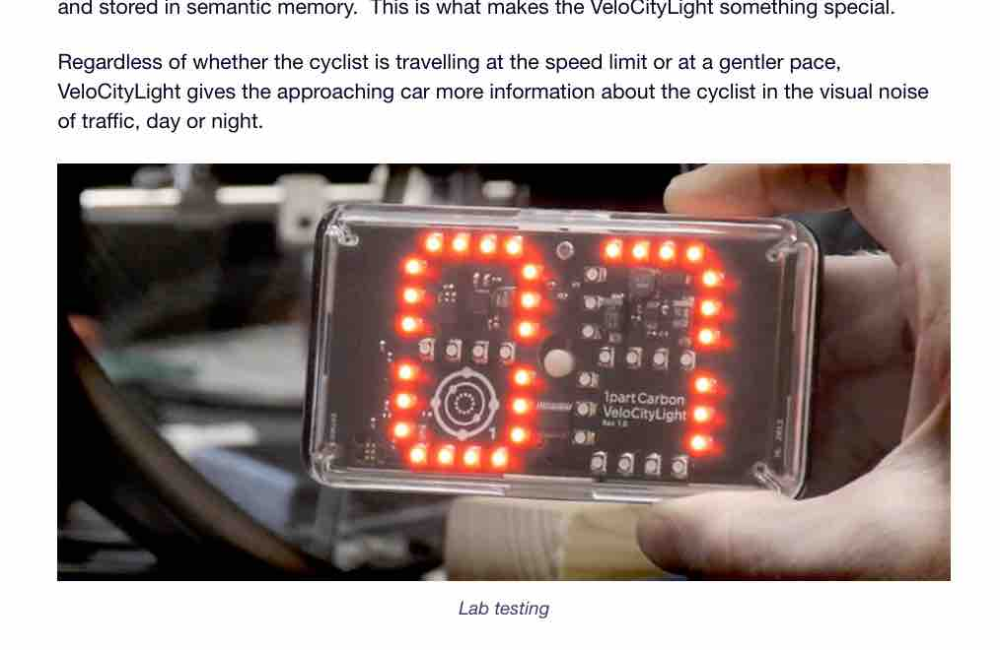
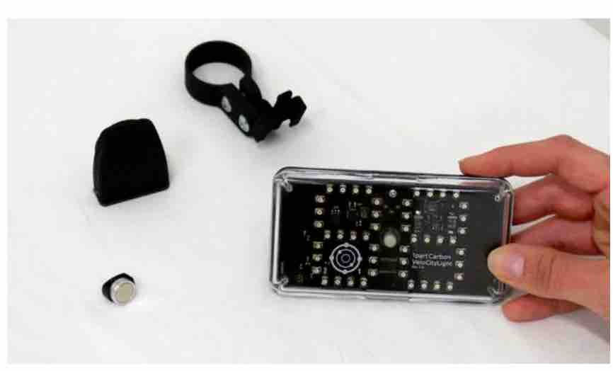
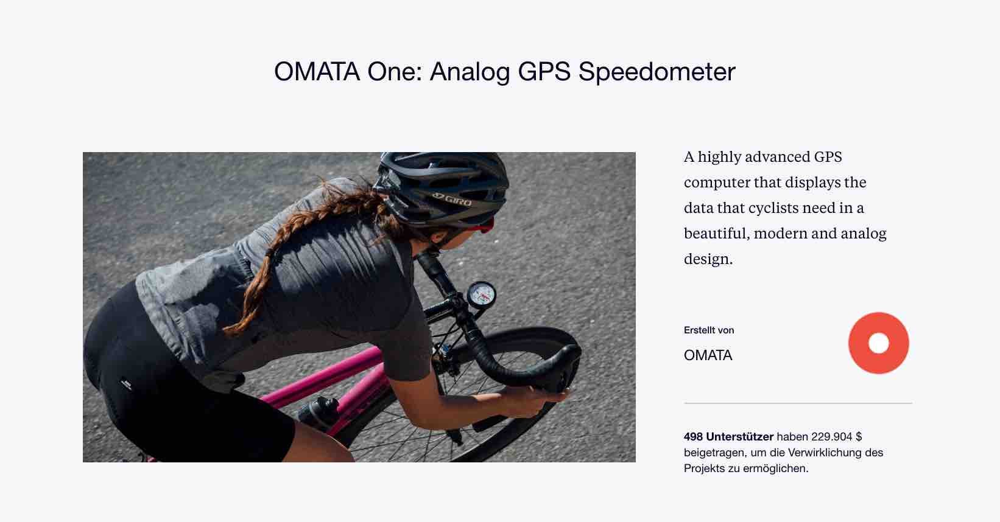
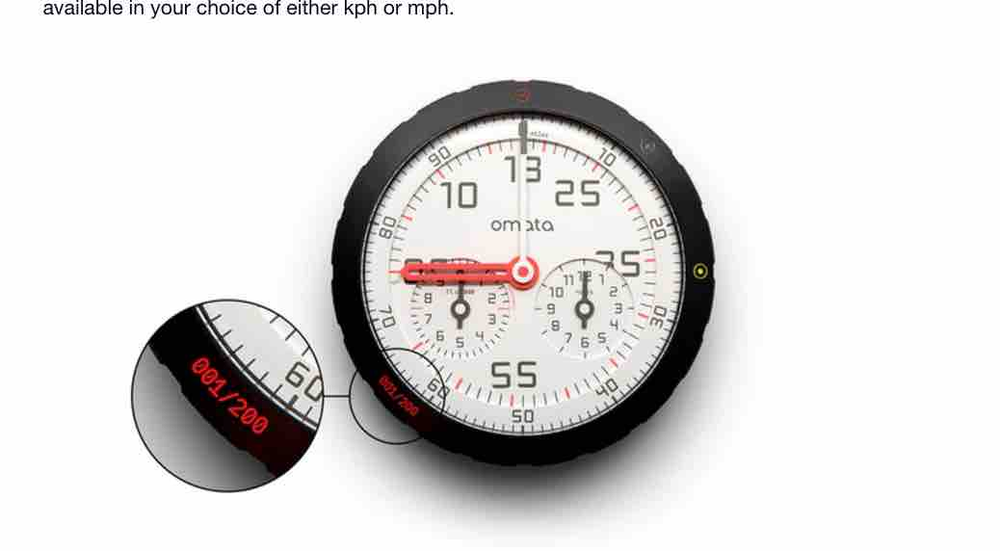

[BACK to START](../)

[FINAL PROJECT](../final) / [WEEK 1](../week1) / [COMPUTER AIDED DESIGN](../week2) / [COMPUTER-CONTROLLED-CUTTING](../week3) / [ELECTRONICS PRODUCTION](../week4) / [3D SCANNING & PRINTING](../week5) / [ELECTRONICS DESIGN](../week6)  / [COMPUTER-CONTROLLED MACHINING](../week7) / [EMBEDDED PROGRAMING ](../week8) / [MECHANICAL DESIGN](../week9) / [MACHINE DESIGN](../week10) / [INPUT DEVICES](../week11) / [3D MOULDING AND CASTING](../week12) / [OUTPUT DEVICES](../week13) / [COMPOSITES](../week14) / [EMBEDDED NETWORKING & COMMUNICATIONS](../week15) / [INTERFACE AND APPLICATION PROGRAMMING ](../week16) / [APPLICATIONS AND IMPLICATIONS ](../week17) / [INVENTION, INTELLECTUAL PROPERTY, AND BUSINESS MODELS](../week18) / [PROJECT DEVELOPMENT ](../week19)

# Week 17 - APPLICATIONS AND IMPLICATIONS

May 25 - June 2

[Lecture](http://academy.cba.mit.edu/classes/interface_application_programming/index.html), [Video](http://archive.fabacademy.org/archives/2016/master/videos/06-01/index.html
)

~~~

*Weeks Assignment*  

propose a final project that integrates the range of units covered:

* what will it do?
* who's done what beforehand?
* what materials and components will be required?
* where will they come from?
* how much will it cost?
* what parts and systems will be made?
* what processes will be used?
* what tasks need to be completed?
* what questions need to be answered?
* what is the schedule?
* how will it be evaluated?
 
projects can be separate or joint, but need to show individual mastery of all of the skills
   where possible, you should make rather than buy the parts of your project
~~~

## What will you do?

I want to make a low cost fablabable skateboard and bike speedometer and a skateboard. I will use the low cost mini chip Attiny and make my own pcb board and make a waterproof housing for it. 

## Who's done what beforehand?

I first looked if there where any kickstarter campaigns. I found one not successful skateboard speedometer campaign and two bike speedometer campaigns.

* [***Skateboard GPS Speedometer - The Lancaster***](https://www.kickstarter.com/projects/1130221580/skateboard-gps-speedometer-the-lancaster)

This campaign raised 3.562 $ AUD but was canceled. It uses GPS to calculate the speed and there is also a bluetooth version. It has a 3 digit Display and also has a button. I think the 3 digit display does not look good in a product and its way to chunky. Maybe it would be better with small display. But then it would be maybe not so visible. This is also made for longboard downhill riding.

* [***VeloCityLight - The Intelligent Speedometer Bike Light***](https://www.kickstarter.com/projects/euanmackenzie/velocitylight-the-intelligent-speedometer-bike-lig?ref=nav_search)

This is a bike speedometer that displays the speed to the cars behind you. It has two digit display and uses a 1700 mAh Lipo and is USB rechargeable. It raised 11 000 Pound but was not successful. It also has a ANT wireless chip to connect to a magnetic sensor in the spoke. I really like that strategy. 

 
* [***OMATA One: Analog GPS Speedometer***](https://www.kickstarter.com/projects/omata/omata-one-analog-gps-speedometer/comments)

They are using a 800 mAh Lipo Battery and calculate the speed with GPS. Really nice design. There is also a BLE module integrated but they do not have an app for that yet. For charing they have a USB-C connector and a lipo charging.

There are also quite a few indigogo campaigns .. 

* [SpeedForce -The World's Smartest Cycling Computer (400,000 USD, successful)](https://www.indiegogo.com/projects/speedforce-the-world-s-smartest-cycling-computer#/)
* LIMITS: The World's Smartest Cycling Power Meter, (509,000 USD, successful)

And also instructables for skateboard and bike speedometers: 

* [Arduino Skateboard Speedometer](http://duino4projects.com/arduino-skateboard-speedometer/)
* [Skateboard Speedometer by Invented](https://hackaday.io/project/10286-skateboard-speedometer-by-invented)
* [Skateboard Longboard Speedometer Project](http://www.creative-science.org.uk/longboard_speedo.html) 

* [Arduino Bike Speedometer](http://www.instructables.com/id/Arduino-Bike-Speedometer/)

## What materials and components will be required?  What is their cost?

I am not sure about all components yet because I have not designed the PCB but these are the components I most likely will need. I am thinking about a version with and without a lipo battery. 

***Version A (with Lipo and Bluetooth)***

Part                 |  Quantity         | Total                  |
-------------------- |------------------ |----------------------- |
Attiny85 			    |        1          |       1.45 €           |
hall effect sensor   |        1          |       1.77 €           |
10k Resistor         |  		1	        |           ?            |
1uF Capacitor        |      	1			  |           ?            |
Bluetooth Modul      |      	1	        |        6.95            |
USB	 Connector         |        1          |         ?              |
Lipo Charger Adafruit|        1          |        6.95 €          |
LipBattery 2000mAh   |        1          |       12.95 €          |
Smoothcast 305       |      200 g			 |          ?             |
little neodyne magnet|        1		    |         ?              |
***TOTAL*** 			 |             	    |      ***22.90 €***     |

***Version B (with Coin Battery and Display)***

Part                 |  Quantity         | Total                  |
-------------------- |------------------ |----------------------- |
[Attiny85 ](http://www.digikey.de/product-detail/de/atmel/ATTINY85-20SUR/ATTINY85-20SURDKR-ND/3789090)				 |        1          |       1.45 €           |
hall effect sensor   |        1          |       1.77 €           |
10k Resistor         |  		4	        |           ?            |
1uF Capacitor        |      	1			 |           ?            |      
CR Battery			 |        1          |         ?              |
SMD LEDs             |        2          |         ?              |
[Tiny Oled 			 ]([Tiny Oled Display ](http://www.ebay.de/itm/0-96-I2C-IIC-SPI-Serial-128X64-White-OLED-LCD-LED-Display-Module-for-Arduino-/301952319659?var=&hash=item464dc2c0ab:m:mH-wZvDBRY4fypP9_rU_-sw) )|        1          |     4,90 €              | 
Battery Holder       |        1          |                        |                                      
little neodyne magnet|        1		    |         ?              |
***TOTAL*** 			 |             	    |     ***ca 11 €***            |

## Where will they come from?

I hope I can find most electronic parts are in the [fab academy inventory](https://docs.google.com/spreadsheets/d/1U-jcBWOJEjBT5A0N84IUubtcHKMEMtndQPLCkZCkVsU/pub?single=true&gid=0&output=html). I can source them from digikey or amazon if I need it quick. In the future I will also buy parts from ebay because of the high shipping cost of digikey. Also I got some bamboo for the Skateboard and just got the wheels, bearings and axles from my old Penny board. In the future I plan to do all components of the skateboard myself and only buy the bearings.

## What parts and systems will be made?

* Skateboard
* PCB with Attiny85 <del>and bluetooh module v1<del>
* Hall Sensor Breakout close to the wheel connected with cable to Attiny#
* skateboard mount
* case
* <del>iPhone App</del>

## What processes will be used?

* 3D Design
* 3D Printing
* PCB Designing
* Soldering
* Embedded Programming
* CAM
* Molding and Casting
* Composites
* Application Programming 
* iOS and Android Programming
* Interface Designing

* optional: Casting the wheels and the rims, 3D Printing the board

## What tasks need to be completed?

* Sourcing and deciding on all components
* 1st Arduino Prototype
* Get the Hal Sensor on a little breakout board close to the wheel
* Mill the boards 
* Arduino Code
* Design Mount and Case
* Skateboard Mount 3D Print
* Invader Case 3D Print
* Design App
* Programm App
* Designing and Making Weather Proof Enclosure

## What questions need to be answered?

How to power the sensor board. Will I use a lipo or a coin battery? How to communicate between the board and the app. Bluetooth or wifi? Or do i also integrate a tiny screen. Is a Attiny enough or a Atmega? Do I include a Lipo charger. How to communicate between the 

## What is the schedule?

6 - 12 June: 1st Arduino Prototype Programming Interrupts, Attiny Board Design, Milling, Soldering, Desgining Interface, Programming 

13 - 20 June: 3D Printing Case, Put everything together, Make Video

20 - 30 June: Long Board, Medium Board, Milling and Composite, Make Board Smaller, Molding and casting water proof case

30 - 8 July: Finish Documenting 

## How will it be evaluated? 

I think that means, how do I know if I have succeeded or failed?

For me I already learned so much in the last 5 month. I want to have a firs and make workshops with it.

## Feedback

[Twitter](http://www.twitter.com/andreaskopp) me or email me at [andreasrkopp at gmail dot com
](mailto:andreasrkopp@gmail.com).

Or chat with me on gitter.

[back to top](../week17)

