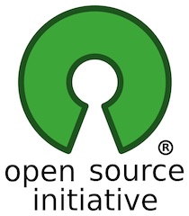
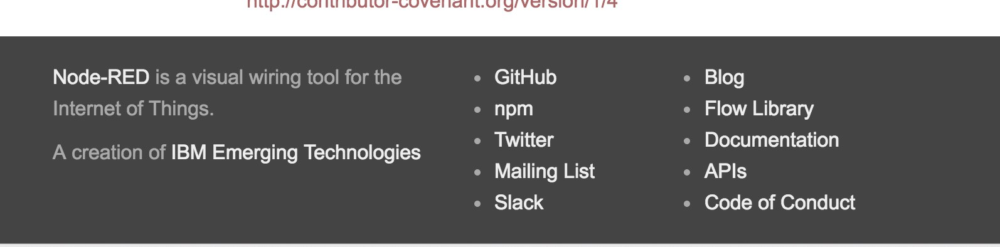
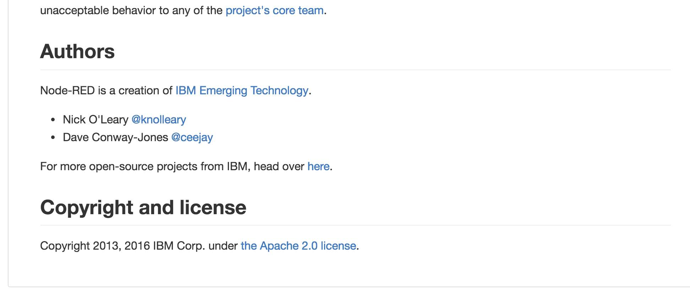
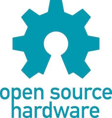
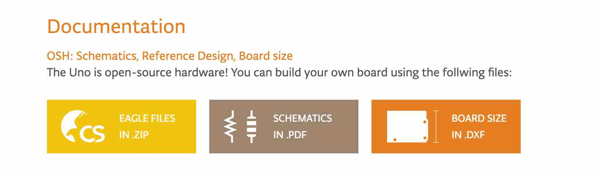
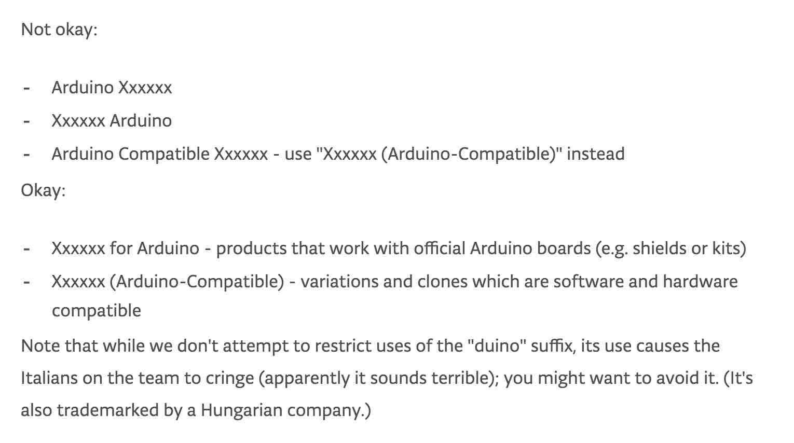
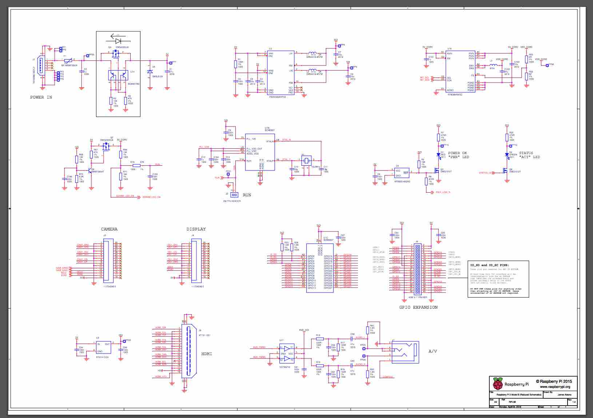
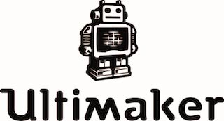

[BACK to START](../)

[FINAL PROJECT](../final) / [WEEK 1](../week1) / [COMPUTER AIDED DESIGN](../week2) / [COMPUTER-CONTROLLED-CUTTING](../week3) / [ELECTRONICS PRODUCTION](../week4) / [3D SCANNING & PRINTING](../week5) / [ELECTRONICS DESIGN](../week6)  / [COMPUTER-CONTROLLED MACHINING](../week7) / [EMBEDDED PROGRAMING ](../week8) / [MECHANICAL DESIGN](../week9) / [MACHINE DESIGN](../week10) / [INPUT DEVICES](../week11) / [3D MOULDING AND CASTING](../week12) / [OUTPUT DEVICES](../week13) / [COMPOSITES](../week14) / [EMBEDDED NETWORKING & COMMUNICATIONS](../week15) / [INTERFACE AND APPLICATION PROGRAMMING ](../week16) / [APPLICATIONS AND IMPLICATIONS ](../week17) / [INVENTION, INTELLECTUAL PROPERTY, AND BUSINESS MODELS](../week18) / [PROJECT DEVELOPMENT ](../week19)  

# Week 18 - INVENTION, INTELLECTUAL PROPERTY, AND BUSINESS MODELS

June 1 - June 8

[Lecture](http://academy.cba.mit.edu/classes/invention_IP_business/index.html), [Video](http://archive.fabacademy.org/archives/2016/master/videos/06-01/index.html
)

~~~
*Weeks Assignment*

develop a plan for dissemination of your final project
~~~

This week we heard a lecture about intellectual property and business models. 

## Patent it?

Neil explained that a patent actually only gives you access to the court system but if some big corporation infringes the patent of you as a small grassroots inventor you do not stand a chance to protect your invention because it has more money for lawyers. So a patent gives you the access to the court system but you still need to go and defend it yourself and also first you need identify infringement which is also quite difficult. 

## Copyright and License

### Open Source = free? 

While patents apply to industrial processes and inventions copyrights apply to creative work which you can choose different licenses for.  

He then explained that [Opens Source](https://de.wikipedia.org/wiki/Open_Source) is not the same as free. Open Source started in software and means that you share the source code of your software and others can then modify, make, distribute and use the software. You still can sell the software.

I checked the Website [opensorce.org ](https://opensource.org/docs/osd) to understand all conditions better. There it says that the license should not restrict any party from selling or giving away the software as a component of an aggregate software distribution containing programs from several different sources. The license shall not require a royalty or other fee for such sale. I understand that this might be quite difficult for many people. 

A great example for a company that makes open source software but still makes a lot of money is [Red Hat](https://www.redhat.com/de). Their linux software is open source and they even go a step further making there software free. They then make there money on maintance and support fees. I know that they make a lot of money because I had a job checking the contracts and invoices at Red Hat. This [techcrunch article](http://techcrunch.com/2014/02/13/please-dont-tell-me-you-want-to-be-the-next-red-hat/) goes into detail of the open source business model. What many companies do now is using open source components and then add their own sofware that is substantial and differentiated and sell the combination as a service. Examples for that model are Facebook, Amazon and Github. 

Also big companies like IBM have now do open source  with parts of their software. Like [Node Red](http://nodered.org/) from IBM Emerging Technologies which now comes with the rasparian distribution. They are licensing their work under the Apache 2.0 license. 

## Open Source Hardware

The Open source hardware initiative brought the open source approach to things. 

"Open Source Hardware (OSHW) is a term for tangible artifacts — machines, devices, or other physical things — whose design has been released to the public in such a way that anyone can make, modify, distribute, and use those things. This definition is intended to help provide guidelines for the development and evaluation of licenses for Open Source Hardware."

A company that populized the open hardware movement is Arduino. They open source the original design file and license them under the Creative Commons [Attribution Share-Alike license](https://creativecommons.org/licenses/by-sa/2.5/). This allows to copy the arduino for personal use and/or make and sell it as long as you credit Arduino and release your designs under the same license. The Arduino software is also open-source. The source code for the Java environment is released under the GPL (Everyone is permitted to copy and distribute verbatim copies of this license document, but changing it is not allowed) and the C/C++ microcontroller libraries are under the [LGPL](http://www.gnu.org/copyleft/lesser.html). The only thing that is not opensource are the design files.

Here you can get the arduino [Eagle files](https://www.arduino.cc/en/Main/ArduinoBoardUno) for the Arduino Uno.

On their website in the FAQ section they go into detail of what is ok and what is not ok. 

So Luiz might need to thing about renaming his [Luiz-ino](http://archive.fabacademy.org/archives/2016/fablabbcn2016/students/20/jekyll/update/2016/04/19/week-eleven.html). A great example of taking arduino and make something new and innovate on their platform is the [Teensy](http://www.pjrc.com/teensy/) (not Open Source) or Flora (not Open Source) which Massimo Bansi also mentioned on his blog. I also like the [TinyDuino](https://tinycircuits.com/pages/tinyduino-overview) (Open Source Hardware and Software, [Eagle File](https://github.com/TinyCircuits/TinyCircuits-TinyDuino-ASM2001)), the [RFDuino](http://www.rfduino.com/) (not Open Source) and the [Light Blue Bean](https://punchthrough.com/) (Attribution 4.0 International (CC BY 4.0), [Eagle Files](https://punchthrough.com/bean/guides/everything-else/hardware-files/)) and the [Particle](https://www.particle.io/) (Open Hardware and Software, [Eagle Files)](https://github.com/spark/photon/tree/master/eagle). They are not compatible to the arduino hardware but software compatible. So you can use the same libraries.   

Every creator chooses a different approach some make their boards open source and some not. It depends on your world view and also who your customer is. The Pi for example is not Open Source Hardware but the [software](https://github.com/raspberrypi) like the linux kernel is open source. Because the pi was initially build for teachers and education and not the makers and open source community they did not focused to make the Pi open Source hardware. The schematics are online but you then you need to program the Broadcom SoC and how to do that is not disclosed. 

But you can obviously design an Raspberry Pi Expansion HAT (Hardware attached on Top). There are quite a [few](http://elinux.org/RPi_Expansion_Boards). Here you find the [specifications](https://github.com/raspberrypi/hats) to make your own.  It seems that not too many people are doing DIY Raspberry Pi hats at the moment and the ones that do are making Kickstarter and Indigogo campaigns like [that](https://www.kickstarter.com/projects/1991736672/iot-hat-for-raspberry-pi-a-must-have-for-pi-zero/description), [that](https://www.kickstarter.com/projects/raspitv/raspio-pro-hat-protect-position-raspberry-pi-ports/description) I backed. 

The dutch 3D printer manufacturer that started in a Fablab in Utrecht is open sourcing the Cad files, the electronics, the software and the slicer from the beginning. This was a great move as most of the early 3D Printing buyers where Makers 

* [Ultimaker2go CAD Files ](https://github.com/Ultimaker/Ultimaker2Go)
* [1249 Ulticontroller board](https://github.com/Ultimaker/Ultimaker2Go/tree/master/1249/1249%20electronica%20ulticontroller%202.1.2) (GPLv2 license) based the [UltiPanel](http://www.thingiverse.com/thing:15081) from the community
* 1546 Ultimainboard V2.1.4 based on the original Ultimaker electronics design by Jan-Jaap Schuurman, Siert Wijnia and ErikDeBruijn at http://reprap.org/wiki/Ultimaker's_v1.5.7_PCB and ArduinoMega2560 by Arduino http://arduino.cc/en/Main/arduinoBoardMega2560

This is a great example of how a big part of a companies success directly can be traced to a [loyal community](https://ultimaker.com/en/community). In every new version of their machine they have taken improvements like a better fan or a exchangeable nozzle from the community and implemented it into their new machine. 

You could see that a big part of the early 3D Printing community were Open Source evangelists when Makerbot became closed source in 2012 with their Replicator 2 which cause a huge outrage and drove many people from the [3D Printing community ](http://josefprusa.cz/open-hardware-meaning/) away from the company. Since then I only hear that they need CEOs have to leave, people get fired and know they are moving their production completely to China. They probably thought that now that they are selling so many printers the makers are only a small part of their customer base but I do not think that is true. The machines are still not like a laser printer so when you are buying a 3D Printer you are a maker.

## How should I license the content on this website and my final projects hardware and software?

In the beginning of the course I already chose the [Creative Commons Attribution 4.0 International License (CC BY 4.0)](http://creativecommons.org/licenses/by/4.0/) for the content of this website. which is the freest creative commons license. It means that you are free to share, copy and redistribute and also adapt any content on this website as long as you give appropriate credit to me. 

Meaning if you use some hardware files or software files from the assignments. you need to acknowledge me like this ... based on the work of [Andreas Kopp](bit.ly/fab16-andreas) of fabacademy 2016.

For my final project - the speedometer I am choosing the [Attribution-ShareAlike 4.0 International (CC BY-SA 4.0)](http://creativecommons.org/licenses/by-sa/4.0/) with adds this sentence to the above license: " ShareAlike — If you remix, transform, or build upon the material, you must distribute your contributions under the same license as the original." So if you are creating a derivative of my speedometer you should license it as well under CC BY-SA 4.0 license and credit me like above. This is the same license Arduino is using for their hardware. 

[BACK to TOP](../week18)
