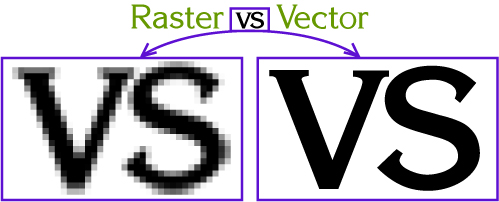
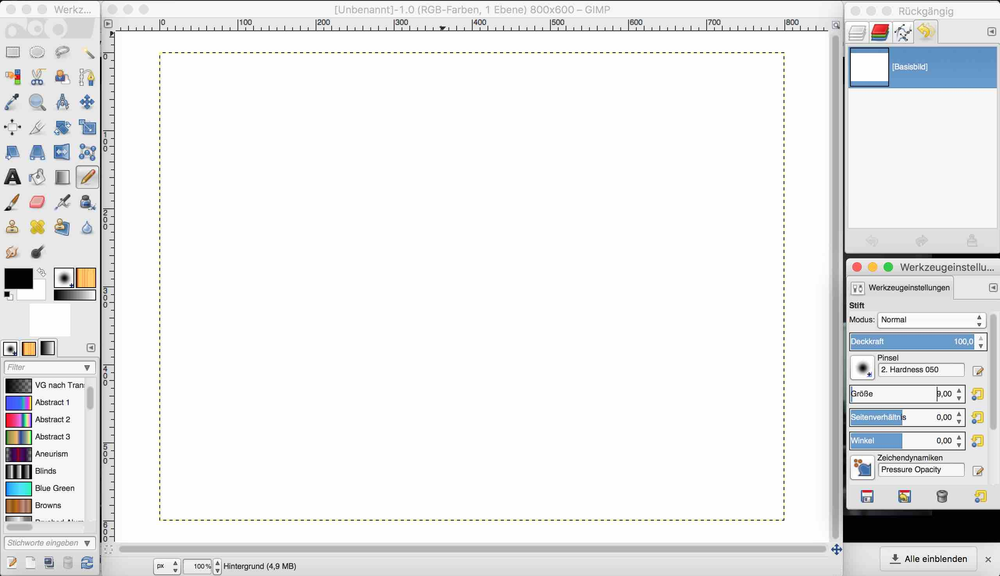
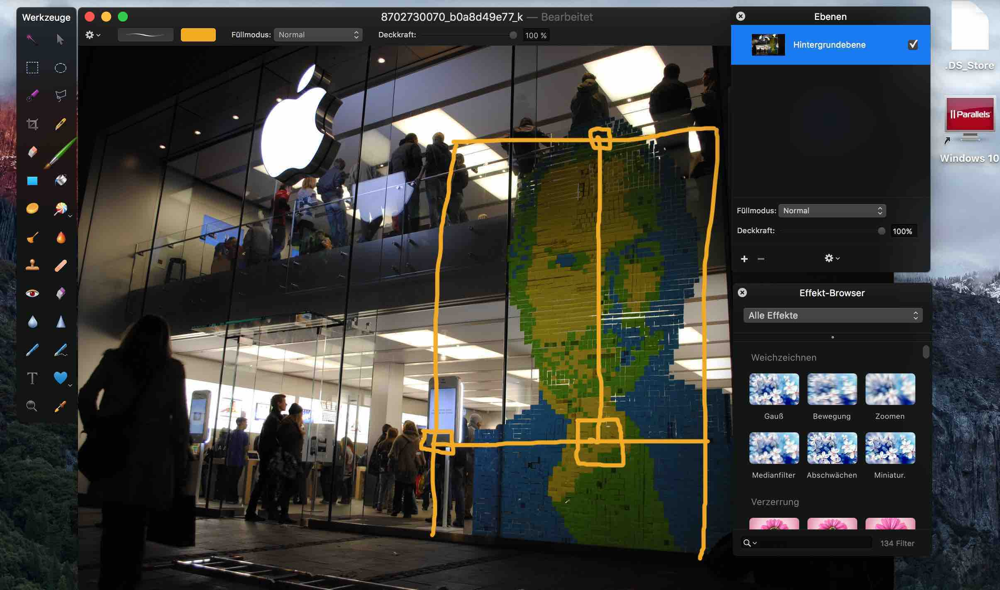
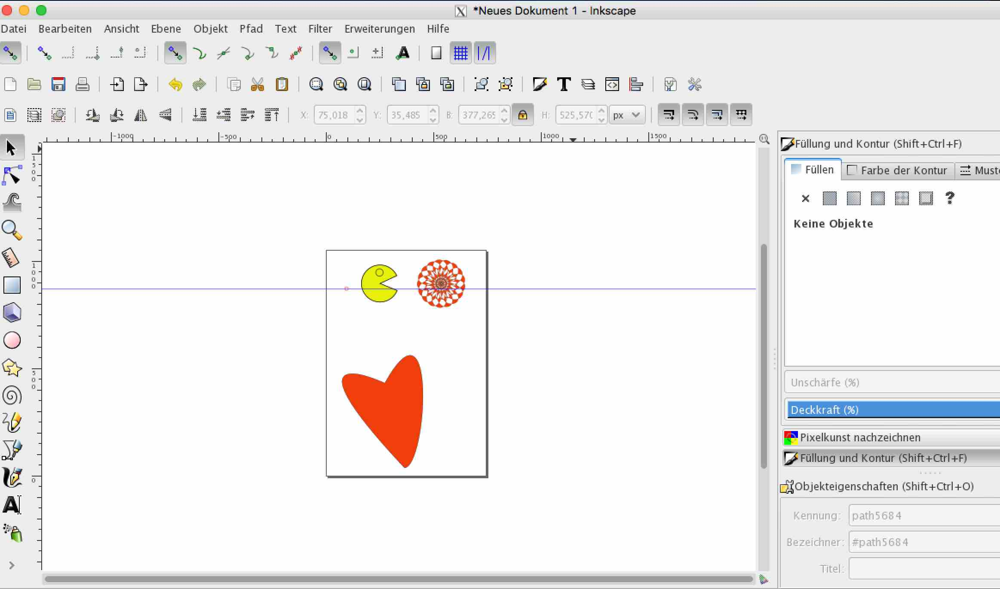
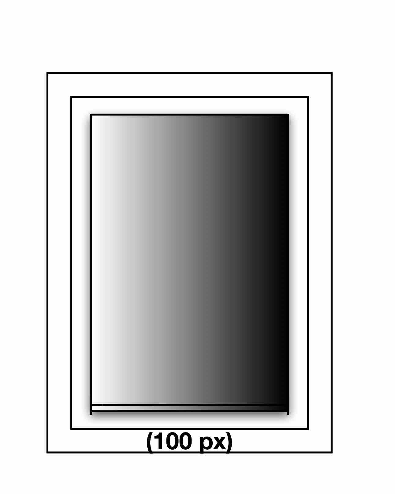
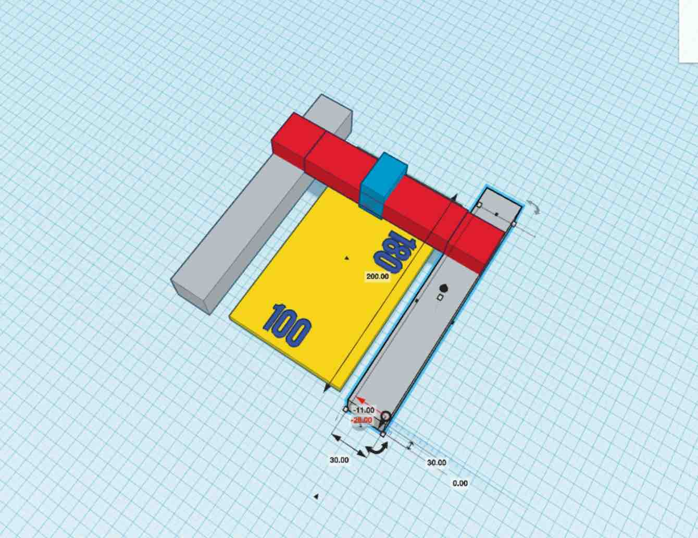
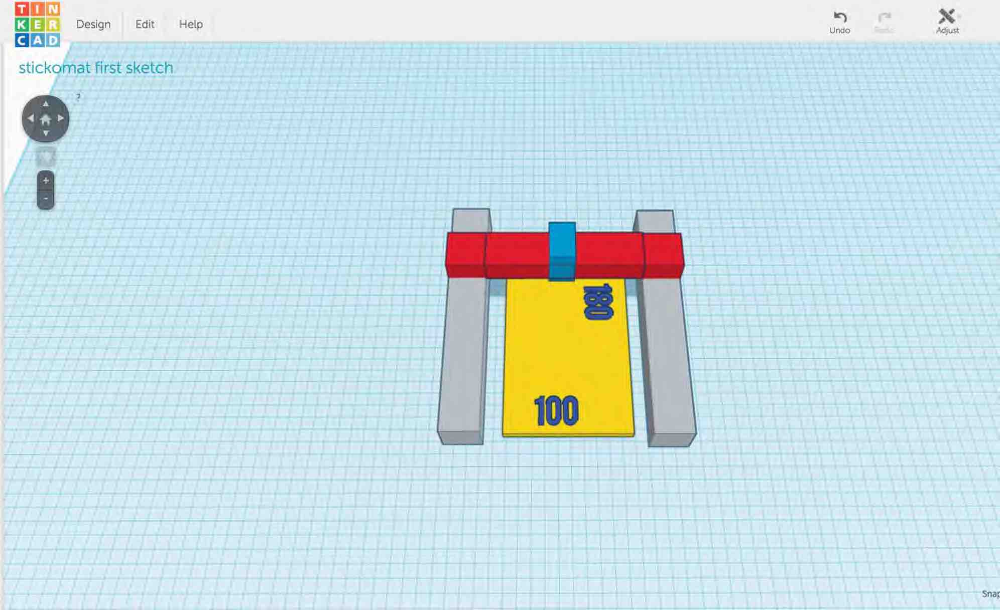
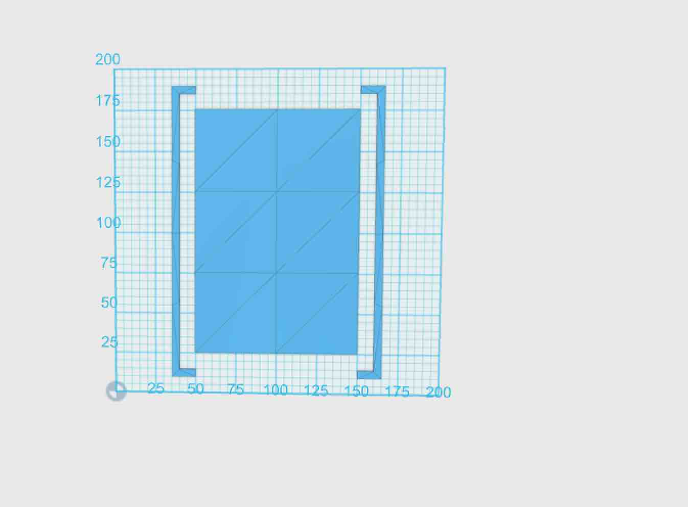
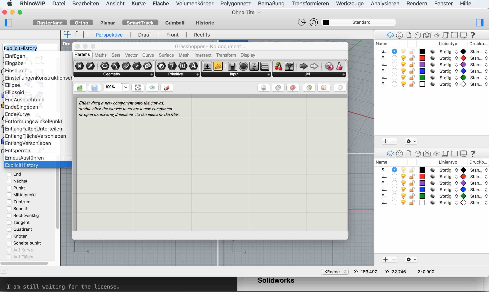
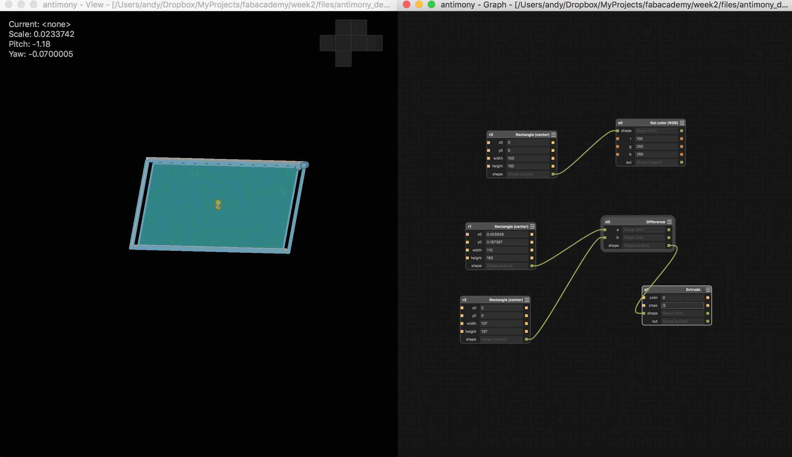

[BACK to START](../)

[FINAL PROJECT](../final) / [WEEK 1](../week1) / [COMPUTER AIDED DESIGN](../week2) / [COMPUTER-CONTROLLED-CUTTING](../week3) / [ELECTRONICS PRODUCTION](../week4) / [3D SCANNING & PRINTING](../week5) / [ELECTRONICS DESIGN](../week6)  / [COMPUTER-CONTROLLED MACHINING](../week7) / [EMBEDDED PROGRAMMING ](../week8) / [MECHANICAL DESIGN](../week9) / [MACHINE DESIGN](../week10) / [INPUT DEVICES](../week11) / [3D MOLDING AND CASTING](../week12) / [OUTPUT DEVICES](../week13) / [COMPOSITES](../week14) / [EMBEDDED NETWORKING & COMMUNICATIONS](../week15) / [INTERFACE AND APPLICATION PROGRAMMING ](../week16) / [APPLICATIONS AND IMPLICATIONS ](../week17) / [INVENTION, INTELLECTUAL PROPERTY, AND BUSINESS MODELS](../week18) / [PROJECT DEVELOPMENT ](../week19) 

# Week 2 - COMPUTER AIDED DESIGN

Februar 3 - Februar 10

[Lecture Link](http://academy.cba.mit.edu/classes/computer_design/index.html), [Video](http://archive.fabacademy.org/archives/2016/master/videos/02-10/index.html) 

~~~
*Weeks Assignment*

* Model (draw, render, animate, simulate, ...) a possible 
final project, and post it on your page with 
original 2D and 3D files. 

* Show how you did it with words/images/screenshots

* Included your design files.

~~~

As i am not sure how to modle my final project yet I tried to install and try out as many 2D and 3D design programs as possible and do one simple file with it. 

## 2D Design 

In 2D Design you have to understand the differences between raster and vector graphics. 

A raster is an image made out of pixels which are tiny squares of color information. A photograph is a typical raster graphic. 

A vector graphic is an image uses math to draw shapes using lines and curves. A commmon vector graphic is a logo or a fonts.

### Raster/Pixel

As a 2d Design raster design tool I normally used photoshop but I do not want to pay monthly for it so I use this opportunity to try out two alternative programs Gimp and Pixelmator.

#### Gimp

I followd a [lecture](https://www.youtube.com/watch?v=Vs_HKJa193s) about gimp and Inkscape from our instructor Ferdi but I additionally looked at some videos on [skillshare](https://www.skillshare.com/classes/design/Gimp-Essential-Training-Course/142862628/classroom/discussions?enrolledRedirect=1 )and at also looked at the tutorials you find when you klick on help. 

I needed to look at the videos step by step to really understand the different tools. 

The first thing I did was to adjust the windows. I think that was on reason why I did photoshop and not gimp in the beginning. 

After that I tried to [resize an image](http://www.wikihow.com/Crop-an-Image-Using-GIMP) an I had to google because its a little different then in photoshop. 

Als I tried to open an portrait and resize it and then I tried to get rid of the background. But I found the tools not very intuitive and switched to Pixelmator for that task.

I also tried to do a pixel art portrait of the Dalai Lama and it worked great. 

I also wanted to install the bimp plugin so you can change more images at the same time.  I could not get it to work so I installed Gimp on Windows in Parallels and used the Windows Installer. 

#### Pixelmator

I also tried Pixelmator. There is a 30 day trial version you can [download](http://www.pixelmator.com/mac/try/thankyou/). I really like that program. Nice design and very intuitiv. I right away sketched how I would like my stickomat to look like. It is great for simple image manipulations.

[Here](./files/stickomat_v1.jpg) you can get the first scetch of my final project.

 

### Vector

Normally I used Corel Draw for vector graphics but as there is now Mac Version I will give Inkscape another try. 

#### Inkscape

I first followed step by step the tutorial from Ferdi from the Fablab Barcelona and then installed two box makers.

I also downloaded the [elliptical box maker](https://github.com/BvdP/elliptical-box-maker/releases/tag/v1.0).

Here is a tutorial on [instructable.](http://www.instructables.com/id/Generating-elliptical-boxes-using-a-laser-cutter-a/).

With the box maker I tied to do the housing of my stickomat.

Here you can download the file [here](./files/stickomat_box.svg) 

 

#### [Graphic]()

This program is Mac, iPad and iPhone only and I downloaded and tried out and did a sketch.

#### Corel Draw

Also I downloaded Corel Draw but could not install it yet because in Parallels I could not put in the @ to sign in to the program.

### 3D Design

This is a great [video](https://www.youtube.com/watch?v=ouvf-4wciak) of 3D Modeling Concepts like Extrude, Revolve, Scale, Round & Filet, Pattern, Sweep, Revolve. 

I believe once you have understood these concepts you can work through every 3D Program and use the one that fits best for your task at hand.  

### Tinkercad

This is the program I am most comfortable with so I used it to first get a 3D idea of my final project. For my final project I created a new project folder. Its really great that you can store all you files online as well. The process to do my design was straight forward first made a box which will be my canvas to stick the post-its on it. Then I did the rods to the side and resized it with the Ruler tool to make them 3x3 cm as a normal aluminum rod would be. 

The only negative points is that you cannot continue working on your design when you do not have internet and that the working table is limited to 1000x1000mm. 

You can find the file [here](https://tinkercad.com/things/gHNLw9qohRZ) on tinkercad. 

### 123D Design

Next I also tried it with 123D Design. Its has a couple of more features then tinkercad but the handling si similar. Also it only meant for 3D Printing an modeling small objects as the working table is also limited to 100cm x 100 cm. 

I did this model by first draw a rectangle with the Sketch tool and the made offsets with the offsets tools and extrude the canvas and the sides. I then put the canvas in the air and created another box to cut away the bottom and the top.

The file of the design you can find [here](./files/stickomat_v1.stl) 

### Fusion360

After that I  also installed Fusion 360 and [did the bacis training tutorials.](http://fusion360.autodesk.com/learning/learning.html?guid=GUID-CC9A8E39-356C-43EA-9EDD-0E9C1321E0F2)

### Rhino Mac + Grasshopper (Work in Progress)

Since January 10 there is a [WIP Grasshopper Version for Rhino Mac.](http://www.grasshopper3d.com/page/grasshopper-for-mac) To start it you need to type in `ExplicitHistory` in the bar above. In the [forum](http://discourse.mcneel.com/c/grasshopper/grasshopperformac) you can report your bugs. 

### Rhine Windows + Grasshopper

I tried to set up the Windows version of Rhino on my Mac and installed Parallels and bought Windows 10 only to find out that it i better set up Bootcamp and Windows and do not use Paralles. I have not done that yet. 

### Blender

I have blender already installed but was not able to try it out yet. 

### Solidworks

*Update 14. April:* 

Finally in Barcelona I was able to play around with Solidworks a bit. 

### Antimony

I [installed](https://github.com/mkeeter/antimony) it (yes there is a Mac installer :-))and played around with it a bit and did a little [tutorial](http://www.mattkeeter.com/projects/antimony/3/).

I did not understand how to export an stl file at first but I looked at the site of site of the student [David Taylor](http://archive.fabacademy.org/archives/2016/charlottelatin/students/87/exercise02.html ) and with the help of another student I managed to export an stl file in the end. You need to create an export node and connect it to the shape you want to export. 

The file you can find [here](./files/antimony_design.sb).

### Openscad

I already know it and will try to do something in the laser and the 3d week and also played with it a bit. The [cheatsheet](http://www.openscad.org/cheatsheet/) is great to get started. I still am not confortable with and I hope to to a project with it in the future. 

### FreeCad

I already tried it out but did not like the interface. 

### OnShape

Later during fabacademy I also created an account for the [online CAD Program OnShape](https://cad.onshape.com). There is first [video ](https://www.youtube.com/watch?v=gHhVGUIfS8Q) you can watch ant then there are also several [tutorials](https://cad.onshape.com/help/index.htm#cshid=tutorials) you can go through. 

I really love the program. 

### Sketchup Pro

Soon to come.

## Overview of Programs

|				        | 2D              | 3D            |               |                  | Use case  | 
|:-------------      | :---------------:| -------------:| -------------:|-------------:|-------------:|
| Gimp	              | Raster/Pixel    |               | mutliplat form | free/opensource |            |
| Pixelmator         | Raster/Pixel    |               | MAC           |     29,99$       |           |
| Inkscape           | Vektor          |               | mutliplatform | free/opensource  |           |
| Graphic            | Vektor          |               | MAC           |  29,99$          |           |
| Tinkercad          |                 | (parametric)  | cloud         |                  | simple          | 
| 123D Design        |                 |               | multiplatform |                  |           | 
| Rhino + Grasshopper|                 |  parametric   | WINDOWS/MAC   |                  |           | 
| Blender            |                 |               | multiplat form|free/opensource   |           | 
| Antimony           |                 |  parametric   | MAC           | free/opensource  |           | 
| Freecad            |                 |               | multiplat form| free/opensource  |           | 
| Onshape            |                 | parametric    | cloud         |    fremium       |           | 
| SketchupPro        |                 |               | multiplatform |    fremium       |           | 

## Project Files

I will put all the project file in the google drive folder [here](https://drive.google.com/open?id=0B3iYmii-HJ7TMHZmVE1wVGdZOEk). 

## Feedback ?

[Twitter](http://www.twitter.com/andreaskopp) me or [email me at andreasrkopp at gmail dot com](mailto:andreasrkopp@gmail.com). 

[BACK to TOP](../week2)