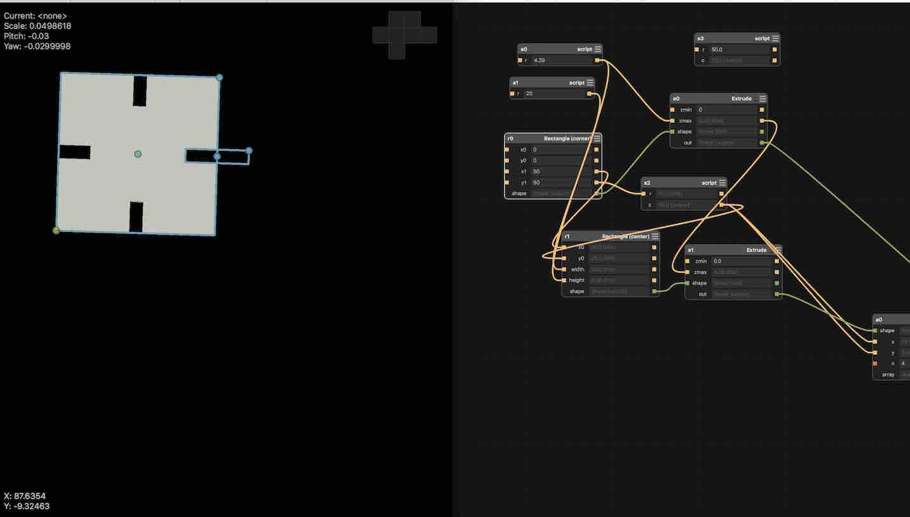
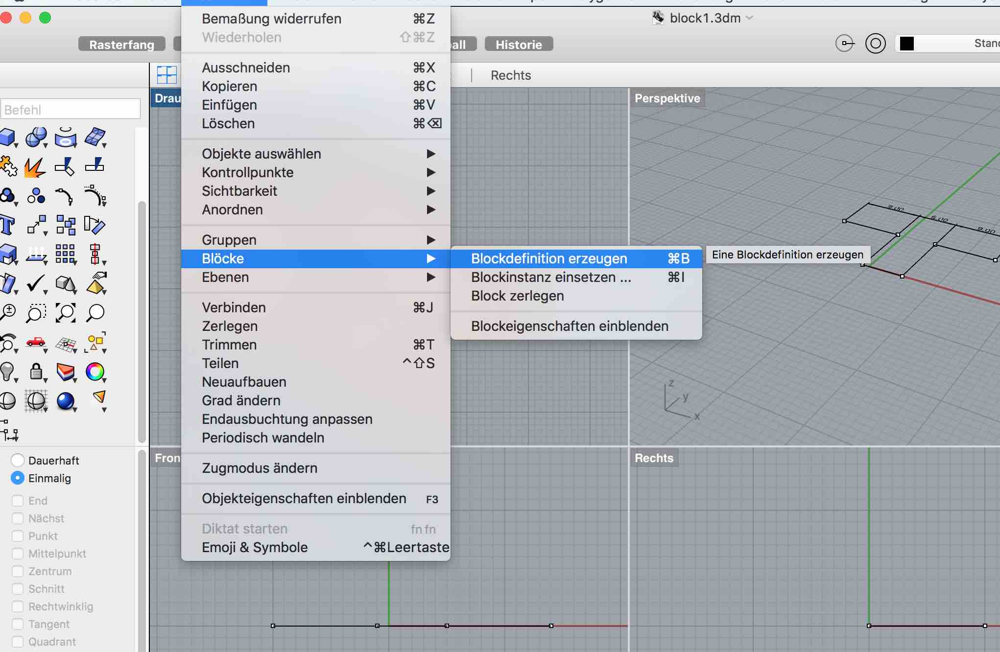
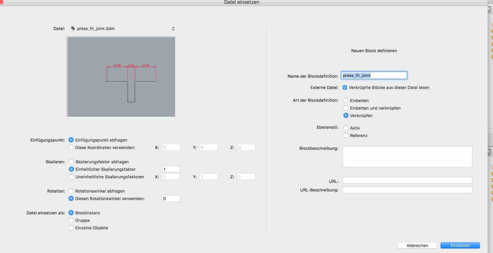
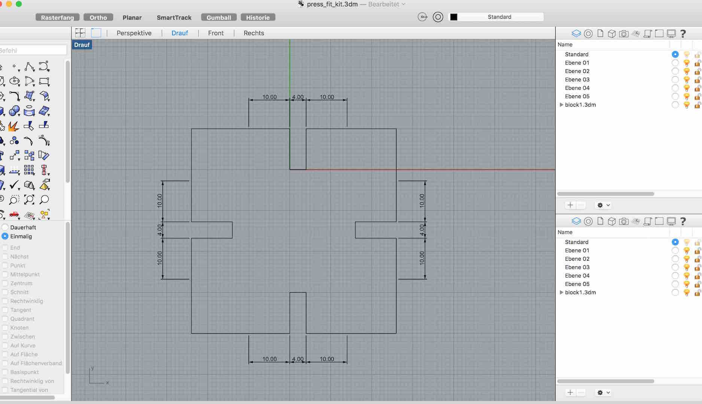
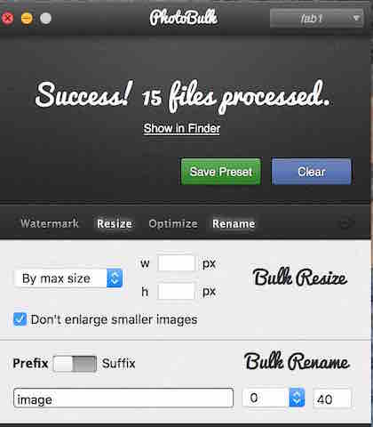

[BACK to START](../)

[FINAL PROJECT](../final) / [WEEK 1](../week1) / [COMPUTER AIDED DESIGN](../week2) / [COMPUTER-CONTROLLED-CUTTING](../week3) / [ELECTRONICS PRODUCTION](../week4) / [3D SCANNING & PRINTING](../week5) / [ELECTRONICS DESIGN](../week6)  / [COMPUTER-CONTROLLED MACHINING](../week7) / [EMBEDDED PROGRAMMING ](../week8) / [MECHANICAL DESIGN](../week9) / [MACHINE DESIGN](../week10) / [INPUT DEVICES](../week11) / [3D MOLDING AND CASTING](../week12) / [OUTPUT DEVICES](../week13) / [COMPOSITES](../week14) / [EMBEDDED NETWORKING & COMMUNICATIONS](../week15) / [INTERFACE AND APPLICATION PROGRAMMING ](../week16) / [APPLICATIONS AND IMPLICATIONS ](../week17) / [INVENTION, INTELLECTUAL PROPERTY, AND BUSINESS MODELS](../week18) / [PROJECT DEVELOPMENT ](../week19)   

# Week 3 - COMPUTER-CONTROLLED-CUTTING

February 10 - February 17

[Lecture Link ](http://academy.cba.mit.edu/classes/computer_cutting/index.html), [Video Link](http://archive.fabacademy.org/archives/2016/master/videos/02-10/index.html), [Documentation](http://fabacademy.org/archives/content/tutorials/04_Computer-Controlled_Cutting/Press-Fit_Construction_Tips.html)

~~~
*Weeks Assignment*

Laser cutter

* Make a parametric press fit kit with the laser cutter
* Explain how you drew your files
* Shown how you made your press-fit kit
* Eaten fresh vegetables today
* Included your design files and photos of your finished project

Vinyl Cutting

There is no specific project that is focussed on this very useful tool. There are a range of ways you might utilize it throughout the program, or your local instructor may set a specific project.

You might make:

* stickers
* flexible circuit boards
* a textured surface/relief pattern 
* screenprint resists/stencils
* Ensure that you have used it in some way during this time 
and met the objectives below.

Have you:

* Explained how you drew your files
* Shown how you made your vinyl project
* Included your design files and photos of your finished project

~~~

 
## Vinyl cutter

I wanted to get a vinyl cutter for quite some time now and for this assignment I finally bought the [Cameo Silhouette America](http://www.amazon.de/gp/product/B00P2H8ZBM?keywords=cameo&qid=1456752607&ref_=sr_1_1&sr=8-1).

First I installed the Silhouette Software from their Website and then just went through the manual that came with the cutter to load the cutting mat and and put a sheet of paper on the sticking mat and cut a "hello". But I forgot to specify the material but it went alright only I had problems to get the paper of the sticking mat. 

Next I wanted to make a raspberry pi sticker with some vinyl I had lying around from a previous project. I downloaded a raspberry pi png from the internet and loaded it into the Silhouette Software with the trace tool I traced the imaged and printed it out. 

I put the blade in position 3 and used the preset "White Stickerpaper."

You can see the result on the back of my macbook.

I also looked for a plugin for Inkscape but could only find one for the Mac Version. Only for Windows Inkscape, Illustrator and Corel draw. If you are using one of these program you can find it [here](http://www.hobbyplotter.de/download/content/index.php?id=40). 

### Vinylcutter as Plotter

Also you can use the Cameo as a Plotter by downloading this [penholder](http://www.thingiverse.com/thing:346734/#files) from Thingiverse.   

### Vinylcutter as Engraver

To use it as a engraver you get get [this](http://www.amychomas.com/index.php?main_page=product_info&cPath=25&products_id=139) tool. 

### Making flexible PCB with the Cutter

Also you can make [flexible pcbs](http://images.google.de/imgres?imgurl=http://fab.cba.mit.edu/content/processes/PCB/vinyl1.jpg&imgrefurl=http://fab.cba.mit.edu/content/processes/PCB/vinylcut.html&h=375&w=500&tbnid=-i5e77l0go6eOM:&tbnh=95&tbnw=126&docid=jeWQ8twjMTLxBM&usg=__RjL10ZFVK9fcMLEa-gAEBfitiBU=&sa=X&ved=0ahUKEwjD1pmA653LAhUIz3IKHdqgDkgQ9QEIJzAB) with the Cutter. 

## Laser Cutter

### Make a Laser cut Press Fit Construction Kit

The assignment for this week is to make a laser cut press fit construction kit. These [constructions tipps and examples](http://archive.fabacademy.org/archives/2016/doc/press_fit.html) helped me a lot.  

What is press fit you might ask? It is a fastening between two parts which is achieved by friction after the parts are pushed together, rather than by any other means of fastening according to [wikipedia](https://en.wikipedia.org/wiki/Interference_fit).

I looked around in my office and my kitchen to find some press-fit examples like a honey pot, a magnesium pill tube and a kitchen box.  

Also I found some tipps how to make a 3D Printing Press-Fit Parts. As I still do not have a laser cutter at home but quite a few lasercutters this is more practical for me.  

In the lecture Neil talked about a [Chamfer](https://en.wikipedia.org/wiki/Chamfer) to make the press fit joints better.  

What is a chamfer you might ask? Chamfers are straight-line transitions between curves on the same plane or between surfaces. You can do one by creating a line segment between two curves and trims or extends the curves to meet it." [according to a Rhino documentation](http://docs.mcneel.com/rhino/5/help/en-us/seealso/sak_fillet-blend-chamfer.htm).

Why do we need Chamfers? It takes a misalignment and alines it and compresses the material resulting in a better Joint. 

### My Process 

These are the things I used for this assignment:

* digital caliper
* Analog caliper
* rajet laser Cutter
* Zing Laser Cutter.
* 4 mm plywood

Normally I would use the [Maker Case Boxmaker](http://www.makercase.com/) then import the files into Corel Draw or Inkscape and make my adjustments there. My experience so far is that the boxes for that you generate with this Boxmaker are not press-fit and you need to do quite some adjusting, so I decided to learn to do this exercise in Inkscape, OpenScad, Antimony and Rhino. Also my goal is to but a website together like the boxmaker for a pressfit box.

#### Measuring & Testing

First I measured my material with a caliper. With the digital caliper the material was 3.65 mm thick and with the analog 3,75 mm. 

The I measured the kerf which is the material that the laser burns away. For that I cut a square, then measure the inner dimension of the hole and the outer dimension of the piece. 

Subtract and divide by two: this is the kerf for that material. For the Trotec that was 0,2 mm for the Zing that was also 0,2 mm.

### Inkscape

To find out the perfect notch size I started to make a couple of hinges with different sizes. I started with 3.7 mm and decreased it by 0.5 mm Steps.

The site of [João Leão](http://archive.fabacademy.org/archives/2016/fablabbcn2016/students/4/exercise03.html) guided me through this step by step. 

You create a couple of rectangles and clone them (Alt + D) and then resize them according to the thickness of your material.

Then select all rectangles and distribute.

With the Rayjet the best fit I got with 3,4 mm and 3,45 mm. 

Then I did the same test with the Zing with 100 % Power and 85 %s Speed but it did not cut through completely so I tried with 90 % Speed and 85% Power. The best fit I got with 3,5 mm and 3,55 mm.

[Here](http://wiki.fablab.is/wiki/Inkscape_how_to_make_a_pressfit_design) you can find the full process step by step. 
 

### Corel Draw

In CorelDraw the process is quite similar. 

You create a couble of rectangles and clone them and then resize them according to the thickness of your material. In Corel you need to select the first rectangle and always clone that one. 

Then select all rectangles align them and distribute them over the selection evenly. 

Then group all rectangle with CTRL + G and change the color of the rectangle to red. 

Create a second big rectangle and select all small rectangles and move them so they intersect with it. Select the both and select trim. Because it did not cut the first rectangle I copied and pasted it again and trimmed it again. 

With the Trotec the best fit was with 3,45 mm and 3,4 mm with 100 % Power and 0.2 % speed. 

Then I also used the Zing laser and there the best fit was with 3,5 mm and 3,45 mm and 90 % speed and 85 % power. 

So it means the notch (width of the tabs) has to be 0.2 mmm wider then the tile.  

I tried to do the parametric kit with Corel Draw but it was very time consuming. You clone a thing and rotate it and then it is not together any more. 

Some project I would love to build upon is the [boxmaker](https://github.com/rahulbot/boxmaker-website) from [@rahulbot](https://twitter.com/rahulbot) or [makeabox.io ](https://github.com/kigster/laser-cutter). Or this box frin thingiverse [http://www.thingiverse.com/thing:1541](http://www.thingiverse.com/thing:1541).

### Making it Parametric with Antimony

With Corel Draw I was not able to make the it really parametric so I wanted to move to Antimony but could not really get much further myself. 

*Update 8. April:* While in Barcelona Ferdi showed me to make my Press Fit really parametric. You can find the file under Project Files. Next step is to make the pencil holder also parametric. The files for my first try you can find in Project Files below. 

### Making it Parametric with Rhino

***Update 4. July*** 

I have finally gotten into Rhino and watched the [Tutorial](https://vimeo.com/155032336) of Saverio Sillo on how to make parametric shapes with Rhino.

You first draw the connection you want to make parametric in one file and  define it as a block and save it. Then you open a new file and import the first file. Make sure you select link.

Then you draw you design and Mirror and copy your joint wherever you want it to be. 

When you want to update your joints you modife the joint in your first file and in your second file click on edit>blocks>update and all joints get updated.

### Cutting

I took my files from Corel Draw and cut them with the Zing Laser cutter. 

### Pencil holder Case

I also would like to make this pencil holder design parametric with rhino or Antimony.

Coming soon! 

## Project Files

[Download](https://drive.google.com/folderview?id=0B3iYmii-HJ7TVE5uTWpISnFSUHc&usp=sharing) all project files from this assignment from my Google Drive or directly from the repository here.

[block1.3dm (rhino joint file)](./files/block1.3dm)

[press_fit_kit.3dm(rhino design file)](./files/press_fit_kit.3dm)

[anytmony_parametric_design.sb (antimony)](./files/anytmony_parametric_design.sb)

[raspberry_pi_logo_vynil_cutter_file.studio3](./files/raspberry_pi_logo_vynil_cutter_file.studio3)

## Tipps and Tricks

This time I used a [batch image processing tool](http://bulkresizephotos.com/)  I had to resize quite some pictures I took with my i-phone and then scaled it down by 20%. 

***Update 4. Juli 2016***

In the meantime I switched to [PhotoBulk](https://itunes.apple.com/de/app/photobulk-watermark-resize/id537211143?mt=12) to batch process my images. Which works great as I only have to drag a bunch of video in the tool and they get renamed, resized and optimized. But still some pictures are too big and I needed to resoize them with the Preview tool of Mac. 

## Learnings

* how to make a file parametric
* test joints
* vinyl cut

## Feedback

Please give me feedback 
[Twitter](http://www.twitter.com/andreaskopp) me or [email me at andreasrkopp at gmail dot com](mailto:andreasrkopp@gmail.com).
 
 

[BACK to TOP](../week3)

