[BACK to START](../)

[FINAL PROJECT](../final) / [WEEK 1](../week1) / [COMPUTER AIDED DESIGN](../week2) / [COMPUTER-CONTROLLED-CUTTING](../week3) / [ELECTRONICS PRODUCTION](../week4) / [3D SCANNING & PRINTING](../week5) / [ELECTRONICS DESIGN](../week6)  / [COMPUTER-CONTROLLED MACHINING](../week7) / [EMBEDDED PROGRAMMING ](../week8) / [MECHANICAL DESIGN](../week9) / [MACHINE DESIGN](../week10) / [INPUT DEVICES](../week11) / [3D MOLDING AND CASTING](../week12) / [OUTPUT DEVICES](../week13) / [COMPOSITES](../week14) / [EMBEDDED NETWORKING & COMMUNICATIONS](../week15) / [INTERFACE AND APPLICATION PROGRAMMING ](../week16) / [APPLICATIONS AND IMPLICATIONS ](../week17) / [INVENTION, INTELLECTUAL PROPERTY, AND BUSINESS MODELS](../week18) / [PROJECT DEVELOPMENT ](../week19)  

# Week 5 - 3D SCANNING & PRINTING

Februar 24 - March 2

[Lecture Link](http://academy.cba.mit.edu/classes/scanning_printing/index.html), [Video Link](http://archive.fabacademy.org/archives/2016/master/videos/02-24/index.html)

This weeks [recitation](https://plus.google.com/u/2/events/c4vhem4fhn14d7rjrorh7jskgfo) was from Vija Gupta "On creating a new economy and using the human power for a better future."

~~~
*Weeks Assignment*

* Describe what you learned by testing the 3D printers
* Shown how you designed/made your object (small) and explained why it could not be made substractively  
* Scanned an object
* Outlined problems and how you fixed them
* Included your design files and ‘hero shot’ photos of the scan and the final object	

~~~
## Testing the limitations of my 3D Printers

I have 3 [craftbots](https://www.craftunique.com/) from Hungary, 1 Uli2go from the Netherlands, 1 [Kiwi3D ](https://www.sharebot.it/index.php/prodotto/kiwi-3d/)from Italy and 3 Micos from the US in my lab. I already spend quite some testing the limits of these printers.

For this assignment I downloaded a [test from Thingiverse](http://www.thingiverse.com/thing:1363023) to test the limitations of my printers. 

The test piece from Vctrl takes about 1:30 to print and includes 30 test. 

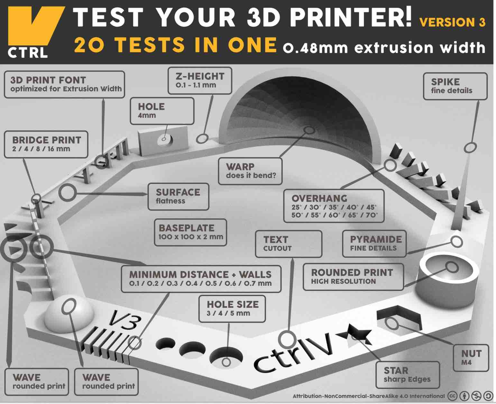

### Testing the CraftBot+ vs Ulti2go

The white piece was green piece was printed on the Craftbot+ and the white one on the Ulti2go.

* **01 Nut, Size M4 Nut should fit perfectly**

It fits but I had to push it in a bit hard. It seems to fit a bit better at the Ulti2go piece. 

* **02 Wave, rounded print**

They waves are very round at the Ulti2go piece but do not look so good with the Craftbot+.

* **03 Star, Sharp Edges**

They are both sharp. The Ulti2go piece look a little bit sharper.

* **04 Name, Complex Shapes**

Looks good at both pieces. 

* **05 Holes, Size 3, 4, 5 mm**

Ulti2go: 2,72 mm / 3,66 mm / 4,84 mm
Craftbot+: 2,32 mm / 3,44 mm / 4,62 mm

* **06 minimal Distance: 0.1, 0.2, 0.3, 0.4, 0.5, 0.6, 0.7 mm**

Looks that the Ulti2go can print with more detail. 

* **07 Z height: 0.1, 0.2, 0.3, 0.4, 0.5, 0.6, 0.7, 0.8, 0.9, 1.0, 1.1 mm**

Looks that the Ulti2go can also print with more detail in the z-axis.

* **08 Wall Thickness: 0.1, 0.2, 0.3, 0.4, 0.5, 0.6, 0.7 mm**

* **09 Bridge Print: 2, 4, 8, 16 mm**

They both do not look that great.

* **10 Sphere, Rounded Print 4.8mm height**

Both look good.

Ulti2go: 4,85 mm
Craftbot+: 4,86 mm

* **11 Sphere Mix, 7 mm height**

* **12 Pyramide, 7 mm height**

Both look good.

Ulti2go: 6,9 mm
Craftbot+: 6,67 mm

* **13 Overhang: 25, 30, 35, 40, 45, 50, 55, 60, 65, 70°**

Both overhangs look good. Just the Ulti2go a bit better. 

* **14 Warp, does it bend?**

Both bend and both have problems on the very top. The Craftbot has a bit more problems in the middle. 

* **15 3D Print Font, optimized for 3D printing**

It looks a bit sharper withe the Ulti2go.

* **16 Surface, Flatness**

Yes both pieces are flat.

* **17 Size, 100 x 100mm x 23.83 (10mm width)**

Ulti2go: 92,5 x 92,1
Craftbot+: 92 x 92,12

* **18 Spike, minimum Layer Time, 21 mm height from Bottom (include Baseplate)**

Not quite 21mm. The top looks better at the Ulti2go.

Ulti2go: 16,93
Craftbot+: 17,82 mm

* **19 Hole in Wall, 4 mm diameter, check for proper print**

At both pieces the top is not round. 

Ulti2go: 3,96 mm
Craftbot+: 4,3 mm 

* **20 Raft Test, raft should be just under the model**

Raft are both good. I just made it too thick at the craftbot.

* **21 Retract Travel, check retract settings for longer travel**

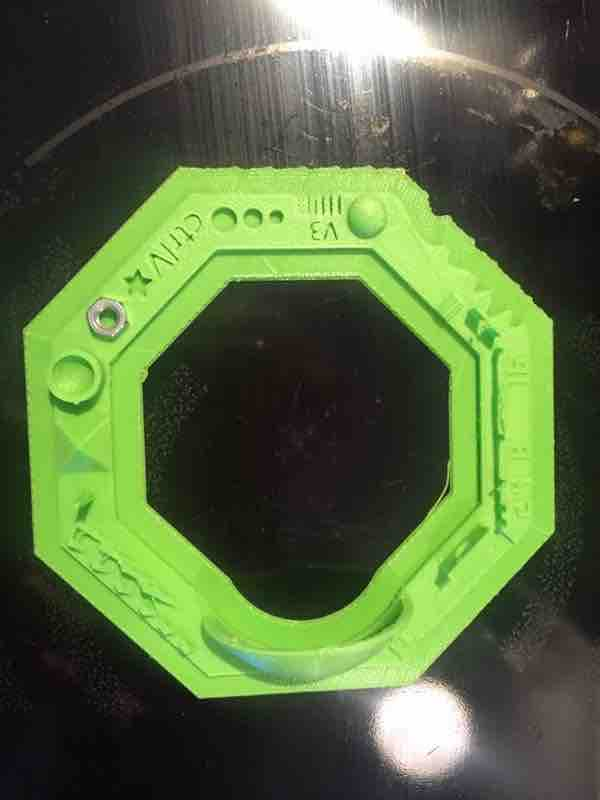

## Calibration

Update: During my week in Barcelona Ferdi told me about away how to configure you 3D printer. For that you have to follow [that guide ](http://reprap.org/wiki/Triffid_Hunter's_Calibration_Guide/de) and the change some values on your firmware and upload it again. How do modify the firmwar I still have to find out. 

For the ultimaker2go I am using the Tinker V16.03 firmware and this is the [soucecode](https://github.com/TinkerGnome/Ultimaker2Marlin/releases/tag/V16.03) and for the craftbot+ I have to ask were to download the source code of the firmware. 

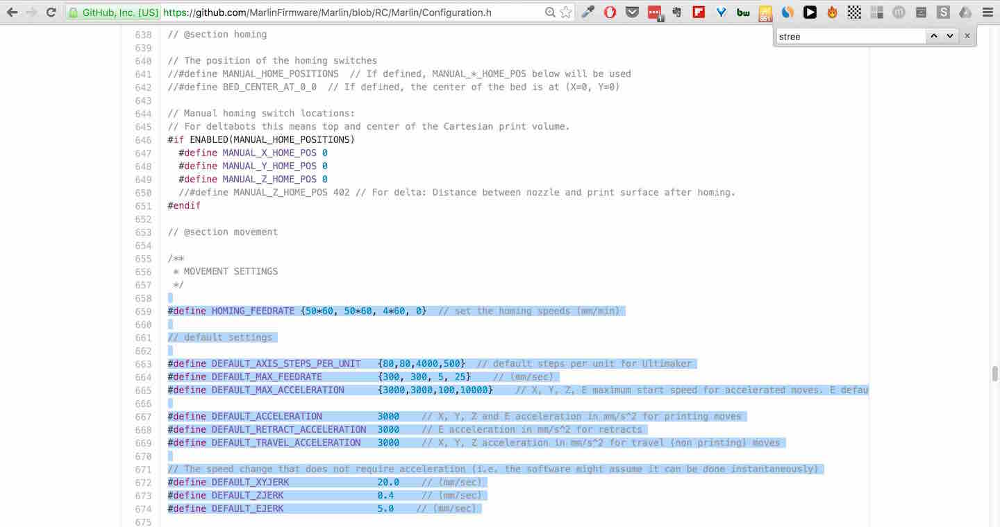

## 3D QR Code

I wanted to 3D print a QR Code in 3D which you cannnot produce substractivly without painting first a sheet of wood white and then the top black. And even then it would be hard to paint the sides of the QR Codes perfectly black. 

### Method 1

To test my 3D Printers and to do something new I will do a 50mm x 50 mm 3D QR Code with two filament colours white and black. I think you could not do that substractively without having to use glue. 

I found a great [barcode generator](http://www.thingiverse.com/thing:46884) from [mcg1355](http://www.thingiverse.com/mcg1355/about) on Thingiverse. But you need windows to use the program. 

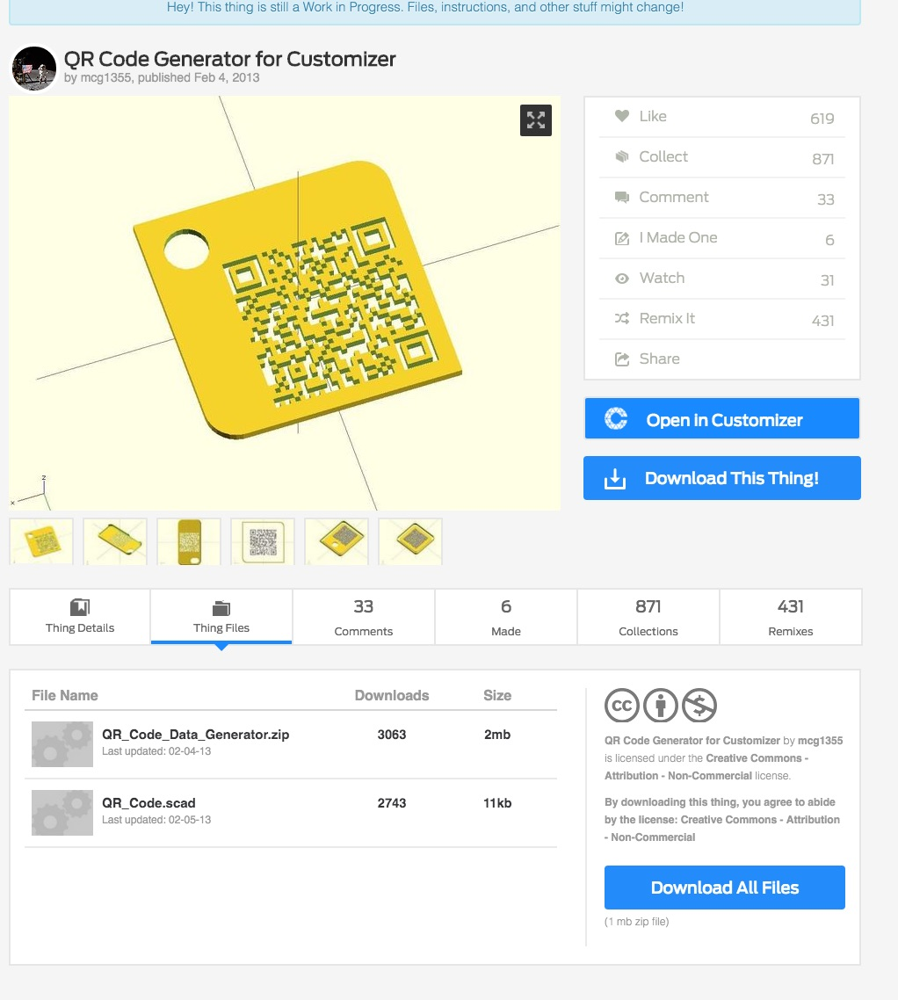

And I wanted to try to do it myself. So i did it the QR Code with Inkscape as I learned in the second Week assignment.  

Then I exported it as a stl and tried to import into Tinkercad and 123Design but that did not work!! So I tried more ... 

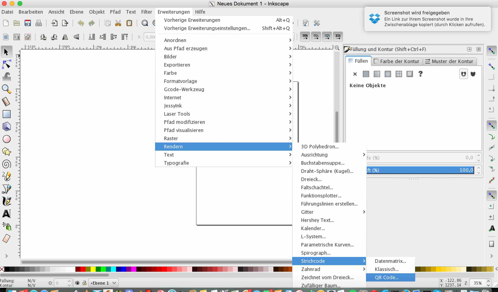

Finally it worked to export is as a dxf and import into Fusion 360. There I extruded the little pixes 5mm. This was really time consuming as I had to select each pixel and then extrude all the selected pixels. Does somebody has and idea how that works better?

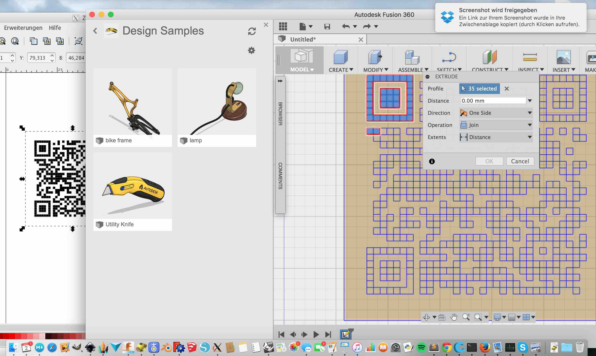

After doing that I exported it as a stl and imported it into tinkercad as I was not yet really familiar with Fusion. Exporting a stl in Fusion is a little tricky you have to click on the object tree with a right click and then you can find the option `Save as STL`

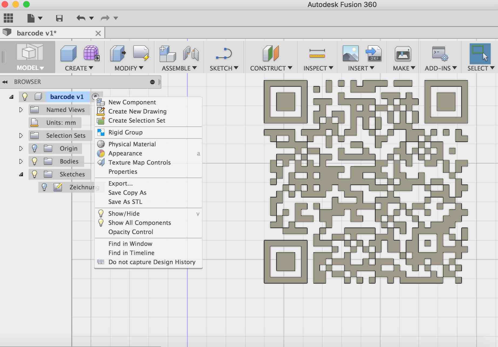

In tinkercad I put a 1.2 mm box below the code and exported it as a stl. 

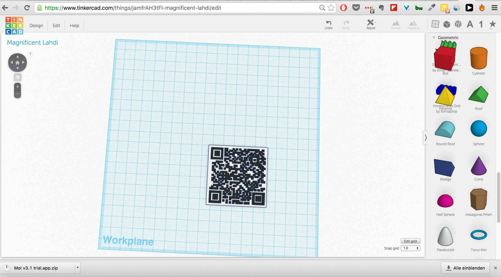

Then I opened the stl with Cura and changed the white filament to the black filament after the base of 1.2 mm finished printing. 

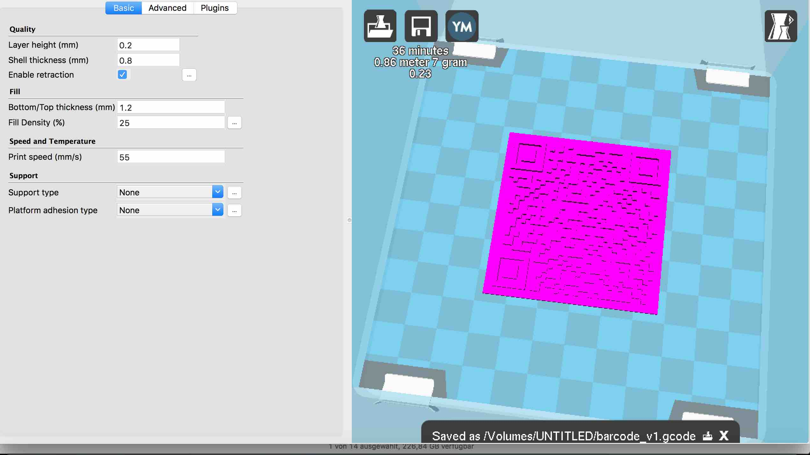

You can also use a Cura plugin called `Pause at height` for that so you do not have to stop it yourself. You just have to be careful that you let the head stop inside the dimensions of your printer. 

Also you need to clean the nozzle when you change the filament so you do not mess up the code. Also I am thinking about changing the nozzle from the standard 0.4 mm to 0.25 mm. 

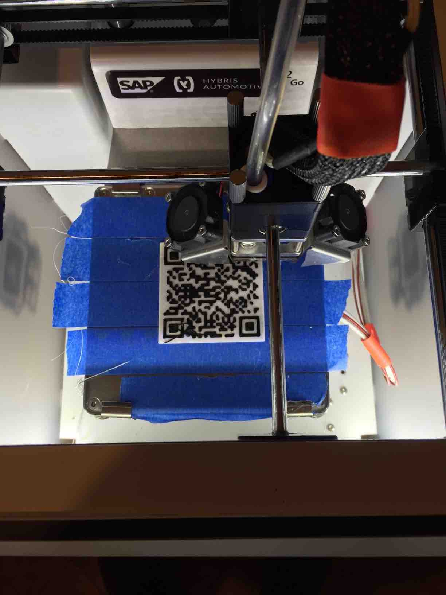

This is the final result. If you want to test it you can download some [Barcode/QR-Code Scanner](https://itunes.apple.com/de/app/barcoo-barcode-scanner-qr/id339525465?mt=8) for your phone.

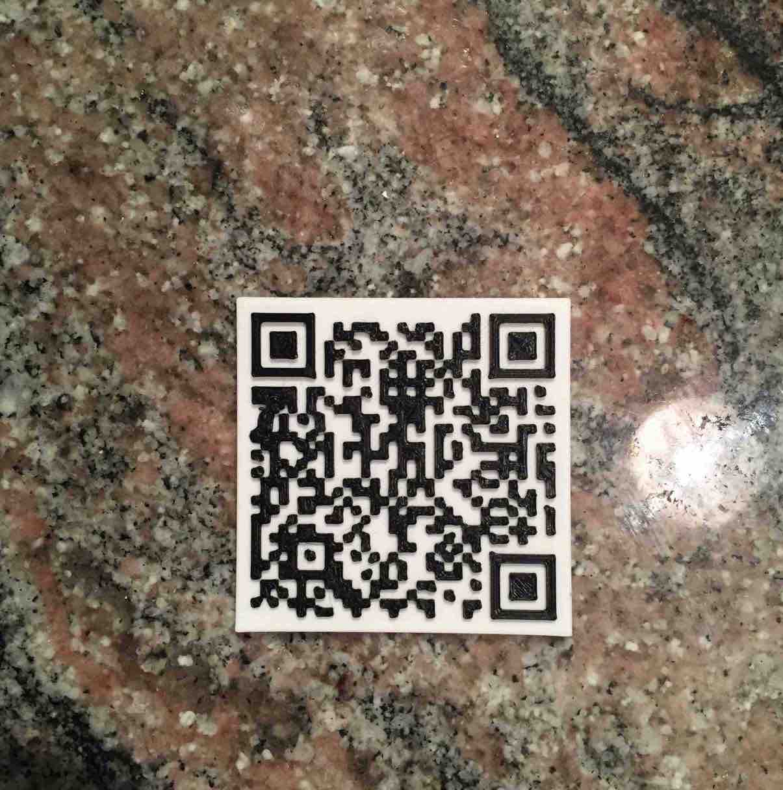

### Method 2

*Update 7. April 2016:* While working [Fablab Berlin](https://fablab.berlin/en/) for Junior Lab during the easter holidays I discovered a faster method how to make a 3D Barcode and do not have to install a single program. 

These are the necessary steps:

1. Generate a barcode with a [free barcode maker](https://www.barcodesinc.com/generator/qr/?chl=BarcodesIncyxx%3Cy&chs=200x200&cht=qr&chld=H%7C0) or in inkscape 
2. Download the png
3. Invert the image with [fabmodules](http://fabmodules.org/) and download inverted png
4. [Open tinkercad](https://www.tinkercad.com) and go to shape generator > image generator 
5. Drag an drop it to your workplane
6. Put in you inverted barcode image
7. Resize it to 50 x 50 mm
8. Extrude a little bit and put it so you have at least 2 - 3 black layers
9. You also you can use my tinkercad [file](https://tinkercad.com/things/fiCNffka4Sj) and just put in your barcode. 
10. I am suggesting that you make 3 layer white and at 3 layer black when printing

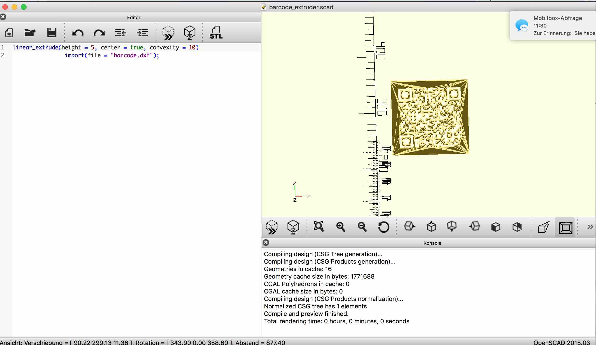

### Method 3

*Update 8. April 2016:* While visiting the Fablab Barcelona Ferdi showed me another quick method. 

1. Generate a barcode with Inkscape
2. Gruppe aufheben
3. Delete white background
4. Put barcode on the left lower corner
5. Export as dxf in mm an no LW Poline
3. Open up OpenScad and look at the [user manual](https://en.wikibooks.org/wiki/OpenSCAD_User_Manual/Using_the_2D_Subsystem#import_dxf) for import dxf
4. Paste in the code and save the openscad file in the same directory you have your barcode in. 
5. Extrude and put a base under your code
6. I am suggesting that you make 3 layer white and at 3 laser black
7. You can find the file on my google drive linked in Project Files

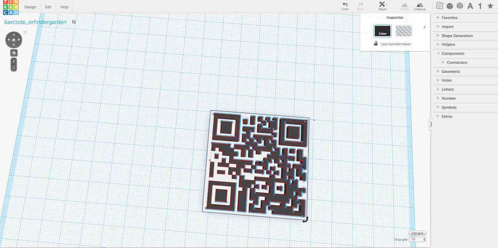

 
## Multicolor Raspberry Pi Logo for my PennyBoard 

After that I made a multi color raspberry pi logo for my penny board. 

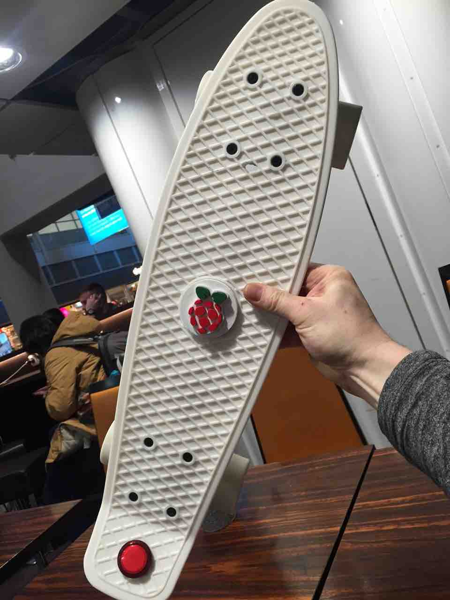

## Multi Print Cura Plugin

One limitation I really do not like of my printer is that you only can print one stl file at a time are are limited to your print bed. 

To tackle this problem I created a Cura Plugin that kicks out a print after the print finishes with the print head. Send me an email and I send it to you it works with the Ultimaker2 and the Craftbot+ so far. 

Send me an email if your interested.

## 3D Scanning

### Scanning a Person

I used an [iSense 3D Scanner](http://www.3dsystems.com/shop/isense) from 3D system that uses the [structure sensor](http://structure.io/) from Occipital. It sends out millions of infrared dots then a infrared camera picks up those dots according of the pulsing of the light on the object the light a depth map is build. By moving the sensor around you can capture the depth map from all sides and it is then stiched together to create a point cloud of your scan which is then transformed into a mesh in the sensors software.  

You can buy the sensor for i-pad and i-phone and the device uses a bunch of build in sensor like the camera sensor, the acceleromter and gyroscope so it knows not only where the position of the object is but also how the camera has moved since its initial positioning. 

I bought the [i-phone version](http://www.3dmensionals.de/cubify-isense-3d-scanner-fuer-iphone-6) but realized that the i-phone app is pretty bad and I loose the tracking all the time. Also you cannot see the files in the app right away but there is an app from another company called [itSeeze3D](http://itseez3d.com/product.html) with I found scans much better and you also can see the files locally and can send them to your computer via email. Unfortunately there is no itSeeze3D iphone app yet.

***Limitations of the isense***

On the 3d systems website they say the iSense has a maximum resolution of 0.025 inches or 0.0635 mm but I found on other websites that the resolution is 0.5 mm. The problem with this device is that you cannot objects smaller then 30cm very well. Also you cannnot use a spinning table to scan a smaller object as the sensor uses the gyroscope and needs the ipad/iphone moving around the object. Also it will have problems with objects that are too shiny and has nurbs in the middle. 

### Bill of materials

* iphone/ipad
* [iSenseScanner](https://www.igo3d.com/de/isense-3d-scanner-iphone-6.html)
* [Calibrator app ](https://itunes.apple.com/us/app/structure-sensor-calibrator/id914275485?mt=8)
* [itSeeze3D app](https://itunes.apple.com/us/app/itseez3d/id888490358?mt=8) (for ipad only!)
* another option would be to use the [Skantect Software](http://skanect.occipital.com/)

First you need to calibrate the sensor with the sensor calibrator app. Then you walk around the person you want to scan. The app will tell you to move slower when you it loses the connection. The problem with the app from 3D System is you need to connect your iphone to your computer and download the scans out of itunes. 

***Other apps for the structure sensor***
hen 
As you can build upon the Structure SDK 0.6 there are a couple of other apps you can download. 

* [Room Capture](https://itunes.apple.com/us/app/room-capture-structure-sensor/id916501905?mt=8) (ipad)
* [360 Panorama](https://itunes.apple.com/us/app/360-panorama/id377342622?mt=8) (iphone)

### Postprocessing with Meshmixer

If you use itSeeze3D you can send yourself the stl or obj files of your scan otherwise you need to go to connect your phone to your conn 

I opened the file in [Meshmixer](http://www.meshmixer.com/) a free program from Autodesk and also imported a hulk figure from [thingiverse](http://www.thingiverse.com/thing:421887) (Hulk by [X3RPM](http://www.thingiverse.com/X3RPM/about) is licensed under the Creative Commons - Attribution - Non-Commercial).

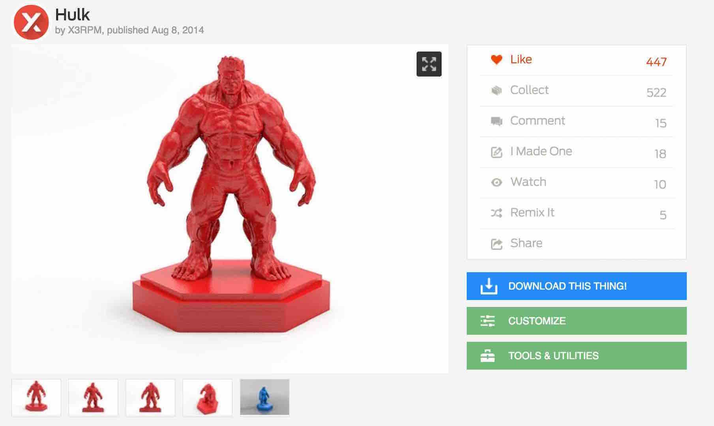

Then I cut the head of the shoulders with a plane and moved it around and worked on the size and the position of the head until it looked natural. But I realized it would look better if I would make the head disproportional big. If you want to put your own head on the hulk just import your scanned hat and put it over my figure. 

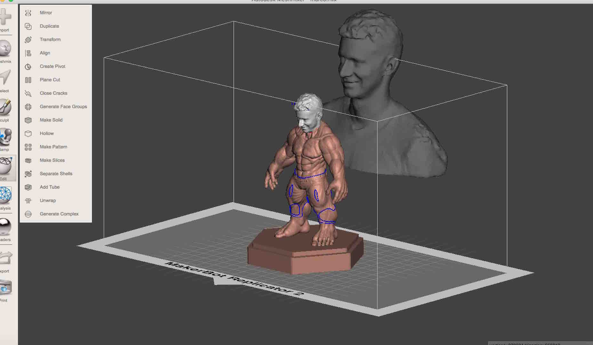

***Repair Mesh***

Before the model can be 3D printed it has to be closed completely. I like that Meshmixer has a autorepair function to repair your mesh. You just click on 'Analyse' in the left sidebar and then Inspector>Autorepair all. This was enough to repair all my scans so far. 

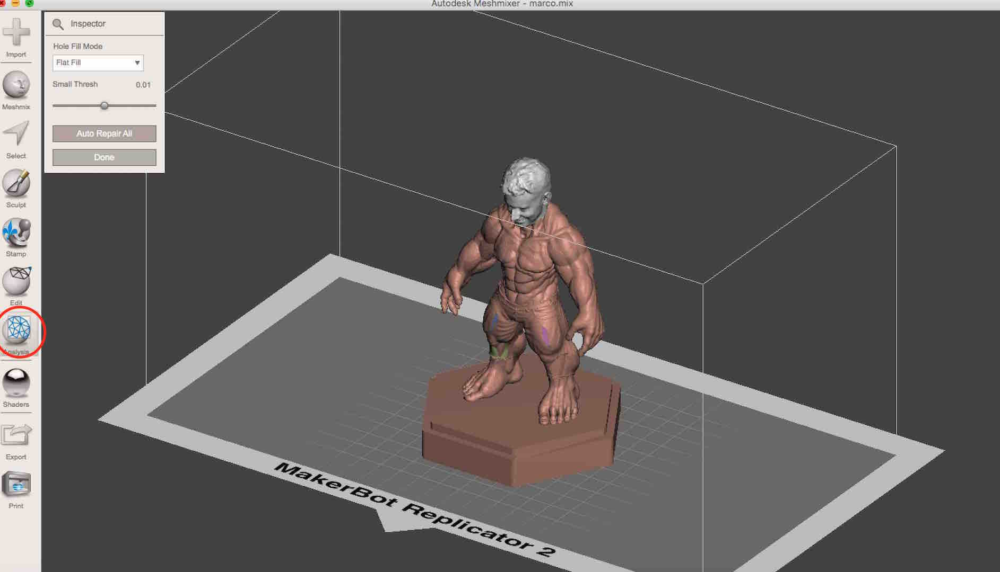
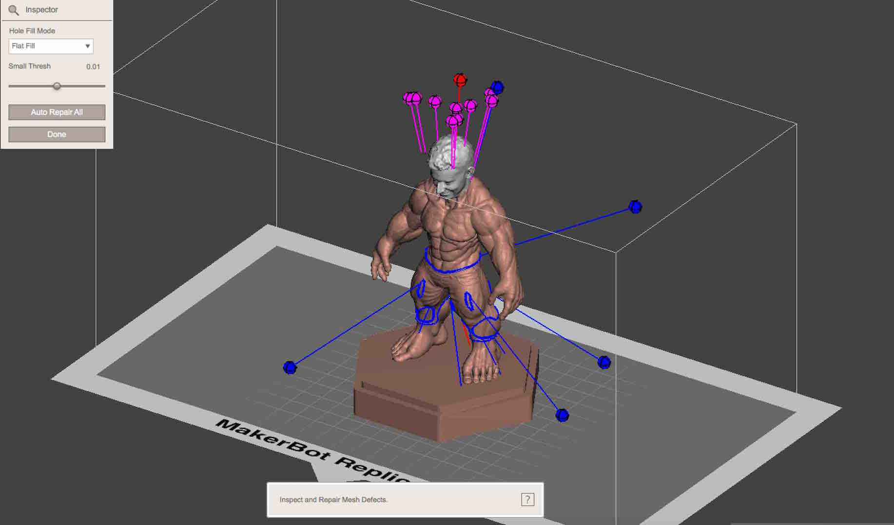

### Printing the Scan

I wanted to print the hulk with my friends face as big as possible. I took me a coubple of failed prints but in the end I finished it. On the craftbot with 15% infill and 0.2 it takes about 10 hours.

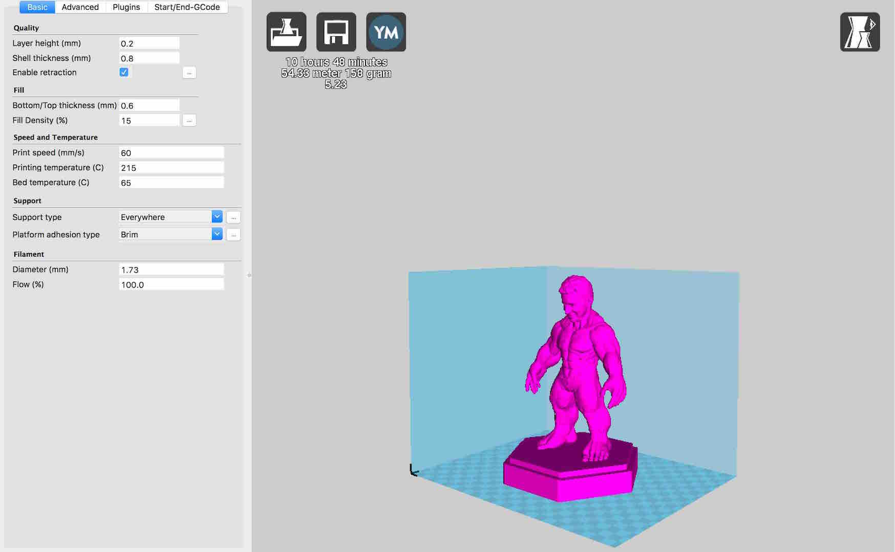
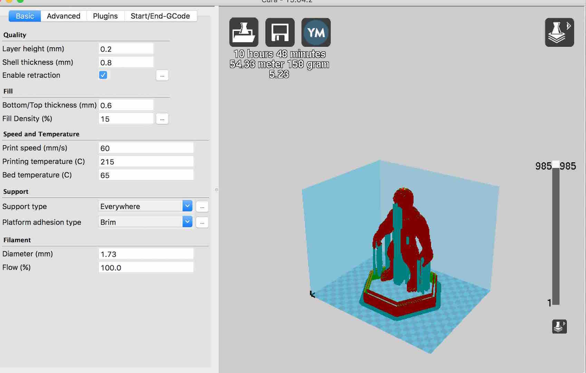

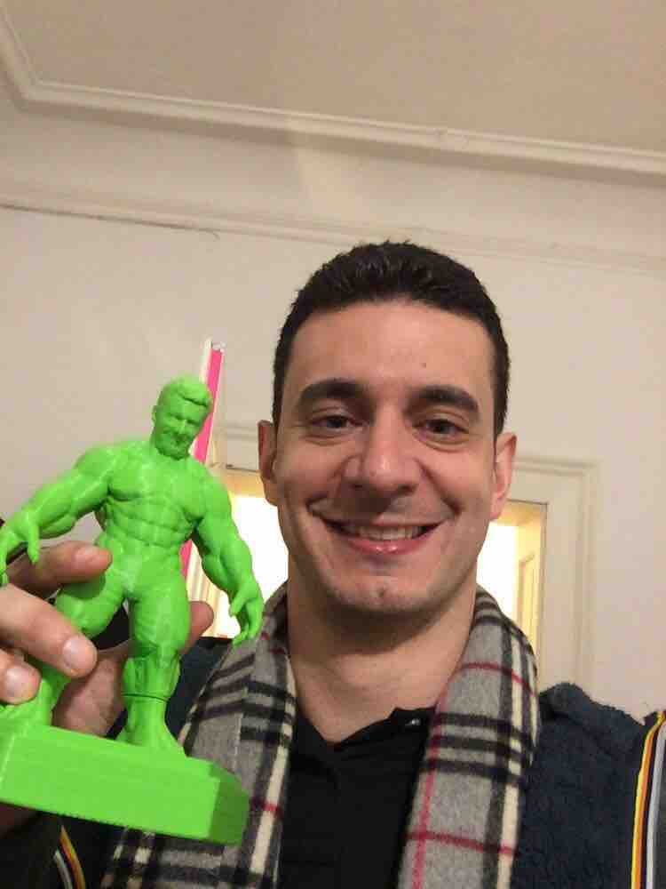

### Scanning a Object

***Update 5. July***

My classmates all scanned a little object with the Roland MDX-20 Modela and got really great results with resolutions up to 0.05 mm!!. You can find some results on the sites of [Cit](http://archive.fabacademy.org/archives/2016/fablabbcn2016/students/139/htm/week_5.html), [Caro](http://archive.fabacademy.org/archives/2016/fablabbcn2016/students/346/Week05.htm), [Arnau](http://archive.fabacademy.org/archives/2016/fablabbcn2016/students/36/pages/project5.html) or [Joao](http://archive.fabacademy.org/archives/2016/fablabbcn2016/students/4/exercise05.html). In blender you can then repair your scan. This process gives you a great detailed scans only the mill/scanner has a $4,495 list price and the scanning process takes way to long. A nice product would be to develop scanner had for the ultimaker or the Othermill. 

***Scanner Overview***

A little research into 3D Scanners shows that all newer scanners are using lasers and not a litle needle like the MDX-20 and are also much cheaper. They can scan up to around 0.0635 mm. Here I found a good overviews  

#### Scanning a Object with the isense

To scan an object with the isense you have to place some magazines next to it. 
Here is a [video tutorial ](http://itseez3d.com/product.html) how to do that. 

## Project Files

[Download](https://drive.google.com/folderview?id=0B3iYmii-HJ7TSjVvWkJkb3RoblU&usp=sharing) all project files from this assignment from my Google Drive.

## Learnings

By testing the printers I realized that if you really want to work precisely you need to print this test out before and adjust your design accordingly.

Limitations of the isense. 

## Feedback

[Twitter](http://www.twitter.com/andreaskopp) me or [email me at andreasrkopp at gmail dot com](mailto:andreasrkopp@gmail.com).

 
[BACK to TOP](../week5)