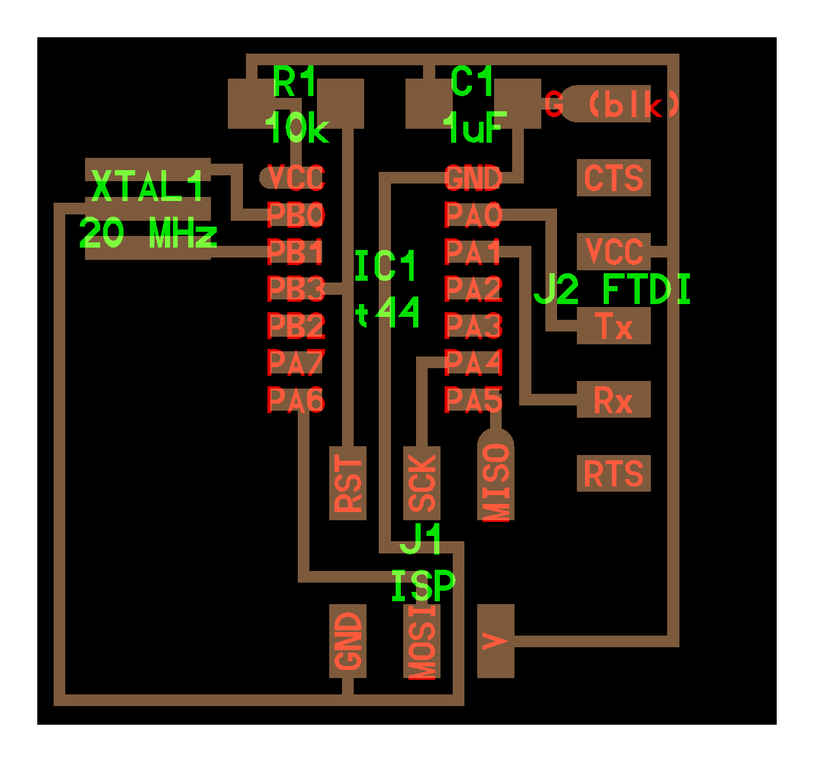
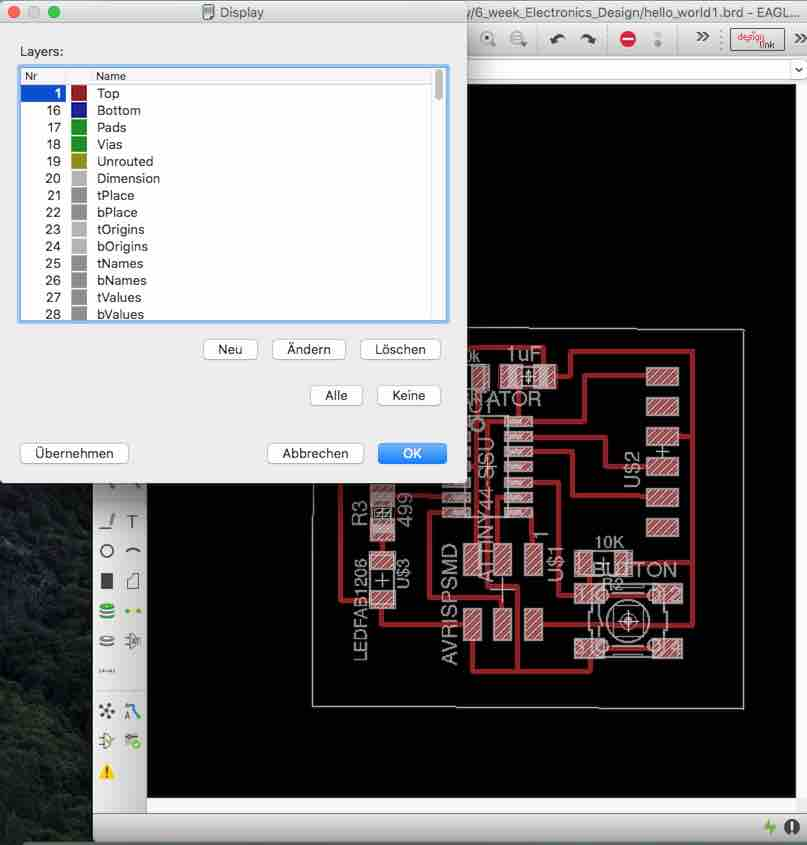
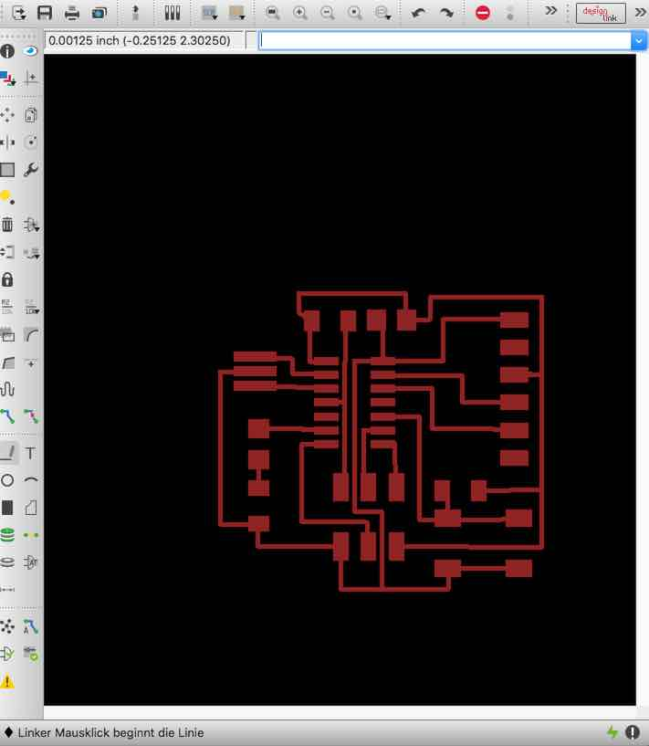
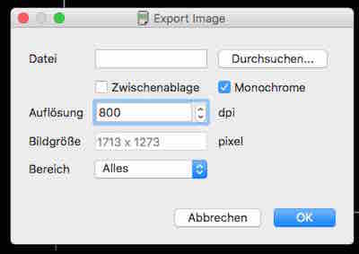
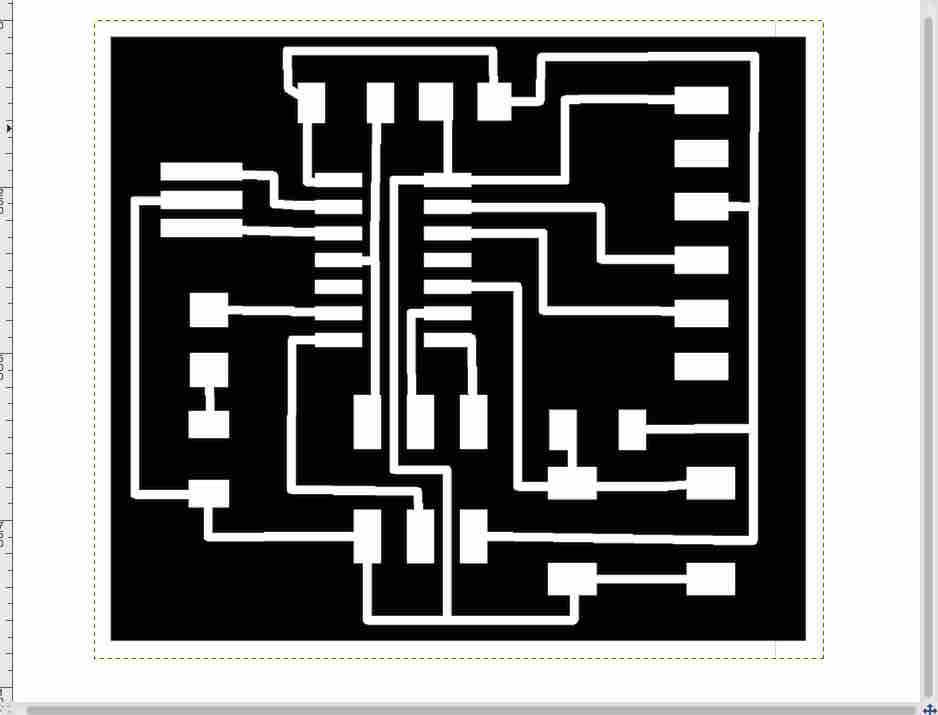

[BACK to START](../)

[FINAL PROJECT](../final) / [WEEK 1](../week1) / [COMPUTER AIDED DESIGN](../week2) / [COMPUTER-CONTROLLED-CUTTING](../week3) / [ELECTRONICS PRODUCTION](../week4) / [3D SCANNING & PRINTING](../week5) / [ELECTRONICS DESIGN](../week6)  / [COMPUTER-CONTROLLED MACHINING](../week7) / [EMBEDDED PROGRAMMING ](../week8) / [MECHANICAL DESIGN](../week9) / [MACHINE DESIGN](../week10) / [INPUT DEVICES](../week11) / [3D MOLDING AND CASTING](../week12) / [OUTPUT DEVICES](../week13) / [COMPOSITES](../week14) / [EMBEDDED NETWORKING & COMMUNICATIONS](../week15) / [INTERFACE AND APPLICATION PROGRAMMING ](../week16) / [APPLICATIONS AND IMPLICATIONS ](../week17) / [INVENTION, INTELLECTUAL PROPERTY, AND BUSINESS MODELS](../week18) / [PROJECT DEVELOPMENT ](../week19)

# Week 6 - ELECTRONICS DESIGN

March 2 - March 9

[Lecture](http://academy.cba.mit.edu/classes/electronics_design/index.html), [Video of Lecture](http://archive.fabacademy.org/archives/2016/master/videos/03-02/index.html)

The recitation this week was from [Kenny Cheung who know works at NASA](https://plus.google.com/u/0/events/c463tjdamkf13avqd3ma6mv25hc). 

~~~
*Weeks Assignment*

* Try out as many Electronic Design Tools as possible
* redraw the echo hello-world board,
* add (at least) a button and LED (with current-limiting resistor)
* check the design rules, and make it
* extra credit: simulate its operation
* extra credit: measure its operation

~~~

## Eagle

First I [downloaded](http://www.cadsoftusa.com/) the Eagle Mac [freeware version](http://www.cadsoftusa.com/download-eagle/freeware/). There are some limitations. Meaning you limited to 100 x 80 mm and 2 layers. We will use the mill to make our boards and can anyway only mill copper tracks on the bottom and the back of the board. Also the freeware is for noncommercial use and if you want to sell you board you need to upgrade to the Pro Version.

*Update 8. April:* 

### Import Fab Academy Library

I learned how to import the Fab Library so I can search and add the components of [the hello World Board](http://academy.cba.mit.edu/classes/embedded_programming/hello.ftdi.44.png) and I also learned how to use the schematic tool and the boad editor. This tutorial explains how to [add libraries](https://github.com/adafruit/Adafruit-Eagle-Library). 

In eagle you work with schematic editor and the board editor. 

A project schematic is like the comments of a program´s code. It helps you understand what the board actually does.

In the board editor you create the actual PCB design.  

Both of the editors have to be kept open. If you close one of the two the changes are not reflected in the other. 

I just created a new schematic and added all the components to it. [This](http://archive.fabacademy.org/archives/2016/doc/electronics_design_eagle.html#step2) tutorial explains all the steps. 

### Add components

We are using the 1206 SMD Components which is one size smaller then Through Hole Components. Watch [this](https://www.youtube.com/watch?v=b9FC9fAlfQE) video for a great explanation.

Look for all parts to put into your schematic by typing them into the search field.

*I added all the parts that were on the original board:*

* 6-pin programming header: for programming the board
* microcontroller (Attiny44) 
* [resonator (20MHz)](http://fabacademy.org/archives/2015/doc/aboutClockSpeed.html)
* FTDI Header 
* capacitors (1uF)
* 10K Resistor

*Additionally I added:*
	
* an LED with a resistor
* Button with a pull up [(pull-up resistor)](http://www.sparkfun.com/tutorials/218) of 10K

To select the correct value of the resistor you have to calculate it. 

To calculate the resistor first look at the datasheet of the LED to find out the diode forward voltage and the diode forward current. For that go to the [Fablab Inventory](https://docs.google.com/spreadsheets/d/1U-jcBWOJEjBT5A0N84IUubtcHKMEMtndQPLCkZCkVsU/pub?single=true&gid=0&output=html) and look for the colour of LED your are using and get the part Number of the LED. I was using a green LED so my part number was 160-1169-1-ND. Then go to the Digikey Website and put in the part number. This way you find the [datasheet](http://optoelectronics.liteon.com/upload/download/DS-22-98-0004/S_110_LTST-C150GKT.pdf) where you find all the information. 

Also I noticed that where the green line is is the Cathode (-) which is important later when stuffing the board. Don´t trust the internet!

The source voltage is 5V, the forward current of the LED is 30mA and forward Voltage is 2,1 resulting in a recommended resistor of 100 ohms.  You get that by typing the values all into the online [LED Calculator](http://led.linear1.org/1led.wiz). 

I am using a 499 Ohms resistor like all the other designs but you could also choose the resistor of 100 ohms.

### Connect, Label, Name and give Value to components

*Update 10. April:* 

While in Vallaudra I finally finished adding the components and labeled, named and gave values to the resistors and the capacitors. Just go over a component and right click. I had a problem with the Naming of the GND. You have to write GND@1, GND@2, etc.. Here I found a [tutorial.](http://dangerousprototypes.com/docs/Cadsoft_Eagle_how_to_make_parts_tutorial#Making_the_Symbol).

I also wired them like in Neils design and added the button and the led.

That is how it looks like when you have wired all the components and labeled and named them.

I also went through [this](https://learn.sparkfun.com/tutorials/using-eagle-schematic) and [this](https://learn.sparkfun.com/tutorials/using-eagle-board-layout) and [this](http://archive.fabacademy.org/archives/2016/doc/electronics_design_eagle.html#step2) tutorial.

*Update 11. April:*

### Design Traces

Back in the Fablab I finished designing the traces in the board editor which took me all day.

### Design Rule Check (DRC)

After designing you make a Design Rule Check to make sure your mill passes through the fine traces.

We are using a 1/64 inch mill for the traces. 1/64 is 15,6 mm. So to be cool I put in 16 mil.  

I needed a couple of trys to finally get a no errors anymore. This was the hardest part for me in this assignment.

### Prepare Board for Milling with the Roland

#### Export from Eagle

Select then all layers and make the outside box of you board smaller. Then select no layer and then only top layer. Then export the board design (Export -> Image). Select Monochrom and 800 dpi.

#### Prepare Black and White PNG in Gimp for Fabmodules

Now you need to prepare to black and white png image so fabmodules can calculate the gcode for the mill. Black is where the mill cuts the copper away leaving the white traces. 

Open the png you just exported in Gimp. This is the Gimp process:

1. Select the image, click in canvas size change to millimeters and and 1,6 to the high and the width. The milling tool we use for cutout is 1/32 which is 0,8 mm so we add two times the milling tool. Click in center. 
2. Duplicate the layer and paint it in white (Bucket Fill Tool)

SELECT -> ALL
SELECT -> BORDER (0.8mm)
Paint the border in black

Finally you get these 2 black and white pngs. 

Note to myself: make a gimp script that does this process automatically.

## Mill the board

I will not put the step by step documenentation for the milling part here. Please look for my step by step guide in the [Electronic Production Week.](../week4). 

## Stuff the board

After milling its time to stuff the board. With the command "run bom" in Eagle you can get the bill of components of your board. I put again a strip of double sided tape in my notebook and got all the components together. 

Dada .... 

## Project Files

[Download](https://drive.google.com/folderview?id=0B3iYmii-HJ7TLWdPZUMwb3B6QjA&usp=sharing) all project files from this assignment from my Google Drive.

## Learnings

* Finally got started with Eagle
* How to work with Libraries
* Make a Design Rules Check
* Don´t trust the internet for information. In one picture the Cathode was on the wrong side

## Feedback

[Twitter](http://www.twitter.com/andreaskopp) me or [email me at andreasrkopp at gmail dot com](mailto:andreasrkopp@gmail.com).

[BACK to TOP](../week6)