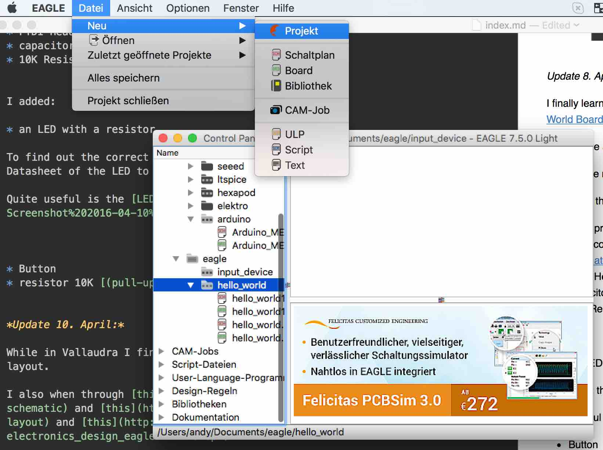

[BACK to START](../)

[FINAL PROJECT](../final) / [WEEK 1](../week1) / [COMPUTER AIDED DESIGN](../week2) / [COMPUTER-CONTROLLED-CUTTING](../week3) / [ELECTRONICS PRODUCTION](../week4) / [3D SCANNING & PRINTING](../week5) / [ELECTRONICS DESIGN 1](../week6)  / [COMPUTER-CONTROLLED MACHINING](../week7) / [EMBEDDED PROGRAMING ](../week8) / [MECHANICAL AND MACHINE DESIGN](../week9) / [INPUT DEVICES](../week10) / [3D MOULDING AND CASTING ](../week11) / [OUTPUT DEVICES](../week12) /  [COMPOSITES](../week13) / [EMBEDDED NETWORKING & COMMUNICATIONS](../week14) / [INTERFACE AND APPLICATION PROGRAMMING ](../week15) / [APPLICATIONS AND IMPLICATIONS ](../week16) / [INVENTION, INTELLECTUAL PROPERTY, AND BUSINESS MODELS](../week17) / [PROJECT DEVELOPMENT ](../week18) 

# Week 6 - ELECTRONICS DESIGN I

March 2 - March 9

[Lecture](http://academy.cba.mit.edu/classes/electronics_design/index.html), [Video of Lecture](http://archive.fabacademy.org/archives/2016/master/videos/03-02/index.html)

The recitation this week was from [Kenny Cheung who know works at NASA](https://plus.google.com/u/0/events/c463tjdamkf13avqd3ma6mv25hc). 

~~~
*Weeks Assignment*

* Try out as many Electronic Design Tools as possible
* redraw the echo hello-world board,
* add (at least) a button and LED (with current-limiting resistor)
* check the design rules, and make it
* extra credit: simulate its operation
* extra credit: measure its operation

~~~

## Fritzing

I first wanted to download the fritzing realising that I already have downloaded it previously. 

You can design your PCB with the software and [order](http://fab.fritzing.org/fritzing-fab) your PCB as well from them. 

There is also a guide 

## Eagle

Then I [downloaded](http://www.cadsoftusa.com/) Eagle. There is a [freeware version](http://www.cadsoftusa.com/download-eagle/freeware/) with some limitations.

## Virtial Breadboard

## Kicad

I also downloaded Kicad for Max. 

http://www.virtualbreadboard.com/

## Fusion 360 and CadSoft EAGLE

## Makin the Board

## Project Files

[Download](https://drive.google.com/open?id=0B3iYmii-HJ7TLWdPZUMwb3B6QjA) all project files from this assigment from my Google Drive.

## Learnings

This week I finally connected the Google Drive Mac Version that helped me to link the download links of my project files.

## Feedback

[Twitter](http://www.twitter.com/andreaskopp) me or [email me at andreasrkopp at gmail dot com](mailto:andreasrkopp@gmailcom).

