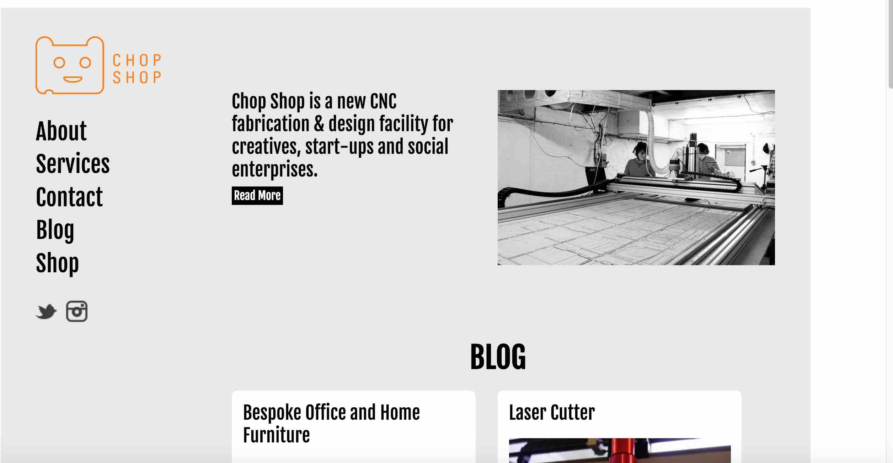
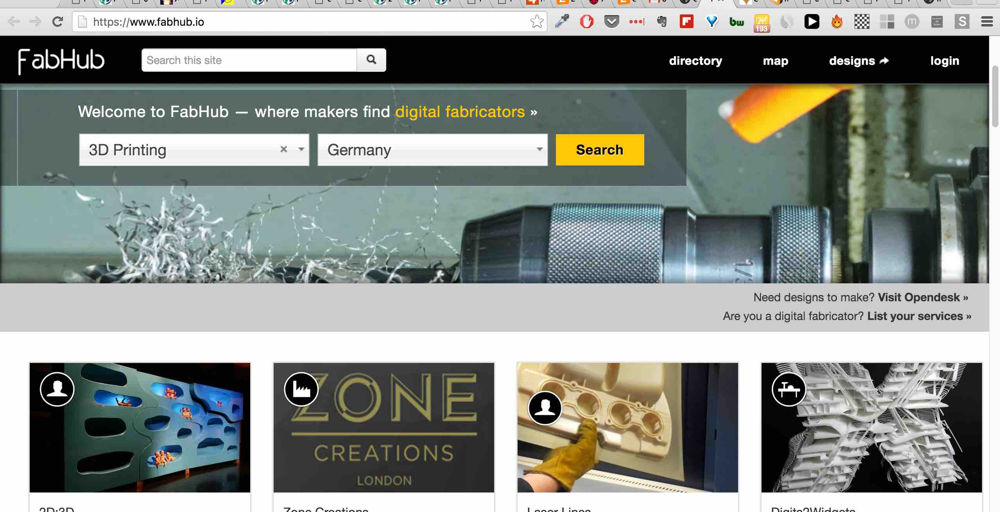
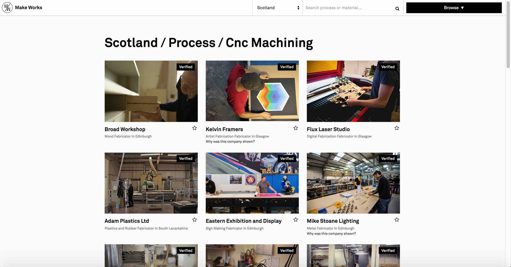
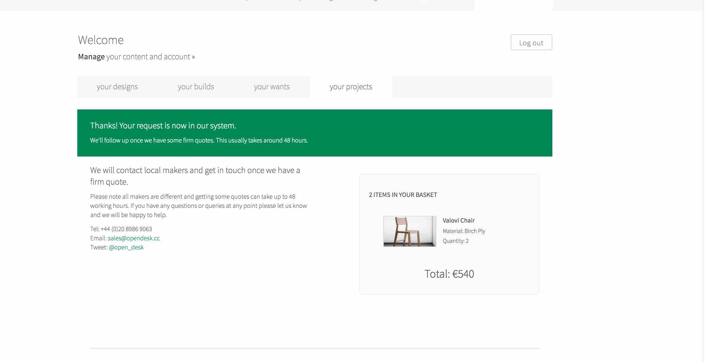
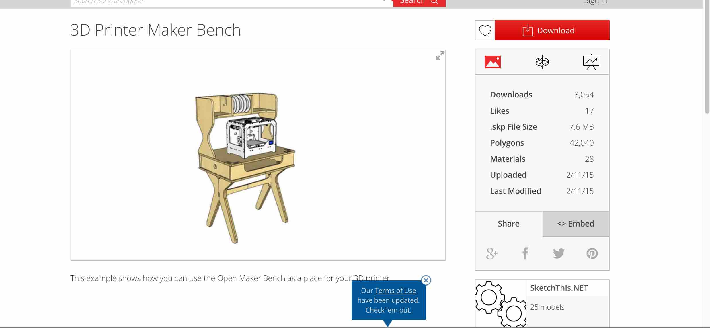
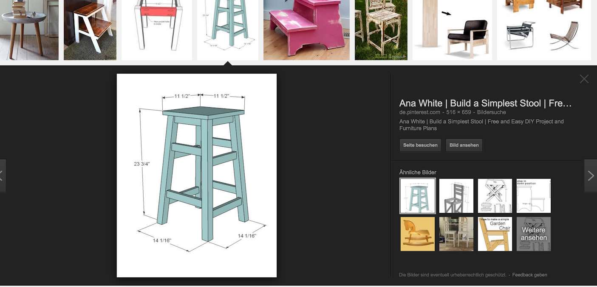

[BACK to START](../)

[FINAL PROJECT](../final) / [WEEK 1](../week1) / [COMPUTER AIDED DESIGN](../week2) / [COMPUTER-CONTROLLED-CUTTING](../week3) / [ELECTRONICS PRODUCTION](../week4) / [3D SCANNING & PRINTING](../week5) / [ELECTRONICS DESIGN](../week6)  / [COMPUTER-CONTROLLED MACHINING](../week7) / [EMBEDDED PROGRAMMING ](../week8) / [MECHANICAL DESIGN](../week9) / [MACHINE DESIGN](../week10) / [INPUT DEVICES](../week11) / [3D MOLDING AND CASTING](../week12) / [OUTPUT DEVICES](../week13) / [COMPOSITES](../week14) / [EMBEDDED NETWORKING & COMMUNICATIONS](../week15) / [INTERFACE AND APPLICATION PROGRAMMING ](../week16) / [APPLICATIONS AND IMPLICATIONS ](../week17) / [INVENTION, INTELLECTUAL PROPERTY, AND BUSINESS MODELS](../week18) / [PROJECT DEVELOPMENT ](../week19) 

# Week 7 - COMPUTER-CONTROLLED MACHINING

March 9 - March 16

[Lecture](http://academy.cba.mit.edu/classes/computer_machining/index.html), [Video of Lecture](http://archive.fabacademy.org/archives/2016/master/videos/03-09/index.html)

~~~
*Weeks Assignment*

Make Something Big

~~~

I planned to use the Shopbot in the Makerspace in Munich but the machine was not working in the week I needed it to use so I used the week to research where there are other large wood CNC machines and CNC service providers around Munich and prepare my cutting files. 

I found a course in the [MakerSpace Shop Bot Course ](http://www.maker-space.de/course/37.cnc-002-cnc-holzfraese-shopbot-und-einfuehrung-in-die-software-vcarve-fuer-einsteiger-sgk-c.html) on the 6.4. and that there are workshops as well in the Fablab Zurich.

There is also a [CNC course in the fablab Berlin](https://fablab.berlin/en/workshops/24-cnc-milling-introduction.html) with a BZE PFE 1000 PX for 240 € but the next course will be in the middle of April and when I was in the Fablab Berlin in the week after easter I could not find the time to do a personal introduction.

After looking for alternatives I finally found CNC shop that will let me use the CNC at the end of the week. This was also a great exercises to find out who has a big CNC machine around Munich and who I could work with in the future. I think there is the need of something like [Chop Shop](http://chopshopcnc.com/) that offers CNC and Lasercutting Services for Artists, Designers and Start-ups and Makers that do not have this big machines.

 

I also looked at platforms like [100k Garage](http://www.100kgarages.com/) in the US and [Fabhub](https://www.fabhub.io/) that list CNC Shops. Laser Cutters and 3D Printers and other Workshops. Unfortunately there are not many listing in Germany yet. 

  
 

I also found [Make Works](http://makeworks.co.uk/scotland/process/cnc-machining) a directory of local fabricators, material suppliers and workshop facilities a the moment in Scotland and Birmingham. I would love to have something like that here in Bavaria. 
 

To get an idea about prices I asked for a quote of a desk and a stool from [open desk](https://www.opendesk.cc/) that transferred me to a local CNC Shop east of Munich. The estimate was 540 € for two chairs.

***Update 27. April***

I never got a real quote from them. They told me that they did not get a quote from th CNC Shop. 

I looked at some other students like [Till ](http://fabacademy.org/archives/2015/eu/students/cremer.till/08.html) and [Helga](http://fabacademy.org/archives/2015/eu/students/hauksdottir.sigridur_helga/W8_computer_controlled_machining.html) and [Paul](http://archive.fabacademy.org/archives/2016/fablabamsterdam/students/90/week7.html) from Amsterdam and also looked at [this site](http://fabacademy.org/archives/2015/eu/students/gunnarsson.thorarinn_b.b/week.8.html) after I heard it in the review. 

Finally I remembered that I have a Booth Builder in my network that has a CNC and I asked if I could do it at his shop.  

## What I'm gonna for this assignment?

For this assignment I wanted to make a [Maker Bench](https://3dwarehouse.sketchup.com/collection.html?id=ub750b5d7-37d7-4479-b8e6-f4532018adb5) and design design some adaption to fit my Ult2go and the Other mill on top of it. 

For that I need to download the Sketch Up Pro Version and then make my adaptions and export a dxf model. 

### Design and Prototype

*Update 11. April:*

Software: SketchUp Pro, Solidworks
Tools: Lasercutter

Finally during my week in Barcelona I managed to set up Sketchup Pro and got the dxf file of the Maker Bench out of Sketchup. I decided to first make a model of the table and cut it with the Lasercutter. 

Because the table is too big to take home to Munich I decided to make a stool for a standing table. 

*Update 21. April:*

I looked at all the chairs and stools I could find in the fablab and finally decided to make a cnc design of the first stool I build at Fablab Munich.

I also had a look at [this](http://www.instructables.com/id/50-Digital-Joints-poster-visual-reference/) poster with 50 digital joints. 

### Milling

Machine used: ShopBot PRSalpha 144
Material: 15mm plywood (Seekiefer)

## Project Files

[Download](https://drive.google.com/folderview?id=0B3iYmii-HJ7TRTFZNVBoMU8tRXc&usp=sharing) all project files from this assignment from my Google Drive.

## Learnings

* Work with Sketch up. Export dxf files.
* Work with solidworks
* make joints

## Feedback

[Twitter](http://www.twitter.com/andreaskopp) me or [email me at andreasrkopp at gmail dot com](mailto:andreasrkopp@gmail.com).

