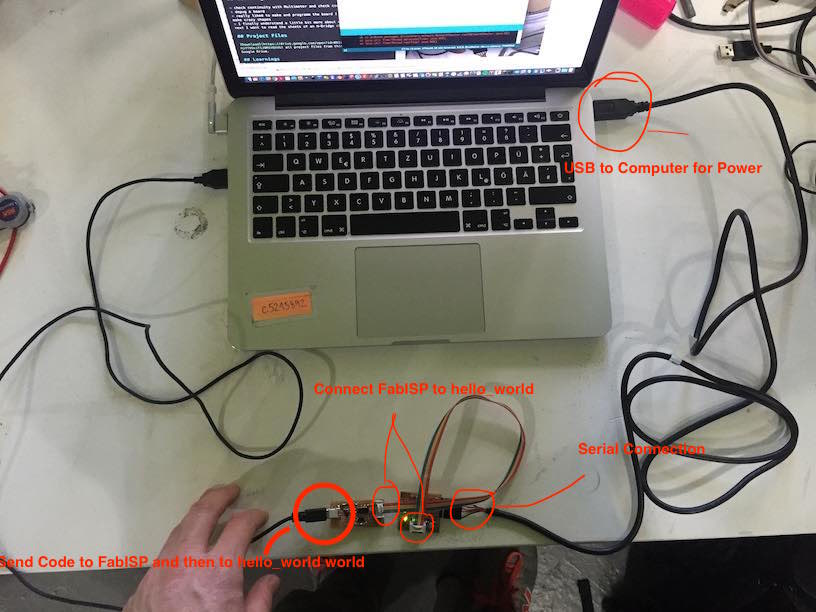
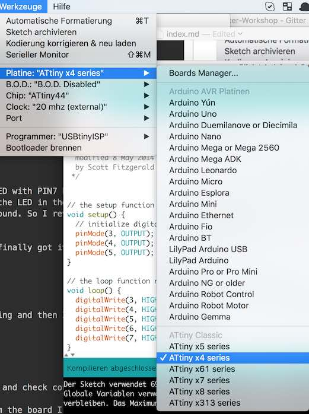
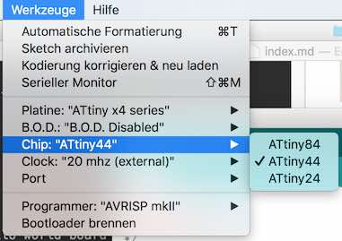
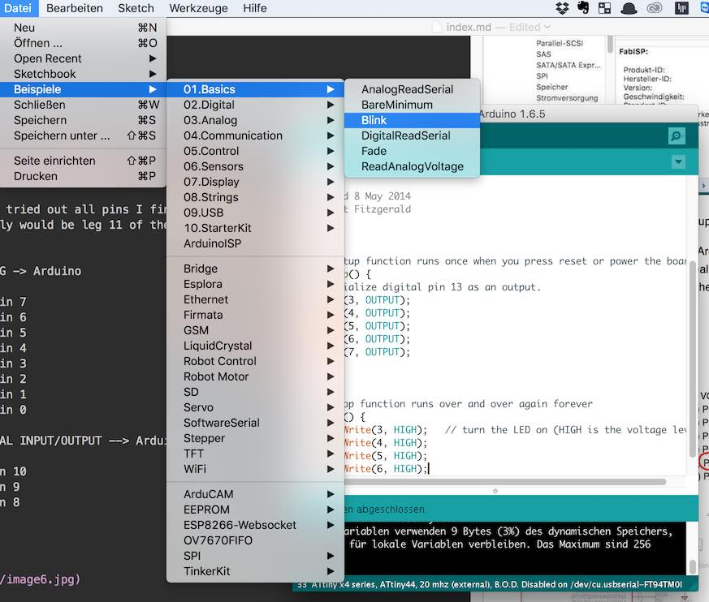

[BACK to START](../)

[FINAL PROJECT](../final) / [WEEK 1](../week1) / [COMPUTER AIDED DESIGN](../week2) / [COMPUTER-CONTROLLED-CUTTING](../week3) / [ELECTRONICS PRODUCTION](../week4) / [3D SCANNING & PRINTING](../week5) / [ELECTRONICS DESIGN](../week6)  / [COMPUTER-CONTROLLED MACHINING](../week7) / [EMBEDDED PROGRAMMING ](../week8) / [MECHANICAL DESIGN](../week9) / [MACHINE DESIGN](../week10) / [INPUT DEVICES](../week11) / [3D MOLDING AND CASTING](../week12) / [OUTPUT DEVICES](../week13) / [COMPOSITES](../week14) / [EMBEDDED NETWORKING & COMMUNICATIONS](../week15) / [INTERFACE AND APPLICATION PROGRAMMING ](../week16) / [APPLICATIONS AND IMPLICATIONS ](../week17) / [INVENTION, INTELLECTUAL PROPERTY, AND BUSINESS MODELS](../week18) / [PROJECT DEVELOPMENT ](../week19)  

# Week 8 - EMBEDDED PROGRAMMING

March 16 - March 23

[Lecture](http://academy.cba.mit.edu/classes/embedded_programming/index.html), [Video of Lecture](http://academy.cba.mit.edu/classes/embedded_programming/index.html)

The [recitation](https://plus.google.com/events/cnu4maiedr2361t3t82jbkcbdvc) was from Nadya Peek about Object oriented hardware.
 
~~~
*Weeks Assignment*

* Read the read a micro-controller data sheet
* program your board to do something, with as many different programming languages and programming environments as possible

~~~

## Read Attiny44 Datasheet

I started reading the [data sheet of the Attiny44](http://www.atmel.com/Images/doc8006.pdf) but did not got far. I understood that its a cheap (60 cent) chip to run simple programs like blinking an LED with a button. 

*Update 13. April:* 

Only when I finally finished my hello_world board and my LED did not work I understood why you need to read a data sheet of a micro-controller. 

These are some facts that I found interesting about the chip:


* Able to work at 1.8 - 6.0V
* Minimizing Power Consumption -> sleep modes
* Each port has its own internal pull-up resistor
* CPU (Central Processing Unit) that processes 8bits at a time
* AVR micro controllers do not support an operating system, meaning that they can not execute multiple tasks at a time.


## Program the hello_world

 
### Bill of Material and Tools

To program the hello_world board I made earlier I needed these things:

* Micro USB Cable
* FTDI Cable (I bought [this](http://www.amazon.de/UART-CP2102-Module-Serial-Converter/dp/B00AFRXKFU/ref=sr_1_1?ie=UTF8&qid=1461921231&sr=8-1&keywords=FTDI+CAble) form Amazon)
* ISP Cable
* your FabISP Board
* Arduino IDE
* [the FTDI Drivers](http://www.ftdichip.com/Drivers/VCP.htm)
* [FTDI Drivers for my FTDI Cable from Amazon](silabs.com/products/interface/usbtouart/Pages/usb-to-uart-bridge.aspx) 

* [Fabacademy Tutorial Programming Attiny](http://fabacademy.org/archives/content/tutorials/09_Embedded_Programming/Programming_ATtiny_with_Arduino_IDE.html)

[BACK to TOP](../week8)


### Make the ISP Cable

ISP means In System Programming or In Cirucuit Serial Programming. To connect the hello world board to your FabISP you need to make yourself a cable. For that you need 2x3 female connector and a 10 Wire cable that you have to reduce to 6 cables. Check all the pins with a multimeter afterwards if the cables are connected.


### What is a FTDI Cable?

I will use a FTDI Cable to connect my board via USB to my Laptop to program it. It is a USB to Serial Cable called also USB-232R. It enables you to connect the Serial Connection of the hello_world board to the USB Port of the computer. .

After checking the comments on amazon.de that said that I have to install some [drivers](http://www.silabs.com/products/interface/usb-bridges/classic-usb-bridges/pages/usb-to-uart-bridge.aspx) for it. But when going to the website from Silicon Labs it says all drivers are already preinstalled. 

I was not sure so I installed them anyway and I also installed the Software from Silicon Labs. For that you also need to [this](https://support.apple.com/kb/DL1572?locale=de_DE) older Java Version.


The datasheet of the CP2102 Chip from Silicon Labs my FTDI Cables uses I found [here](http://www.silabs.com/support%20documents/technicaldocs/cp2102-9.pdf).


Its a little different then the cable the other students were using in the Fablab Barcelona. Which is like this. 


### Connect the Cables

I connected the ISP Cable to my hello_world board and  a Micro USB Cable to one USB port of your computer. Make sure that you always connect GND to GND with the ISP Cable and that you also check where is the GND at your hello_world board. 

I first used th FTDI Cable from the Fablab Barcelina and made sure that the Black Cable (GND) is on top and the Green Cable (RTS) is on the bottom when connecting it to my hello_world board.




Using my cable I checked again and I only connected GND, RX und TX. 


### Install Arduino and make it work with Attiny

As I want to use Arduino IDE to use it to program the Attiny we first need to 
to install the Attiny support manager for Arduino. Here you find a [tutorial](https://learn.adafruit.com/add-boards-arduino-v164/setup) on Adafruit. You need to put the URL below in the Additional Boards Managers URL window. Here is a [full list](https://github.com/arduino/Arduino/wiki/Unofficial-list-of-3rd-party-boards-support-urls#list-of-3rd-party-boards-support-urls) of Boards that you can program with the Arduino IDE.


```
https://adafruit.github.io/arduino-board-index/package_adafruit_index.json

```

 


 
 
 
This enables you to install additional boards. Once you have installed the Attiny package you see INSTALLED after it. 
 
 
 
Select the Platine Attinyx4 Series, the Chip ATtiny44, the clock 20mHz and the Port 

 
 
 
 


### Program your hello_world board with Arduino IDE


Check if your FabISP is recognized. 


Then you open the Blink sketch and upload it to the Attiny.



First I tried to program the LED with Arduino pin7 but it did not work. So I checked if I had soldered on the LED in the right direction and I realized it was the wrong way around. So I reversed the LED but I still did not get the LED to turn on. So I checked my schematic of my hello_world board again.


Only after I tried out all pins I finally got it to turn on Arduino pin 3 which normally would be leg 10 or PA3 of the Attiny. 


ATTINY ANALOG -> Arduino

LEG 6 (PA7)  --> pin 7  
LEG 7 (PA6)  --> pin 6  
LEG 8 (PA5)  --> pin 5  
LEG 9 (PA4)  --> pin 4  
LEG 10 (PA3) --> pin 3  
LEG 11 (PA2) --> pin 2  
LEG 12 (PA1) --> pin 1  
LEG 13 (PA0) --> pin 0 

ATTINY DIGITAL INPUT/OUTPUT --> Arduino

LEG 2 (PB0)  --> pin 10  
LEG 3 (PB1)  --> pin 9  
LEG 5 (PB2)  --> pin 8


Dada ...


*Update 21. April:* 

I then changed the sketch to blinking with a delay of 100.


And then I included the button. I just guessed that the button is on pin 7 or leg 6 and I was right. So somehow my LED and my BUTTON was reversed.


All the code you can find in project files.


## Program Attiny with C

***Update 29. April:***

Apart from the Arduino IDE you can also program the Attiny using C.

I first looked at the [Fabacademy Tutorial how to Program the Attiny with C](http://fabacademy.org/archives/content/tutorials/09_Embedded_Programming/Programming_Hello_Echo_Using_C.html).

First you need to get the c and the make file from the [Fabacademy Week 8 Website ](http://academy.cba.mit.edu/classes/embedded_programming/index.html)and download them in the same folder and open the folder in terminal.

Because I have already set the fuses to run at 20MHz I do not need to set them again. 


```
sudo make -f hello.ftdi.44.echo.c.make program-usbtiny

```


Ok it worked. I got the code to upload  


To see the code in action I opened up the Arduino IDE and I typed in letters and then hit send but I did not get letters beck but only strange signs. 


Next I tried the button and led code. This code is called hello.ftdi.44.echo.c.make

Because my Led is on pin3 of the Arduino which is Leg 6 and PA7 I changed the line in the c Code in line 39.


define serial_pin_out (1 << PA7)


So now I also needed the button. So my guess is that that one must be on PIN3. But that did not work. I tried out every PIN but it did not work so I guess it has something to do with the Code. 


```
sudo make -f hello.ftdi.44.echo.interrupt.c.make program-usbtiny

```


## Program Attiny with CrossPack AVR 

Coming soon. 

file:///usr/local/CrossPack-AVR/manual/gettingstarted.html

http://archive.fabacademy.org/2016/fablabkamplintfort/students/109/exercise08.html

http://fabacademy.org/archives/2014/students/hurtado.michael/task/embedded_programming.html


## Program Attiny with Atmel Studio

Coming soon. 

http://archive.fabacademy.org/archives/2016/fablabtoscana2016/students/117/week8.html

http://fabacademy.org/archives/2014/students/hurtado.michael/task/embedded_programming.html

## Learnings

* check continuity with Multimeter and check connections in Eagle
* debug a board
* really liked to make and program the board I am looking forward to make crazy shapes
* I finally understand a little bit more about electronics and chips next I want to read the sheets of an H-Bridge chip and and EEPROM
* It would be great if I would have labeled GND on my ISP and my hello_world board
* learned to control a pin in C


## Project Files

[Download](https://drive.google.com/folderview?id=0B3iYmii-HJ7TSjVvWkJkb3RoblU&usp=sharing) all project files from this assignment from my Google Drive.


## Feedback

[Twitter](http://www.twitter.com/andreaskopp) me or [email me at andreasrkopp at gmail dot com](mailto:andreasrkopp@gmail.com).


[](https://gitter.im/ARKopp/fabacademy2016?utm_source=badge&utm_medium=badge&utm_campaign=pr-badge)


