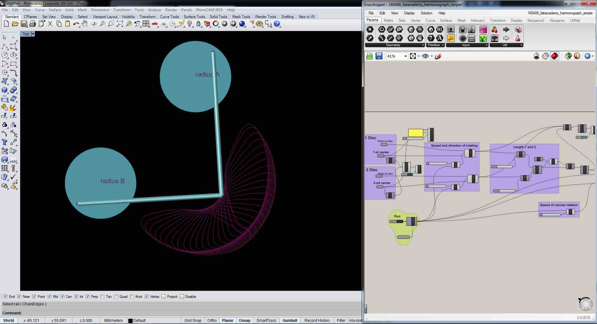
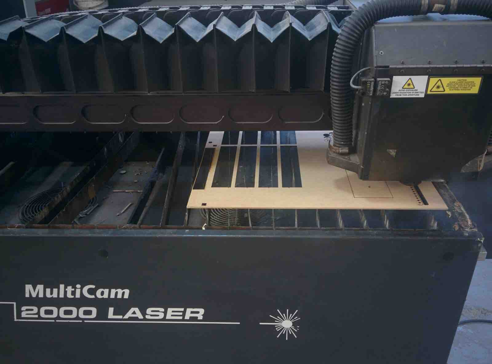
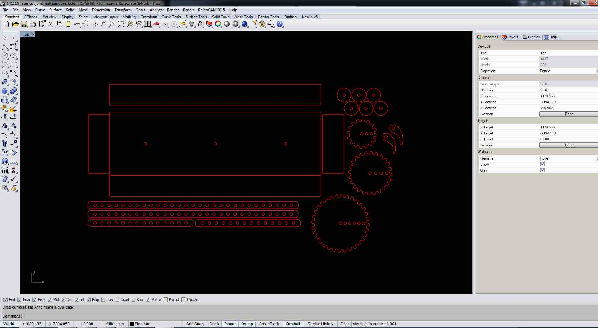
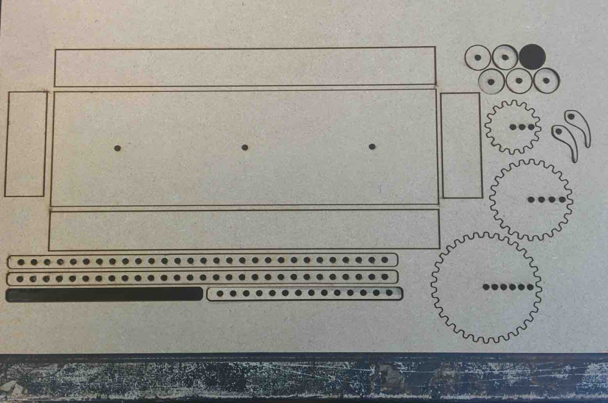
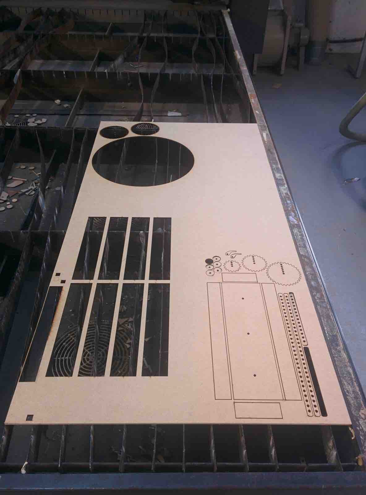
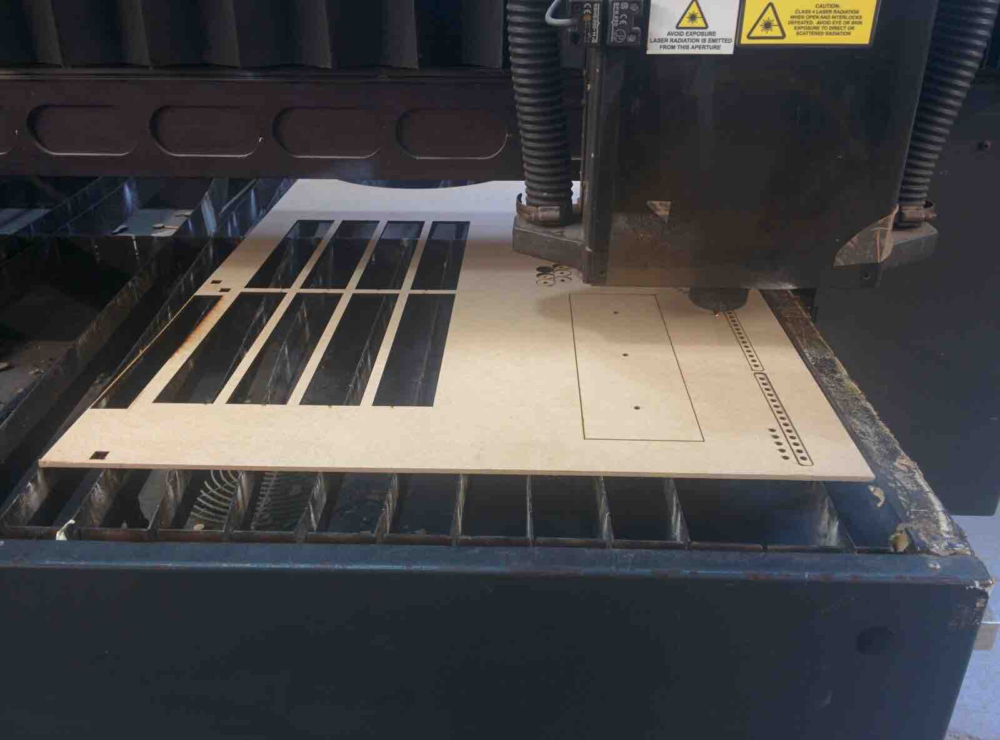
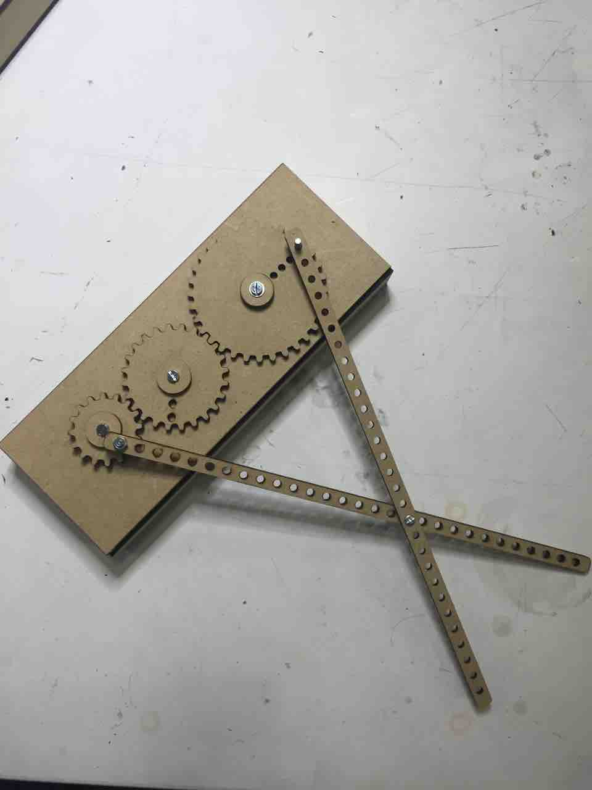
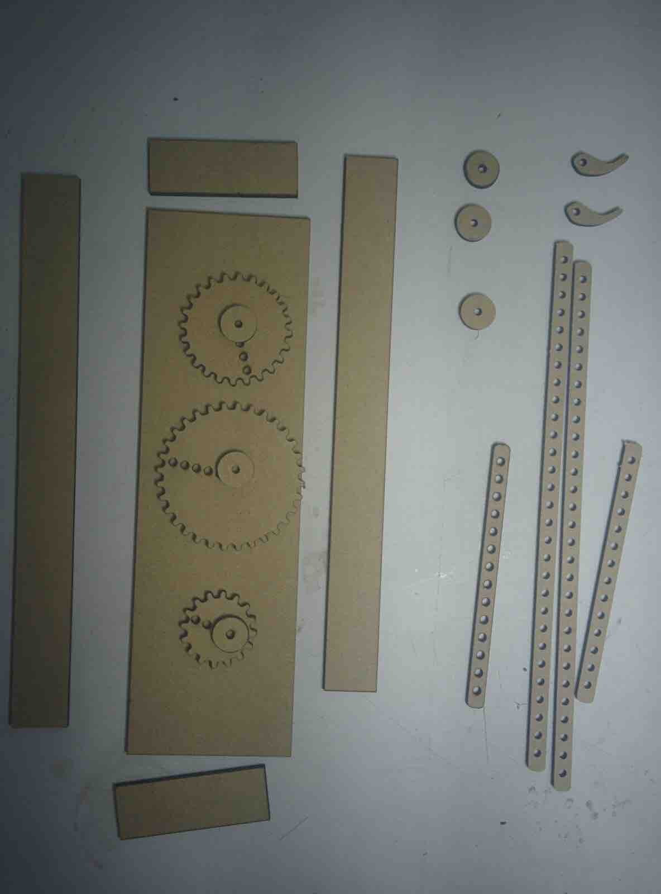
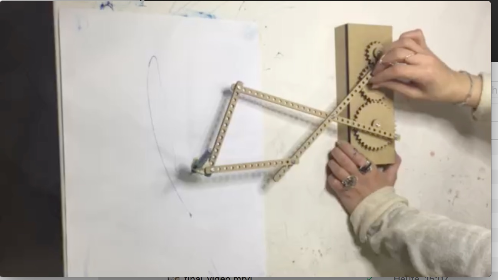

[BACK to START](../)

[FINAL PROJECT](../final) / [WEEK 1](../week1) / [COMPUTER AIDED DESIGN](../week2) / [COMPUTER-CONTROLLED-CUTTING](../week3) / [ELECTRONICS PRODUCTION](../week4) / [3D SCANNING & PRINTING](../week5) / [ELECTRONICS DESIGN](../week6)  / [COMPUTER-CONTROLLED MACHINING](../week7) / [EMBEDDED PROGRAMMING ](../week8) / [MECHANICAL DESIGN](../week9) / [MACHINE DESIGN](../week10) / [INPUT DEVICES](../week11) / [3D MOLDING AND CASTING](../week12) / [OUTPUT DEVICES](../week13) / [COMPOSITES](../week14) / [EMBEDDED NETWORKING & COMMUNICATIONS](../week15) / [INTERFACE AND APPLICATION PROGRAMMING ](../week16) / [APPLICATIONS AND IMPLICATIONS ](../week17) / [INVENTION, INTELLECTUAL PROPERTY, AND BUSINESS MODELS](../week18) / [PROJECT DEVELOPMENT ](../week19)  

## Week 9 - MECHANICAL DESIGN 

March 23 - March 30

[Lecture](http://academy.cba.mit.edu/classes/mechanical_design/index.html), [Video](http://archive.fabacademy.org/archives/2016/master/videos/04-06/index.html)

~~~
*Weeks Assigment*

* make a machine, including the end effector (?)
* build the passive parts and operate it manually
* document the group project and your individual contribution

~~~

For this weeks group project we have to design a machine to be operated manually. Inspired by Eva´s previous kinetic research at the Angewandte Universität, Vienna, we decided to build a primograph.

As I arrived only on Tuesday in Barcelona my contribution for this first part of the group project was a part of the documentation. 

Group Members:

  * Eva Blsakova (link missing)
  * [Norma Deseke](http://archive.fabacademy.org/archives/2016/fablabbcn2016/students/284/)
  * [Elissa](http://archive.fabacademy.org/archives/2016/fablabbcn2016/students/79/)
  * and me
	
	

### Bill of Tools and Materials

 * Rhino and Grasshopper
 * Test Machine: Epilog Legend Laser Cutter
 * Test Materials: black and white Acryl, 3mm
 * Final Machine: Multicam 2000 Laser Cutter
 * Final Materials: MDF Wood,4mm 
 * Other materials: 12 screws, 24 washers, glue

 
## Inspiration and Research  
        
Copenhagen based artist Eske Rex created a [drawing machine](http://www.eskerex.com/?p=464) generating beautiful artwork.
      
Eske Rex: "Drawing Machine is a construction involving two pendulums, each suspended from a tower construction and connected through “drawing arms” and moveable joints. A ballpoint pen resting on a drawing surface covered with paper is mounted at the point where the pendulums come together. The pendulums are set in motion by hand, and their movements are represented on the paper. The Drawing Machine serves two purposes: On exhibitions where the movements of the pendulums affect the entire room, and the experience engages the beholder’s body. While the rhythmic repetitions cause the beholder to pause, the drawing emerges on the paper. And as a tool where investigations on the relation between time and movement."

[Drawing Apparatus](http://thecreatorsproject.vice.com/blog/two-turntables-are-a-drawing-machine) by Robert Howsare created from two turntables. [Eva´s research](http://www.martinohutz.de/ITUS-Kinetic-Research) for Video of ITUS kinetic morphologies 

## CAD Process

Here we also have a [video]( ) of a simulation in Rhino and a [simulation]( ) we did with an app. 

  

## Computer Aided Machining Process

Material, Machine and Tests: 

* 3mm black acrylic: 15-100-5000 (speed power frequency) on Epilog Legend Laser Cutter (load file, press 8- xy off, press go; move home manually; press 7 - adjust; press 9 - focus; press go) 
* First test: didn't cut through
* Second test: decrease speed to 4%, still not cut; cut same place twice with same settings: cut but edges burned, would affect wheels and translation of movement. So change material. 
* Third test: white acrylic also 3mm, 15 speed didn't work, 5 works, nice clear cutting edge 
* While it worked in the final test, setting out to cut the whole box failed. This was either related to the uneveness of the machine surface base or varying material thickness? Settings worked in some but not all parts of the material.Idea to use wood for arms and wheels, but based on previous tests wood has a texture which renders movement less smooth, whihc would impact on wheels translation of forces (movement). We tried anyway. 

Change: Material and Machine MDF Wood on Multicam 2000 Laser
* The cutting worked fine, however when we assabled the box, we realised that we had misplaced the gears, they where actually not touching. So we went back to the design file and relocated the gears (Rhino). So we recut the box and assambled it.

 

 

 
 

       

## Final Result for the week
        

Here you see a video of our final result.    

And here is the [video](https://drive.google.com/file/d/0BwDWM-G4s7v3WVZwNUhtcnlkZFE/view?usp=sharing) of our primograph in action. 

## Project Files

[Download](https://drive.google.com/folderview?id=0B3iYmii-HJ7TRC13dHJmamhkSDA&usp=sharing) all project files from this assigment from my Google Drive.

## Learnings

Because I did the screencapture of the animation in Grasshopper I learned to use Screenflow and also I learned how to screencapture video of an ipad/iphone  with Airsever. 

## Feedback

[Twitter](http://www.twitter.com/andreaskopp) me or [email me at andreasrkopp at gmail dot com](mailto:andreasrkopp@gmail.com).

Or chat with me on gitter.

